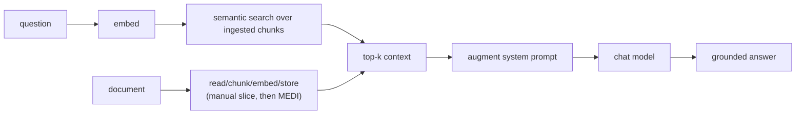

# Part 3: Add RAG by hand (console)

> **⏱️ Estimated Time:** 60-75 minutes

In Part 2 you built a chat app. The problem: the model only knows what it was
trained on. Ask it about *your* product, *your* policies, or anything private and
it will guess. **Retrieval-Augmented Generation (RAG)** fixes that by retrieving
relevant text and injecting it into the prompt.

In this part you build a **minimal** RAG loop by hand first, then replace the
ingestion plumbing with [`Microsoft.Extensions.DataIngestion` (MEDI)](https://learn.microsoft.com/en-us/dotnet/ai/conceptual/data-ingestion). This gives
you the mental model without spending most of your time on
boilerplate.

## What you will build



1. **`IEmbeddingGenerator`**: turn text into a form the app can compare by meaning
2. **Chunk** the document into smaller pieces the app can search
3. **Embed + store** those chunks (manual in-memory first, then MEDI + vector store)
4. **Cosine similarity search**: rank chunks by how relevant they are to the question
5. **Augment the prompt** with the best matching chunks, then answer

## Prerequisites

- Completed [Part 2](../Part%2002%20-%20Build%20Chat%20App/README.md)
- A [Microsoft Foundry](https://learn.microsoft.com/azure/foundry/what-is-foundry) resource with **`gpt-5-mini`** *and*
  **`text-embedding-3-small`** deployed (see [Part 1 - Setup](../Part%2001%20-%20Setup/README.md))

## Step 1: Start from the Part 2 project

Continue in your Part 2 `ChatApp` (or open the [provided project](RagChatApp)).
The embedding client comes from `Microsoft.Extensions.AI.OpenAI`, which you
already reference, so there are no new packages in this step.

Create a `sample-docs` folder next to your project file and copy the sample
markdown document into it.

### Option A: Copy from the command line

```bash
mkdir sample-docs
copy "..\Part 03 - Add RAG\RagChatApp\sample-docs\contoso-trailblazer-3000.md" "sample-docs\"
```

### Option B: Copy in Visual Studio 2026

1. In Solution Explorer, right-click the project and select **Add > New Folder**.
   Name it `sample-docs`.
1. Right-click `sample-docs` and select **Add > Existing Item**.
1. Browse to `Part 03 - Add RAG\RagChatApp\sample-docs\contoso-trailblazer-3000.md`
   and select **Add**.

The app reads the document from its output folder at runtime, so the file has to
be copied on build. Select `contoso-trailblazer-3000.md` in Solution Explorer and
set **Copy to Output Directory** to **Copy if newer** in the Properties window,
or add this to your `.csproj` directly:

```xml
<ItemGroup>
  <None Include="sample-docs\**\*" CopyToOutputDirectory="PreserveNewest" />
</ItemGroup>
```

> [!TIP]
> Keep model names in code/config (not secrets). In this part, use a normal
> code default for embeddings: `text-embedding-3-small`.

## Step 2: Minimal manual slice (instructional)

In this step you will type the manual RAG flow into `Program.cs` in small,
testable sections.

### Concepts used in Step 2

Before you start typing, these three concepts are worth understanding:

- **Embedding**: a way to turn text into something the computer can compare by
  meaning instead of exact wording. In this lab, embeddings let the app match a
  user's question with chunks from the document even when the words are not an
  exact string match.

- **Cosine similarity**: the scoring step that answers, "Which chunk feels most
  like this question in meaning?" After both the question and the document
  chunks are embedded, cosine similarity gives each chunk a relevance score so
  you can rank the results.

- **Top-k retrieval**: the step where you keep only the best few matches after
  ranking. With `topK = 3`, the app keeps the three most relevant chunks and
  sends those to the model as context. That keeps the prompt focused and avoids
  dumping the whole document into every request.

### 2.1 Add configuration, models, and Azure clients

Open `Program.cs` and update it with:

```csharp
using Azure;
using Azure.AI.OpenAI;
using Microsoft.Extensions.AI;
using Microsoft.Extensions.Configuration;

var config = new ConfigurationBuilder()
  .AddUserSecrets<Program>()
  .Build();

string endpoint = config["AzureOpenAI:Endpoint"]
  ?? throw new InvalidOperationException(
    "Missing 'AzureOpenAI:Endpoint'. Run: dotnet user-secrets set \"AzureOpenAI:Endpoint\" \"https://YOUR-RESOURCE.openai.azure.com/\"");
string key = config["AzureOpenAI:Key"]
  ?? throw new InvalidOperationException(
    "Missing 'AzureOpenAI:Key'. Run: dotnet user-secrets set \"AzureOpenAI:Key\" \"YOUR-KEY\"");

const string chatModel = "gpt-5-mini";
const string embeddingModel = "text-embedding-3-small";

var azureClient = new AzureOpenAIClient(new Uri(endpoint), new AzureKeyCredential(key));
IChatClient chatClient = azureClient.GetChatClient(chatModel).AsIChatClient();
IEmbeddingGenerator<string, Embedding<float>> embeddingGenerator =
  azureClient.GetEmbeddingClient(embeddingModel).AsIEmbeddingGenerator();
```

This is the same secrets-first pattern from Part 2, but now you create both a
chat client and a second client used for search.

### 2.2 Read and chunk the source document

Add this below the client setup:

```csharp
string docPath = Path.Combine(AppContext.BaseDirectory, "sample-docs", "contoso-trailblazer-3000.md");
string document = await File.ReadAllTextAsync(docPath);

string[] chunks = document
  .Split("\n\n", StringSplitOptions.RemoveEmptyEntries | StringSplitOptions.TrimEntries)
  .Where(c => c.Length > 0)
  .ToArray();
```

This splits the document into paragraph-sized chunks so the app can search
smaller pieces instead of treating the whole file as one block of text.

### 2.3 Embed chunks and build a simple in-memory store

Add this next:

```csharp
Console.WriteLine($"Embedding {chunks.Length} chunks from the product guide...");

GeneratedEmbeddings<Embedding<float>> embeddings =
  await embeddingGenerator.GenerateAsync(chunks);

var store = new List<(string Text, ReadOnlyMemory<float> Vector)>();
for (int i = 0; i < chunks.Length; i++)
{
  store.Add((chunks[i], embeddings[i].Vector));
}

Console.WriteLine("Knowledge base ready. Ask about the Contoso TrailBlazer 3000 boots.");
Console.WriteLine("(Type 'exit' to quit.)");
Console.WriteLine();
```

This is intentionally simple. You compute the search data once at startup and
keep it in a list.

### 2.4 Add cosine similarity helper

At the bottom of `Program.cs`, add:

```csharp
static float CosineSimilarity(ReadOnlySpan<float> a, ReadOnlySpan<float> b)
{
  float dot = 0f, magA = 0f, magB = 0f;
  for (int i = 0; i < a.Length; i++)
  {
    dot += a[i] * b[i];
    magA += a[i] * a[i];
    magB += b[i] * b[i];
  }

  return magA == 0f || magB == 0f
    ? 0f
    : dot / (MathF.Sqrt(magA) * MathF.Sqrt(magB));
}
```

This is the manual scoring function used to rank which chunks are the best match.

### 2.5 Add the grounded chat loop

Add the loop below your ingestion code:

```csharp
var history = new List<ChatMessage>();

while (true)
{
  Console.Write("You: ");
  string? input = Console.ReadLine();

  if (string.IsNullOrWhiteSpace(input) ||
    input.Equals("exit", StringComparison.OrdinalIgnoreCase))
  {
    break;
  }

  ReadOnlyMemory<float> questionVector =
    (await embeddingGenerator.GenerateAsync(input)).Vector;

  const int topK = 3;
  var topChunks = store
    .Select(item => (item.Text, Score: CosineSimilarity(questionVector.Span, item.Vector.Span)))
    .OrderByDescending(x => x.Score)
    .Take(topK)
    .Select(x => x.Text)
    .ToArray();

  string context = string.Join("\n\n---\n\n", topChunks);
  var systemPrompt = new ChatMessage(ChatRole.System,
    "You are a product support assistant. Answer the user's question using ONLY " +
    "the context below. If the answer isn't in the context, say you don't know.\n\n" +
    $"Context:\n{context}");

  var messages = new List<ChatMessage> { systemPrompt };
  messages.AddRange(history);
  messages.Add(new ChatMessage(ChatRole.User, input));

  Console.Write("Assistant: ");
  var answer = new System.Text.StringBuilder();
  await foreach (ChatResponseUpdate update in chatClient.GetStreamingResponseAsync(messages))
  {
    Console.Write(update.Text);
    answer.Append(update.Text);
  }
  Console.WriteLine();
  Console.WriteLine();

  history.Add(new ChatMessage(ChatRole.User, input));
  history.Add(new ChatMessage(ChatRole.Assistant, answer.ToString()));
}

Console.WriteLine("Goodbye!");
```

This is the complete manual RAG loop: convert the question into search data,
find the best matching chunks, add them to the prompt, then stream the answer.

### Checkpoint A: Complete manual implementation

After typing each section, compare with the reference files:

- [RagChatApp/Program.cs](RagChatApp/Program.cs)
- [checkpoints/manual-program.cs](checkpoints/manual-program.cs)

At this checkpoint, your manual `Program.cs` should match the manual reference.

## Step 3: Replace ingestion plumbing with MEDI (recommended)

Now replace the manual ingestion/chunking/storage code with a MEDI pipeline while
keeping the same search + answer behavior.

### Why use MEDI instead of the naive implementation?

The Step 2 version is intentionally simple for learning, but it has limits:

| Manual naive implementation (Step 2) | MEDI pipeline (Step 3) |
| --- | --- |
| Custom chunking/search code you maintain yourself | Standard reader/chunker/writer components |
| In-memory store only; no persistence by default | Vector store-backed storage (`SqliteVectorStore`) |
| Harder to evolve when sources/formats grow | Easier to swap readers, chunkers, and writers |
| Good for understanding mechanics | Better baseline for real projects and iteration |

Use Step 2 to understand how the pieces work. Use Step 3 to reduce boilerplate
and move toward something you would be more likely to keep in a real app.

### 3.1 Add MEDI packages

From the command line:

```bash
dotnet add package Microsoft.Extensions.DataIngestion --prerelease
dotnet add package Microsoft.Extensions.DataIngestion.Markdig --prerelease
dotnet add package Microsoft.Extensions.Logging.Console
dotnet add package Microsoft.ML.Tokenizers.Data.O200kBase
dotnet add package Microsoft.SemanticKernel.Connectors.SqliteVec --prerelease
```

Or, in Visual Studio 2026, from **Tools > NuGet Package Manager > Package Manager
Console**:

```powershell
Install-Package Microsoft.Extensions.DataIngestion -IncludePrerelease
Install-Package Microsoft.Extensions.DataIngestion.Markdig -IncludePrerelease
Install-Package Microsoft.Extensions.Logging.Console
Install-Package Microsoft.ML.Tokenizers.Data.O200kBase
Install-Package Microsoft.SemanticKernel.Connectors.SqliteVec -IncludePrerelease
```

Three of these are prerelease. If you use **Manage NuGet Packages** instead of
the console, check **Include prerelease** or they won't show up in search
results.

### 3.2 Add MEDI usings, logger, config, and AI clients

Start by updating the top of `Program.cs`:

```csharp
using Azure;
using Azure.AI.OpenAI;
using Microsoft.Extensions.AI;
using Microsoft.Extensions.Configuration;
using Microsoft.Extensions.DataIngestion;
using Microsoft.Extensions.Logging;
using Microsoft.Extensions.VectorData;
using Microsoft.Extensions.DataIngestion.Chunkers;
using Microsoft.ML.Tokenizers;
using Microsoft.SemanticKernel.Connectors.SqliteVec;

using ILoggerFactory loggerFactory =
  LoggerFactory.Create(builder => builder.AddSimpleConsole());

IConfigurationRoot config = new ConfigurationBuilder()
  .AddUserSecrets<Program>()
  .Build();

string endpoint = config["AzureOpenAI:Endpoint"]
  ?? throw new InvalidOperationException("Missing AzureOpenAI:Endpoint");
string apiKey = config["AzureOpenAI:Key"]
  ?? throw new InvalidOperationException("Missing AzureOpenAI:Key");
const string chatModel = "gpt-5-mini";
const string embeddingModel = "text-embedding-3-small";

AzureOpenAIClient azureClient = new(new Uri(endpoint), new AzureKeyCredential(apiKey));
IChatClient chatClient = azureClient.GetChatClient(chatModel).AsIChatClient();
IEmbeddingGenerator<string, Embedding<float>> embeddingGenerator =
  azureClient.GetEmbeddingClient(embeddingModel).AsIEmbeddingGenerator();
```

This keeps the same model setup as Step 2, then adds the MEDI and storage
packages needed for a more realistic ingestion path.

### 3.3 Compose the MEDI ingestion pipeline

Add this pipeline setup:

```csharp
IngestionDocumentReader reader = new MarkdownReader();

IngestionChunkerOptions chunkerOptions = new(TiktokenTokenizer.CreateForModel(chatModel))
{
  MaxTokensPerChunk = 1200,
  OverlapTokens = 150
};

IngestionChunker<string> chunker =
  new SemanticSimilarityChunker(embeddingGenerator, chunkerOptions);

using SqliteVectorStore vectorStore = new(
  "Data Source=vectors.db;Pooling=false",
  new()
  {
    EmbeddingGenerator = embeddingGenerator
  });

using VectorStoreWriter<string> writer = new(
  vectorStore,
  dimensionCount: 1536,
  new VectorStoreWriterOptions { CollectionName = "product-docs" });

using IngestionPipeline<string> pipeline =
  new(reader, chunker, writer, loggerFactory: loggerFactory);
```

This replaces your hand-written chunking and in-memory list with reusable
components for reading, splitting, and storing content.

### 3.4 Run ingestion over sample docs

Add the ingestion loop:

```csharp
await foreach (IngestionResult result in pipeline.ProcessAsync(
  new DirectoryInfo("./sample-docs"),
  searchPattern: "*.md"))
{
  Console.WriteLine($"Completed processing '{result.DocumentId}'. Succeeded: '{result.Succeeded}'.");
}
```

Each markdown file is read, split into smaller pieces, prepared for search, and
written to `vectors.db`.

### 3.5 Keep grounded retrieval and streaming chat

Add retrieval from the vector store and the chat loop:

```csharp
VectorStoreCollection<object, Dictionary<string, object?>> collection = writer.VectorStoreCollection;

var history = new List<ChatMessage>
{
  new(ChatRole.System, "You are a product support assistant for Contoso TrailBlazer 3000 boots.")
};

Console.WriteLine("MEDI-based RAG app ready. Type a question (or 'exit' to quit).");
Console.WriteLine();

while (true)
{
  Console.Write("You: ");
  string? input = Console.ReadLine();

  if (string.IsNullOrWhiteSpace(input) ||
    input.Equals("exit", StringComparison.OrdinalIgnoreCase))
  {
    break;
  }

  var contexts = new List<string>();

  await foreach (VectorSearchResult<Dictionary<string, object?>> result in
    collection.SearchAsync(input, top: 3))
  {
    if (result.Record.TryGetValue("content", out var content) && content is string text)
    {
      contexts.Add(text);
    }
  }

  string context = string.Join("\n\n---\n\n", contexts);
  var systemPrompt = new ChatMessage(ChatRole.System,
    "Answer using ONLY the context below. If the answer is not in context, say you don't know.\n\n" +
    $"Context:\n{context}");

  var messages = new List<ChatMessage> { systemPrompt };
  messages.AddRange(history);
  messages.Add(new ChatMessage(ChatRole.User, input));

  Console.Write("Assistant: ");
  var answer = new System.Text.StringBuilder();

  await foreach (ChatResponseUpdate update in chatClient.GetStreamingResponseAsync(messages))
  {
    Console.Write(update.Text);
    answer.Append(update.Text);
  }

  Console.WriteLine();
  Console.WriteLine();

  history.Add(new ChatMessage(ChatRole.User, input));
  history.Add(new ChatMessage(ChatRole.Assistant, answer.ToString()));
}

Console.WriteLine("Goodbye!");
```

This preserves the same answer flow as Step 2, but the search results now come
from a real vector store instead of an in-memory list.

### Checkpoint B: Complete MEDI implementation

After typing each section, compare with the MEDI reference:

- [checkpoints/medi-program.cs](checkpoints/medi-program.cs)

At this checkpoint, your MEDI-based `Program.cs` should match the checkpoint.

## Step 4: See the difference

Run it and ask something only the document knows:

```bash
dotnet run
```

In Visual Studio 2026, press **Ctrl+F5**.

```text
You: How do I dry the boots?
Assistant: Air-dry them away from direct heat. Never place them on a radiator,
as that damages the waterproof membrane.

You: What is the warranty?
Assistant: A 2-year limited warranty covering manufacturing defects...

You: Who won the 2022 World Cup?
Assistant: I don't know. That isn't in the provided context.
```

The last answer is the point: the assistant now answers from your document and
declines when the answer is not there.

## What's next

Your knowledge base lives in memory, so it's rebuilt on every run and can't scale.
In **Part 4** you'll scaffold the **aichatweb template** and see how it solves
these problems with a real vector store (Qdrant), ingestion services, and
semantic search, using the same `IChatClient` and `IEmbeddingGenerator`
abstractions you just used by hand.

**Continue to** -> [Part 4: AI Web Chat Template](../Part%2004%20-%20AI%20Web%20Chat%20Template/README.md)

---

Adapted with permission from [Steve Sanderson's dotnet-ai-workshop](https://github.com/SteveSandersonMS/dotnet-ai-workshop) (chapters 2, 3, and 6).
