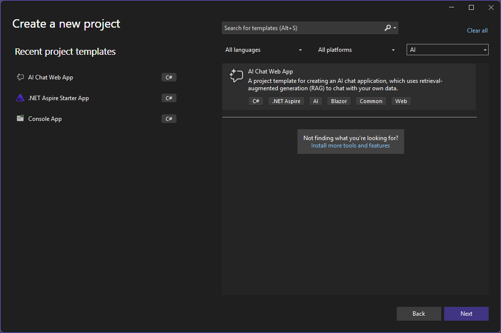
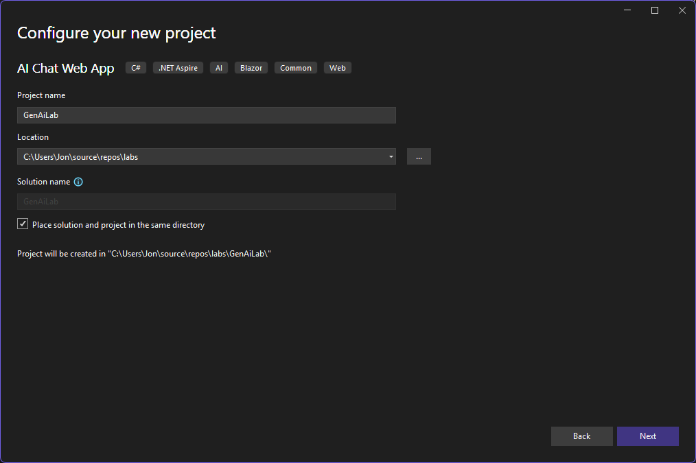

# Part 4: AI Web Chat Template - scaffold `aichatweb` and understand the code

> **⏱️ Estimated Time:** 30-45 minutes

You've now built a chat app (Part 2) and a RAG loop (Part 3) **by hand**. You know
what an `IChatClient` is, what an embedding is, what a vector search does, and why
an in-memory store doesn't scale.

In this part you scaffold the **`aichatweb` template** and compare its generated
web app with what you built by hand. The template includes the same concepts,
with production-oriented wiring for persistence and orchestration.

> **Aspire enters here**, motivated by a real need: your Part 3 vectors lived in
> memory and vanished on exit. A production app needs a persistent, orchestrated
> vector database.

## Prerequisites

- Familiarity with the concepts introduced in [Part 2](../Part%2002%20-%20Build%20Chat%20App/README.md) and [Part 3](../Part%2003%20-%20Add%20RAG/README.md) is helpful, but not required.
- **Docker Desktop** (or Podman) running for the recommended Qdrant + Aspire path.
- [Microsoft Foundry](https://learn.microsoft.com/azure/foundry/what-is-foundry) with `gpt-5-mini` + `text-embedding-3-small` (see [Part 1](../Part%2001%20-%20Setup/README.md))

> [!NOTE]
> Docker is not required to learn the core template concepts. If you cannot run containers, use the Docker-free path below. You will still work with the Blazor chat app, dependency injection, ingestion, embeddings, semantic search, and RAG.

## Step 1: Install the template and scaffold

```bash
dotnet new install Microsoft.Extensions.AI.Templates
dotnet new aichatweb --provider azureopenai --vector-store qdrant --aspire --name GenAiLab --output GenAiLab
```

### Alternative: scaffold in Visual Studio 2026

If you prefer Visual Studio instead of the CLI:

> [!NOTE]
> If **AI Chat Web App** does not appear in the **Create a new project** dialog, install the template first from a terminal:
>
> ```bash
> dotnet new install Microsoft.Extensions.AI.Templates
> ```
>
> Then restart Visual Studio 2026 and search again.

1. Open Visual Studio 2026 and select Create a new project.
1. Search for and choose AI Chat Web App.

    

1. Use GenAiLab as the project name.

    

1. In Additional information, set:
    - AI service provider: Azure OpenAI
    - Vector store: Qdrant
    - Use Aspire orchestration: enabled
1. Create the project and let package restore complete.

This generates a solution with three projects:

| Project | Role |
| --- | --- |
| `GenAiLab.Web` | The Blazor chat web app |
| `GenAiLab.AppHost` | The **Aspire** orchestrator (starts the app + Qdrant) |
| `GenAiLab.ServiceDefaults` | Shared telemetry, health checks, resilience |

### Docker-free path: local vector store without Aspire

The template also supports a local JSON vector store and a standalone web project. Scaffold that variant with:

```bash
dotnet new aichatweb --provider azureopenai --vector-store local --name GenAiLab --output GenAiLab
```

In Visual Studio, choose **Local** for the vector store and leave **Use Aspire orchestration** disabled. The standalone Azure OpenAI template uses keyless authentication. Sign in to Visual Studio or the Azure CLI with an account assigned the **Azure AI Developer** role on the Azure OpenAI resource, then set the endpoint and run the generated project directly:

```bash
dotnet user-secrets --project GenAiLab set AzureOpenAI:Endpoint "https://YOUR-RESOURCE.openai.azure.com/"
dotnet run --project GenAiLab
```

For more about the local template and keyless authentication, see the [official .NET AI template quickstart](https://learn.microsoft.com/dotnet/ai/quickstarts/ai-templates).

Use the rest of this part to inspect the same chat, embedding, ingestion, and retrieval abstractions. The generated local-store implementation differs from the Qdrant snippets shown below, but it plays the same role behind `Microsoft.Extensions.VectorData`.

| You can still complete | This path omits |
| --- | --- |
| Blazor chat UI and AI client configuration | Qdrant and its persistent container volume |
| Document ingestion, embeddings, and semantic search | The Aspire AppHost and service orchestration |
| RAG and the vector-store abstraction | The Aspire dashboard, distributed health checks, logs, traces, and metrics |

The local JSON store is intended for prototyping and learning; it is not the production-oriented vector database used by the recommended path. Skip Step 3, and interpret the Qdrant/AppHost sections as an architecture comparison rather than files that exist in your generated project.

### Bring the packages up to date

Templates ship on their own release cadence, so a freshly scaffolded project is
usually a few versions behind the current packages. Update it before you go any
further — this is what you would do on any real project, and it keeps your code
matching the snapshot in this repo.

In `GenAiLab.AppHost/GenAiLab.AppHost.csproj`, change the SDK version to `13.4.6`:

```xml
<Sdk Name="Aspire.AppHost.Sdk" Version="13.4.6" />
```

The `<Sdk>` element has to be edited by hand — `dotnet add package` only manages
`<PackageReference>` items. For the rest, run these from the `GenAiLab` folder:

```bash
dotnet add GenAiLab.AppHost package Aspire.Hosting.AppHost
dotnet add GenAiLab.AppHost package Aspire.Hosting.Qdrant
dotnet add GenAiLab.Web package Aspire.Qdrant.Client
dotnet add GenAiLab.Web package Aspire.Azure.AI.OpenAI --prerelease
dotnet add GenAiLab.Web package Azure.AI.OpenAI --prerelease
```

Without a `--version`, `dotnet add package` takes the newest **stable** release,
which is what you want for the three Aspire packages.

The two OpenAI packages need `--prerelease` for different reasons.
`Aspire.Azure.AI.OpenAI` has never shipped a stable build, so the command fails
without it. `Azure.AI.OpenAI` has a stable 2.1.0, but it is from December 2024
and is *older* than the version the template already referenced — taking it would
downgrade you.

> [!IMPORTANT]
> The last two go together. `Aspire.Azure.AI.OpenAI` 13.4.6 requires
> `Azure.AI.OpenAI` 2.8.0-beta.1 or later, so bumping only the first one fails
> the build with `NU1605: Detected package downgrade`. This is normal when a
> package raises its minimum dependency, and the error message names the version
> you need.

Then confirm everything still restores and compiles:

```bash
dotnet build
```

> [!NOTE]
> The snapshot in this repo pins exact versions, so if a newer prerelease has
> shipped since this was written you may end up slightly ahead of it. That is
> fine — the code in this part does not depend on anything that changed.

## Step 2: Map the generated code to what you built by hand

Everything below is code the template wrote, and it maps directly to the parts
you already built.

### Chat client: your Part 2 pipeline, as DI configuration

`GenAiLab.Web/Program.cs`:

```csharp
var openai = builder.AddAzureOpenAIClient("openai");
openai.AddChatClient("gpt-5-mini")
    .UseFunctionInvocation()
    .UseOpenTelemetry(configure: c =>
        c.EnableSensitiveData = builder.Environment.IsDevelopment());
openai.AddEmbeddingGenerator("text-embedding-3-small");
```

| Part 2/3 (by hand) | Template (generated) |
| --- | --- |
| `new AzureOpenAIClient(endpoint, key).GetChatClient(...).AsIChatClient()` | `builder.AddAzureOpenAIClient("openai").AddChatClient(...)` |
| `.AsBuilder().UseLogging(...).Build()` | `.UseFunctionInvocation().UseOpenTelemetry(...)` |
| `azureClient.GetEmbeddingClient(...).AsIEmbeddingGenerator()` | `openai.AddEmbeddingGenerator("text-embedding-3-small")` |

Same abstractions, now registered in DI and wrapped with a richer middleware
pipeline (function calling + telemetry instead of your hand-added logging).

### Retrieval: your Part 3 cosine search, as a service

`GenAiLab.Web/Services/SemanticSearch.cs`:

```csharp
public class SemanticSearch(VectorStoreCollection<Guid, IngestedChunk> vectorCollection)
{
    public async Task<IReadOnlyList<IngestedChunk>> SearchAsync(string text, string? documentIdFilter, int maxResults)
    {
        var nearest = vectorCollection.SearchAsync(text, maxResults, new VectorSearchOptions<IngestedChunk> { /* ... */ });
        return await nearest.Select(result => result.Record).ToListAsync();
    }
}
```

| Part 3 (by hand) | Template (generated) |
| --- | --- |
| Your `CosineSimilarity(...)` loop over a `List` | `vectorCollection.SearchAsync(...)` on a real vector store |
| Manual top-k `.OrderByDescending().Take(k)` | `maxResults` argument |
| No filtering | `Filter` by document id |

You wrote the math; the template delegates it to Qdrant through the
`Microsoft.Extensions.VectorData` abstraction. It applies the same swap idea at
the vector-store level.

### Ingestion: your Part 3 chunk-and-embed step, as a pipeline

`GenAiLab.Web/Services/Ingestion/DataIngestor.cs` upserts chunks and documents into
Qdrant collections, tracking what's already ingested so it only processes new or
changed files. `PDFDirectorySource` reads PDFs from `wwwroot/Data`.

| Part 3 (by hand) | Template (generated) |
| --- | --- |
| Split doc into paragraph chunks | `PDFDirectorySource` + chunking |
| `GenerateAsync(chunks)` once at startup | `DataIngestor.IngestDataAsync(...)` with change tracking |
| `store.Add((text, vector))` in a `List` | `chunksCollection.UpsertAsync(...)` into Qdrant |

`Program.cs` kicks it off at startup:

```csharp
await DataIngestor.IngestDataAsync(
    app.Services,
    new PDFDirectorySource(Path.Combine(builder.Environment.WebRootPath, "Data")));
```

> ⚠️ Only ingest **trusted** content. Ingested text is reflected back to users and
> is a prompt-injection risk.

### Persistence + orchestration: the answer to "in-memory doesn't scale"

`GenAiLab.AppHost/AppHost.cs`:

```csharp
var vectorDB = builder.AddQdrant("vectordb")
    .WithDataVolume()
    .WithLifetime(ContainerLifetime.Persistent);

var webApp = builder.AddProject<Projects.GenAiLab_Web>("aichatweb-app");
webApp.WithReference(openai);
webApp.WithReference(vectorDB).WaitFor(vectorDB);
```

This is the direct fix for Part 3's limitation: the vectors now live in a **Qdrant
container with a persistent data volume**, and Aspire starts the database, waits
for it to be ready, then starts the web app and wires the connection strings between
them automatically.

## Step 3: Configure secrets

The AppHost reads the Azure connection string from user-secrets (same secrets-first
rule as Parts 2-3):

```bash
dotnet user-secrets --project GenAiLab.AppHost set ConnectionStrings:openai "Endpoint=https://YOUR-RESOURCE.openai.azure.com/;Key=YOUR-KEY"
```

## Step 4: Run the app

Run the AppHost:

> [!IMPORTANT]
> For Aspire solutions, launch the `GenAiLab.AppHost` project. AppHost bootstraps the other projects and supporting services (such as Qdrant). If you run only `GenAiLab.Web`, you skip the full orchestrated experience.

```bash
cd GenAiLab
dotnet run --project GenAiLab.AppHost
```

Aspire launches a **dashboard** (URL printed in the console) showing every service,
its health, logs, traces, and metrics. This is why `UseOpenTelemetry(...)` was in
`Program.cs`: the telemetry you registered now has a destination.

## Step 5: Test the app end to end

1. In the Aspire dashboard, wait until both `aichatweb-app` and `vectordb` are healthy.
1. Open the `aichatweb-app` URL from the dashboard.
1. Ask a question grounded in your sample data (for example: "What does the document say about warranty terms?").
1. Confirm the answer cites or reflects content from ingested documents rather than a generic model response.
1. In the dashboard, open logs/traces for `aichatweb-app` to confirm request flow and model calls.

If you want the official step-by-step quickstart for scaffold + config + first run, see:
[.NET AI templates quickstart](https://learn.microsoft.com/en-us/dotnet/ai/quickstarts/ai-templates?tabs=visual-studio%2Cconfigure-visual-studio&pivots=azure-openai).

## What you learned

You can now open **any** generated file and explain it, because you built each
concept by hand first:

- `IChatClient` + middleware → Part 2
- `IEmbeddingGenerator`, chunking, vector search, prompt augmentation → Part 3
- Qdrant + Aspire → the persistence and orchestration your hand-built version lacked

## What's next

In **Part 5** you'll step outside the application itself and build a **Model
Context Protocol (MCP) server** — a tool an AI agent can call. That tool becomes
the one you hand to an agent in Part 8.

One thread stays open until the end of the day. Everything you have written so
far talks to `IChatClient` and `IEmbeddingGenerator` rather than to Azure
OpenAI directly, and nothing yet explains why that indirection is worth it. In
[Part 10](../Part%2010%20-%20Choosing%20Providers%20and%20Services/README.md) you
swap the provider out entirely — for a local model, with no application code
changes — right before you deploy.

**Continue to** → [Part 5: MCP Server Basics](../Part%2005%20-%20MCP%20Server%20Basics/README.md)

---

📖 **Return to**: [Workshop Overview](../README.md) | 🔄 **Previous**: [Part 3: Add RAG](../Part%2003%20-%20Add%20RAG/README.md) | ➡️ **Next**: [Part 5: MCP Server Basics](../Part%2005%20-%20MCP%20Server%20Basics/README.md)
