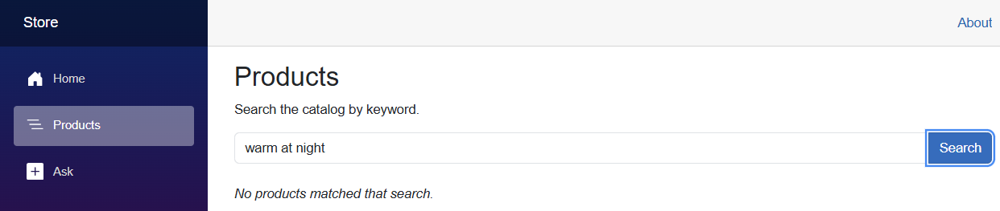
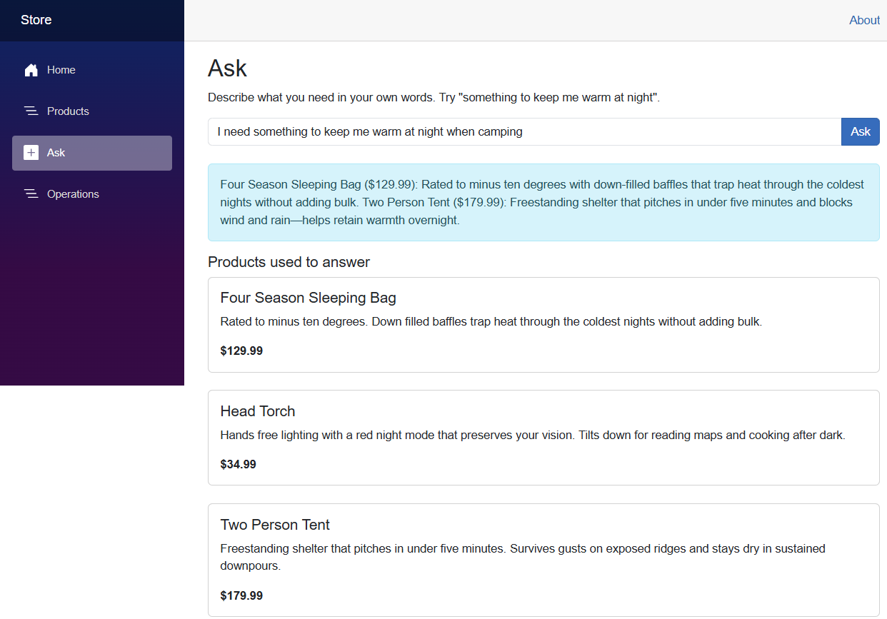
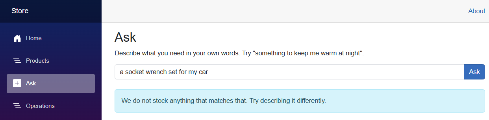
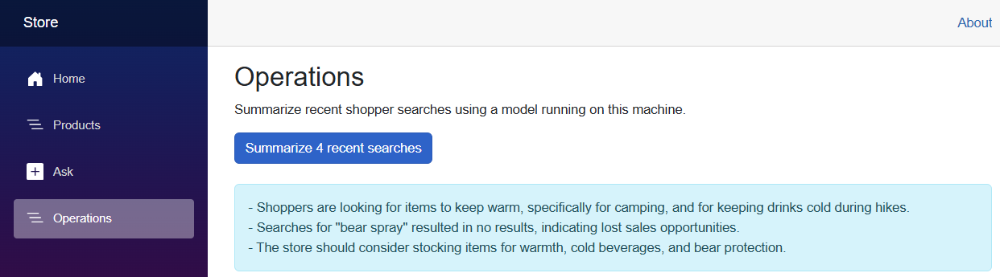

# Part 9: Adding AI to an Existing App

> **⏱️ Estimated Time:** 45-60 minutes
>
> **Prerequisites**: [Part 3: Add RAG](../Part%2003%20-%20Add%20RAG/README.md) for embeddings and semantic search. [Part 8: Agent Framework Basics](../Part%2008%20-%20Agent%20Framework%20Basics/README.md) is helpful background but not required.

## Overview

Everything so far started from an empty folder. Real work rarely does. You have an application in production, it has a database, a search box, and a team that depends on it, and the question is where AI fits into that.

In this part you take a working store application that has no AI in it at all and add three capabilities by hand:

1. **Semantic search** in the catalog API, so shoppers can describe what they want instead of guessing product names.
2. **Grounded answers** in the storefront, so the app can respond in sentences without inventing products.
3. **An operations assistant** running on a local model, reading the app's own search telemetry. This step is optional.

The starting application is a trimmed version of [eShopLite](https://github.com/Azure-Samples/eShopLite), a sample e-commerce app. Same project names, same namespaces, same shape. The code you write here drops into the real repo unchanged, and at the end of this part you will find a map of the eShopLite scenarios that take each idea further.

> Part 4 gave you an AI app that was scaffolded for you. This part is the opposite: the app already exists, you did not write it, and you are retrofitting AI into it.

## Learning Objectives

By the end of this part, you will:

- ✅ Add semantic search to an existing API without replacing the keyword search it already has
- ✅ Keep a relational database as the source of truth and treat the vector store as an index built from it
- ✅ Tune a distance threshold so irrelevant queries return nothing instead of the nearest wrong answer
- ✅ Ground a chat response in retrieved data so the model cannot invent products or prices
- ✅ Explain when a local model is a better fit than a cloud model

## The application you are starting with

This part ships two copies of the same solution:

| Folder | What it is |
| --- | --- |
| `eShopLite-start/` | The store **before** any AI. This is the one you work in. |
| `eShopLite/` | The finished app with all three steps already done — the answer key. Look here if you get stuck, or run it if you want to see where you are heading. |

Open the starting solution:

```bash
cd "Part 09 - Adding AI to an Existing App/eShopLite-start"
code .
```

Five projects, none of which reference an AI package yet:

| Project | What it does |
| --- | --- |
| `DataEntities` | The `Product` record, shared by the API and the storefront |
| `Products` | A minimal API over an EF Core SQLite catalog, with keyword search |
| `Store` | A Blazor storefront that calls the API over HTTP |
| `eShopLite.AppHost` | The Aspire host that runs both and wires up service discovery |
| `eShopLite.ServiceDefaults` | Health checks, telemetry, and resilience defaults |

The two files worth reading before you change anything:

**`Products/Endpoints/ProductEndpoints.cs`** — the catalog API. The search endpoint is a `LIKE` query:

```csharp
group.MapGet("/search/{search}", async (string search, ProductDataContext db) =>
    await db.Product
        .Where(p => EF.Functions.Like(p.Name, $"%{search}%")
                 || EF.Functions.Like(p.Description, $"%{search}%"))
        .ToListAsync())
    .WithName("SearchProducts");
```

**`Products/Data/SeedData.cs`** — twelve outdoor products that seed on first run.

### Run it and watch keyword search fail

```bash
cd ..
dotnet run --project eShopLite.AppHost
```

The Aspire dashboard opens. Click through to the **store** endpoint, then go to **Products** and search.

Search for `water`. You get the Insulated Water Bottle, because the word "water" is in the row.

Now search for `warm at night`. You get **nothing**.



The catalog contains a sleeping bag rated to minus ten degrees with down-filled baffles that "trap heat through the coldest nights", and the search box cannot find it, because the shopper's words and the product's words do not overlap.

That is the problem worth fixing. Stop the app before continuing.

## Step 1: Semantic search in the catalog API

Keyword search is still the right tool when a shopper knows the product name. You are adding a second search path next to it, not replacing it.

### 1.1 Add the packages

```bash
cd Products
dotnet add package Azure.AI.OpenAI
dotnet add package Microsoft.Extensions.AI
dotnet add package Microsoft.Extensions.AI.OpenAI
dotnet add package Microsoft.SemanticKernel.Connectors.SqliteVec --prerelease
```

`SqliteVec` gives you a vector store in a local file. No container, no service to run.

> The project already pins `SQLitePCLRaw.bundle_e_sqlite3` 3.0.4 and `Microsoft.OpenApi` 2.7.5. Both are there to pull transitive dependencies above versions with open advisories, and neither has anything to do with AI. Leave them alone.

<!-- -->

> **Why SQLite here, and what you would use at work**
>
> A file-based vector store keeps this exercise Docker-free, which matters in a room full of laptops on conference wifi. It is not the enterprise answer.
>
> If your data already lives in SQL Server, you do not need a separate vector database at all. **SQL Server 2025 has a native [`vector` data type](https://learn.microsoft.com/sql/t-sql/data-types/vector-data-type?view=sql-server-ver17&tabs=csharp)** with built-in distance functions, so embeddings sit in the same table as the rows they describe, inside the same transaction and the same backup. The eShopLite [`08-SQLServer2025`](https://github.com/Azure-Samples/eShopLite/tree/main/scenarios/08-SQLServer2025) scenario shows this in action. Azure AI Search, Postgres with `pgvector`, and Qdrant (which you saw in Part 4) are the other common choices — [Part 10](../Part%2010%20-%20Choosing%20Providers%20and%20Services/README.md) compares them.
>
> The retrieval code barely changes between them. That is the point of `Microsoft.Extensions.VectorData`.

### 1.2 Describe the search index

Create `Products/Ai/ProductVector.cs`:

```csharp
using Microsoft.Extensions.VectorData;

namespace Products.Ai;

public class ProductVector
{
    [VectorStoreKey]
    public int Id { get; set; }

    [VectorStoreData]
    public string Name { get; set; } = string.Empty;

    [VectorStoreData]
    public string Description { get; set; } = string.Empty;

    [VectorStoreVector(Dimensions: 1536, DistanceFunction = DistanceFunction.CosineDistance)]
    public string EmbeddingSource { get; set; } = string.Empty;
}
```

Three things to notice.

`ProductVector` is not `Product`. The relational table stays the source of truth; this is a derived index built from it. Keeping them separate means you can rebuild the index whenever you like without touching the catalog.

`EmbeddingSource` is a `string`, not a `float[]`. Because the vector store is configured with an embedding generator, assigning text is enough — the connector calls the embedding model for you on upsert and on search.

`CosineDistance` is required by the SQLite connector. Distance is the inverse of similarity: **lower means a closer match**. Getting that backwards is the easiest mistake to make here, and it shows up as a search that returns your worst results first.

### 1.3 Write the search service

Create `Products/Ai/ProductSemanticSearch.cs`:

```csharp
using DataEntities;
using Microsoft.Extensions.VectorData;

namespace Products.Ai;

public class ProductSemanticSearch(
    VectorStoreCollection<int, ProductVector> collection,
    ILogger<ProductSemanticSearch> logger)
{
    public async Task InitializeAsync(IEnumerable<Product> products, CancellationToken ct = default)
    {
        await collection.EnsureCollectionExistsAsync(ct);

        var records = products.Select(p => new ProductVector
        {
            Id = p.Id,
            Name = p.Name,
            Description = p.Description,
            EmbeddingSource = $"{p.Name}. {p.Description}"
        });

        await collection.UpsertAsync(records, ct);
        logger.LogInformation("Product search index is ready.");
    }

    public async Task<List<int>> SearchAsync(
        string query,
        int maxResults = 3,
        double maxDistance = 0.75,
        CancellationToken ct = default)
    {
        var matches = new List<int>();

        await foreach (var result in collection.SearchAsync(query, maxResults, cancellationToken: ct))
        {
            logger.LogInformation(
                "Semantic match {Name} scored {Score:F3}", result.Record.Name, result.Score);

            if (result.Score > maxDistance)
            {
                continue;
            }

            matches.Add(result.Record.Id);
        }

        return matches;
    }
}
```

`SearchAsync` returns ids, not products. The vector store is an index; the database still owns the data.

The `maxDistance` check is the part people leave out. **Vector search always returns its nearest neighbours, whether or not anything is actually relevant.** Ask an outdoor store for a socket wrench and, without a ceiling, it will confidently hand you a sleeping bag. The threshold is what lets the app say "we do not stock that."

### 1.4 Configure credentials

The services you are about to register read two user secrets. Set them in `Products` and in `Store` before running:

```bash
cd Products
dotnet user-secrets set "AzureOpenAI:Endpoint" "https://YOUR-RESOURCE.openai.azure.com/"
dotnet user-secrets set "AzureOpenAI:Key" "YOUR-KEY"

cd ../Store
dotnet user-secrets set "AzureOpenAI:Endpoint" "https://YOUR-RESOURCE.openai.azure.com/"
dotnet user-secrets set "AzureOpenAI:Key" "YOUR-KEY"
```

> If you ran the workshop credential script, use `-ApplyUserSecrets` and it will do this for you.

### 1.5 Register the services

In `Products/Program.cs`, add the usings:

```csharp
using Azure;
using Azure.AI.OpenAI;
using Microsoft.Extensions.AI;
using Microsoft.Extensions.VectorData;
using Microsoft.SemanticKernel.Connectors.SqliteVec;
using Products.Ai;
```

Then add this after the `AddDbContext` call:

```csharp
var aiEndpoint = builder.Configuration["AzureOpenAI:Endpoint"]
    ?? throw new InvalidOperationException("Missing AzureOpenAI:Endpoint. Set it with dotnet user-secrets.");
var aiKey = builder.Configuration["AzureOpenAI:Key"]
    ?? throw new InvalidOperationException("Missing AzureOpenAI:Key. Set it with dotnet user-secrets.");

var azureClient = new AzureOpenAIClient(new Uri(aiEndpoint), new AzureKeyCredential(aiKey));

builder.Services.AddSingleton<IEmbeddingGenerator<string, Embedding<float>>>(_ =>
    azureClient.GetEmbeddingClient("text-embedding-3-small").AsIEmbeddingGenerator());

builder.Services.AddSingleton<SqliteVectorStore>(sp =>
    new SqliteVectorStore(
        "Data Source=vectors.db",
        new SqliteVectorStoreOptions
        {
            EmbeddingGenerator = sp.GetRequiredService<IEmbeddingGenerator<string, Embedding<float>>>()
        }));

builder.Services.AddSingleton<VectorStoreCollection<int, ProductVector>>(sp =>
    sp.GetRequiredService<SqliteVectorStore>().GetCollection<int, ProductVector>("products"));

builder.Services.AddSingleton<ProductSemanticSearch>();
```

> The explicit `<VectorStoreCollection<int, ProductVector>>` on that third registration matters. `GetCollection` returns a concrete `SqliteCollection<,>`, so without it the service registers under the connector's type and injection into `ProductSemanticSearch` fails at startup.

Now build the index at startup. Find the seeding block near the bottom of `Program.cs` and add the last two lines:

```csharp
using (var scope = app.Services.CreateScope())
{
    var context = scope.ServiceProvider.GetRequiredService<ProductDataContext>();
    context.Database.EnsureCreated();
    SeedData.Initialize(context);

    var semanticSearch = app.Services.GetRequiredService<ProductSemanticSearch>();
    await semanticSearch.InitializeAsync(context.Product.ToList());
}
```

Indexing at startup is fine for twelve products. A real catalog would index on write and backfill in a background job.

### 1.6 Expose it

In `Products/Endpoints/ProductEndpoints.cs`, add `using Products.Ai;` and a second endpoint next to the keyword one:

```csharp
group.MapGet("/aisearch/{search}", async (
    string search,
    ProductSemanticSearch semanticSearch,
    ProductDataContext db) =>
{
    var ids = await semanticSearch.SearchAsync(search);

    if (ids.Count == 0)
    {
        return Results.Ok(new List<Product>());
    }

    var products = await db.Product.Where(p => ids.Contains(p.Id)).ToListAsync();

    // Preserve the ranking the vector search gave us.
    var ordered = ids
        .Select(id => products.First(p => p.Id == id))
        .ToList();

    return Results.Ok(ordered);
})
    .WithName("AiSearchProducts");
```

The reordering step is easy to miss. `WHERE Id IN (...)` returns rows in whatever order the database likes, which throws away the ranking you just paid an embedding model to compute.

### 1.7 Try it

```bash
cd ..
dotnet run --project eShopLite.AppHost
```

From the dashboard, open the **products** endpoint and call the new route directly:

```text
/api/product/aisearch/warm%20at%20night
```

The Four Season Sleeping Bag comes back first, from a query that shares no words with it.

Watch the **products** logs in the dashboard while you try a few more. Every match is logged with its score before the threshold filters it, which is how you tune the number:

```text
info: Products.Ai.ProductSemanticSearch[0]
      Semantic match Four Season Sleeping Bag scored 0.552
info: Products.Ai.ProductSemanticSearch[0]
      Semantic match Insulated Water Bottle scored 0.667
info: Products.Ai.ProductSemanticSearch[0]
      Semantic match Merino Base Layer scored 0.686
```

Here is what six queries produced. Your exact values will differ a little, because they depend on the embedding model version:

| Query | Kept | Distances |
| --- | --- | --- |
| `warm at night` | Sleeping Bag, Water Bottle, Base Layer | 0.552, 0.667, 0.686 |
| `something for rainy weather` | Rain Jacket, Tent, Trail Runners | 0.453, 0.680, 0.689 |
| `keep my drink cold` | Water Bottle only | 0.490 (rejected 0.767, 0.787) |
| `I need light for a cave` | Head Torch, Flashlight | 0.635, 0.651 (rejected 0.784) |
| `socket wrench` | **nothing** | 0.754, 0.808, 0.810 |
| `power tools for construction` | **nothing** | 0.782, 0.784, 0.793 |

Real matches land between about 0.45 and 0.69, and queries for things this store does not sell land at 0.75 and above. Hence `maxDistance = 0.75`.

Notice how narrow that gap is. A good match at 0.689 and a junk match at 0.754 are not far apart, and there is no universal correct value — it depends on your data, your embedding model, and how much you would rather show nothing than show something wrong. **You find this number by logging scores against real queries, not by reasoning about it.** Try setting it to `0.9` and searching for `socket wrench` to see what the unfiltered behaviour looks like.

## Step 2: Grounded answers in the storefront

Semantic search returns products. This step turns them into an answer, without letting the model make anything up.

### 2.1 Call the new endpoint

In `Store/Services/ProductService.cs`, add a third method alongside the existing two:

```csharp
public async Task<List<Product>> AiSearchProducts(string searchTerm)
{
    try
    {
        var url = $"/api/product/aisearch/{Uri.EscapeDataString(searchTerm)}";
        return await httpClient.GetFromJsonAsync<List<Product>>(url) ?? [];
    }
    catch (Exception ex)
    {
        logger.LogError(ex, "Semantic search failed for term {SearchTerm}.", searchTerm);
        return [];
    }
}
```

### 2.2 Write the assistant

Add the packages:

```bash
cd Store
dotnet add package Azure.AI.OpenAI
dotnet add package Microsoft.Extensions.AI
dotnet add package Microsoft.Extensions.AI.OpenAI
```

Create `Store/Ai/ProductDiscovery.cs`:

```csharp
using System.Text;
using DataEntities;
using Microsoft.Extensions.AI;
using Store.Services;

namespace Store.Ai;

public class ProductDiscovery(
    IChatClient chatClient,
    ProductService productService,
    ILogger<ProductDiscovery> logger)
{
    private const string SystemPrompt = """
        You are a shopping assistant for an outdoor gear store.

        Answer the shopper's question using ONLY the products listed below. Recommend at
        most two of them and say briefly why each one fits. If none of the products are a
        good fit, say so plainly and do not suggest anything else. Never invent products,
        prices, or features. Keep the answer under 80 words.
        """;

    public async Task<DiscoveryResult> AskAsync(string question, CancellationToken ct = default)
    {
        var products = await productService.AiSearchProducts(question);

        if (products.Count == 0)
        {
            return new DiscoveryResult(
                "We do not stock anything that matches that. Try describing it differently.",
                products);
        }

        var catalog = new StringBuilder();
        foreach (var product in products)
        {
            catalog.AppendLine($"- {product.Name} ({product.Price:C}): {product.Description}");
        }

        List<ChatMessage> messages =
        [
            new(ChatRole.System, SystemPrompt),
            new(ChatRole.User, $"""
                Products available:
                {catalog}
                Shopper's question: {question}
                """)
        ];

        var response = await chatClient.GetResponseAsync(messages, cancellationToken: ct);
        logger.LogInformation("Grounded answer produced from {Count} candidate products.", products.Count);

        return new DiscoveryResult(response.Text, products);
    }
}

public record DiscoveryResult(string Answer, List<Product> Products);
```

This is the RAG loop from Part 3 with the retrieval swapped for an HTTP call to a service you own.

Two design choices are doing the work here.

**The model never sees the catalog.** It sees the three products semantic search returned. That keeps the prompt small and cheap, and it means the model has nothing to hallucinate from — it cannot recommend a product it was never shown.

**The empty case never reaches the model.** If search found nothing, the method returns a fixed sentence. Sending "here are no products, now answer the question" to a language model is an invitation for it to help by inventing something.

`DiscoveryResult` carries the products back alongside the text so the UI can show its sources, the same way Part 3 showed citations.

### 2.3 Register it

In `Store/Program.cs`, add the usings and the registration:

```csharp
using Azure;
using Azure.AI.OpenAI;
using Microsoft.Extensions.AI;
using Store.Ai;
```

```csharp
var aiEndpoint = builder.Configuration["AzureOpenAI:Endpoint"]
    ?? throw new InvalidOperationException("Missing AzureOpenAI:Endpoint. Set it with dotnet user-secrets.");
var aiKey = builder.Configuration["AzureOpenAI:Key"]
    ?? throw new InvalidOperationException("Missing AzureOpenAI:Key. Set it with dotnet user-secrets.");

builder.Services.AddChatClient(
    new AzureOpenAIClient(new Uri(aiEndpoint), new AzureKeyCredential(aiKey))
        .GetChatClient("gpt-5-mini")
        .AsIChatClient());

builder.Services.AddScoped<ProductDiscovery>();
```

### 2.4 Add the page

Create `Store/Components/Pages/Discovery.razor`. The full file is in `eShopLite/`; the parts that matter:

```razor
@page "/discovery"
@using DataEntities
@using Store.Ai
@inject ProductDiscovery Assistant
```

> Inject it as `Assistant`, not `Discovery`. Blazor generates a class named after the file, so `@inject ProductDiscovery Discovery` produces a member with the same name as its enclosing type and the compiler rejects it with CS0542.

```razor
@if (result is not null)
{
    <div class="alert alert-info">@result.Answer</div>

    @if (result.Products.Count > 0)
    {
        <h2 class="h5">Products used to answer</h2>
        @* card for each product in result.Products *@
    }
}
```

Showing the products the answer was built from is not decoration. It is how a shopper checks the assistant, and how you notice when retrieval is the thing that went wrong rather than the model.

Add a link to `Store/Components/Layout/NavMenu.razor`:

```razor
<div class="nav-item px-3">
    <NavLink class="nav-link" href="discovery">
        <span class="bi bi-plus-square-fill-nav-menu" aria-hidden="true"></span> Ask
    </NavLink>
</div>
```

### 2.5 Try it

Run the app, open the storefront, and go to **Ask**.

Ask *"I need something to keep me warm at night when camping"*. You get a short answer naming the Four Season Sleeping Bag and the Two Person Tent, with the products it used shown underneath.



Then ask for something the store does not sell — *"bear spray"*, *"a socket wrench set for my car"*. You get "We do not stock anything that matches that", because the distance gate from Step 1 rejected everything and the model was never called.



That second behaviour is the one worth demonstrating to anyone who is nervous about putting a model in front of customers.

## Step 3 (optional): An operations assistant on a local model

> **Short on time?** Read this section and skip the code. `eShopLite/` has all of it, and the point is the decision rather than the syntax.

Steps 1 and 2 face customers, and they use a cloud model. Not everything should.

The store generates telemetry nobody reads: every search, how many results it returned, how long it took. Somewhere in that log is the fact that shoppers keep searching for things you do not sell. That is a report worth having, and it is a poor fit for a cloud model — it is high volume, it runs continuously rather than while a user waits, and it is internal data you may not want to send anywhere.

This step runs the same `IChatClient` code against a model on your own machine.

### 3.1 Record the telemetry

Create `Store/Ai/SearchTelemetry.cs` — a capped in-memory queue of `SearchEvent(At, Query, ResultCount, ElapsedMs)` records. Register it as a singleton and call `telemetry.Record(...)` from `ProductDiscovery.AskAsync` after the search returns.

### 3.2 Point an IChatClient at a local model

Install [Foundry Local](https://learn.microsoft.com/azure/ai-foundry/foundry-local/get-started) and start a model:

```bash
winget install Microsoft.FoundryLocal
foundry model run qwen2.5-1.5b-instruct-openvino-npu:5
```

Any small model will do. Pick an **instruct** model rather than a reasoning one — see the notes at the end of this step for why.

Then find the endpoint and the exact model id it is serving:

```bash
foundry service status
curl http://127.0.0.1:PORT/v1/models
```

Set them as user secrets in `Store`:

```bash
dotnet user-secrets set "LocalModel:Endpoint" "http://127.0.0.1:PORT/v1"
dotnet user-secrets set "LocalModel:Model" "THE-ID-FROM-/v1/models"
```

> Two things that will cost you ten minutes if you guess. The endpoint must be the OpenAI-compatible base ending in `/v1` — the SDK appends `/chat/completions` to it. And the model id must be the one `/v1/models` reports, not the friendly alias; a model you have not downloaded returns `400`.

Foundry Local speaks the OpenAI protocol, so it needs no new package — the same `OpenAIClient` you already have, pointed somewhere else:

```csharp
var localEndpoint = builder.Configuration["LocalModel:Endpoint"];
var localModelName = builder.Configuration["LocalModel:Model"];

if (!string.IsNullOrWhiteSpace(localEndpoint) && !string.IsNullOrWhiteSpace(localModelName))
{
    builder.Services.AddKeyedChatClient(
        "local",
        new OpenAIClient(
                new ApiKeyCredential("not-used-by-a-local-model"),
                new OpenAIClientOptions { Endpoint = new Uri(localEndpoint) })
            .GetChatClient(localModelName)
            .AsIChatClient());

    builder.Services.AddScoped<OperationsAssistant>();
}
```

Registering it *keyed* is what lets both models coexist. `ProductDiscovery` keeps the default cloud client; `OperationsAssistant` asks for the `"local"` one:

```csharp
public class OperationsAssistant(
    [FromKeyedServices("local")] IChatClient chatClient,
    SearchTelemetry telemetry,
    ILogger<OperationsAssistant> logger)
```

Because both are `IChatClient`, the code that calls the model is identical. Only the registration changed.

### 3.3 Try it

Run the app, ask a few questions on the **Ask** page including some the store cannot answer, then open **Operations** and summarize.



The report correctly picks out a search that returned nothing and calls it a lost sale — from a model running on your laptop, over data that never left it.

It is also visibly weaker than `gpt-5-mini`. It missed one of the two zero-result searches, and it summarizes at a coarser level than the cloud model would. That is the honest tradeoff, and it is a better argument for [Part 10](../Part%2010%20-%20Choosing%20Providers%20and%20Services/README.md) than any slide. A few practical notes from building this:

- The first request loads the model into memory and can take **minutes** — over three on the machine these screenshots came from. Later requests took a few seconds. Warm the model before you demo this.
- Small models have small context windows — this one caps at about 3,700 input and 528 output tokens, so the code sends only the last 40 events.
- Use an **instruct** model, not a *reasoning* one. A reasoning model spends much of that small output budget thinking out loud inside a `<think>` block and can hit the limit before it writes the answer, leaving the user staring at its notes. `OperationsAssistant.StripReasoning` trims that block if you do use one, but the better fix is to pick a model suited to the job.

## Where this goes next

Everything above is a trimmed version of something that exists at full size in [eShopLite](https://github.com/Azure-Samples/eShopLite). If you want to see the same ideas with more behind them:

| What you built | Scenario |
| --- | --- |
| Semantic search over the catalog | [`01-SemanticSearch`](https://github.com/Azure-Samples/eShopLite/tree/main/scenarios/01-SemanticSearch) |
| Grounded product discovery | [`14-ProductDiscoveryCopilot`](https://github.com/Azure-Samples/eShopLite/tree/main/scenarios/14-ProductDiscoveryCopilot) |
| Local-model operations assistant | [`13-ObservabilityAssistantFoundryLocal`](https://github.com/Azure-Samples/eShopLite/tree/main/scenarios/13-ObservabilityAssistantFoundryLocal) |
| Vectors stored in SQL Server 2025 | [`08-SQLServer2025`](https://github.com/Azure-Samples/eShopLite/tree/main/scenarios/08-SQLServer2025) |

Three more scenarios continue the story past where an hour allows. They are worth understanding even if you never run them, because they are the next questions people ask.

### Reports over your own data

[`15-StoreIntelligenceReport`](https://github.com/Azure-Samples/eShopLite/tree/main/scenarios/15-StoreIntelligenceReport)

Step 3 summarized one small log. The next step is a scheduled job that pulls from sales, inventory, and search telemetry together and produces a written report on a timer.

The change in shape is that nobody is waiting for the answer. Once a request is not attached to a user, latency stops mattering and other things start to: the job must be idempotent, it needs to record which data it read so a surprising conclusion can be traced, and a partial failure has to be visible rather than quietly producing a thinner report. This is ordinary background-job engineering, and the model is one step inside it.

### Letting an agent use the app

[`16-MCPStoreOperationsTools`](https://github.com/Azure-Samples/eShopLite/tree/main/scenarios/16-MCPStoreOperationsTools)

In Parts 5 and 6 you built MCP servers over data you invented for the purpose. This scenario puts an MCP server in front of a real application — tools like `search_products`, `check_inventory`, `get_order_status`.

The reason to do that rather than hand an agent database access is that your service layer already contains rules that SQL does not: what "in stock" means when there is a pending reservation, which customers may see which prices, what has to be logged. An agent going straight to the tables bypasses all of it. An MCP tool is a supported entry point to your application that happens to be callable by a model, and the same authorization and auditing apply.

The practical constraint is that tool descriptions are the model's entire documentation. `get_order_status(orderId)` with a vague description gets called with a customer id. Naming and description quality are load-bearing in a way they are not for a normal API.

### Several agents on one request

[`17-A2AStoreOperationsNetwork`](https://github.com/Azure-Samples/eShopLite/tree/main/scenarios/17-A2AStoreOperationsNetwork)

Part 8 built a single agent. This scenario uses several — inventory, orders, customer service — each with its own tools and instructions, coordinating over the [A2A protocol](https://github.com/a2aproject/A2A).

The motivation is the same one that produces microservices: one agent holding every tool and every rule for the whole store has a prompt nobody can reason about, and a change to returns policy risks breaking order lookup. Splitting by domain keeps each agent's instructions small enough to review.

The cost is the same one microservices have. A request that crosses three agents is harder to debug, and you need distributed tracing to see what happened. Worth reaching for when domains are genuinely separate and owned by different teams; not worth it for a single well-defined job.

## What you built

You took an application you did not write and added AI to it in three places, each with a different justification:

| Where | Technique | Why there |
| --- | --- | --- |
| Catalog API | Embeddings + vector search with a distance gate | Shoppers describe needs; keyword search only matches words |
| Storefront | Retrieval-grounded chat | Turns results into an answer without inventing products |
| Operations | Local model over the app's own telemetry | High volume, nobody waiting, data you would rather keep in-house |

The through line: **the existing application stayed in charge.** The relational database is still the source of truth and the vector store is an index built from it. Keyword search still works. The model only ever sees data your own code retrieved and approved. Every AI feature sits behind a service that you can log, test, and turn off.

That is what makes this different from bolting a chatbot onto a homepage, and it is why the changes were small enough to fit in an hour.

## Next steps

- [Part 10: Choosing Providers and Services](../Part%2010%20-%20Choosing%20Providers%20and%20Services/README.md) — the model, hosting, and vector store decisions this part made for you
- [Part 11: Deployment](../Part%2011%20-%20Deployment/README.md) — getting it to Azure

## Reference

- [Semantic Kernel vector store connectors](https://learn.microsoft.com/semantic-kernel/concepts/vector-store-connectors/)
- [SQL Server 2025 vector data type](https://learn.microsoft.com/sql/t-sql/data-types/vector-data-type?view=sql-server-ver17&tabs=csharp)
- [Foundry Local](https://learn.microsoft.com/azure/ai-foundry/foundry-local/get-started)
- [eShopLite](https://github.com/Azure-Samples/eShopLite)

---

**[⬅️ Back: Part 8 - Agent Framework Basics](../Part%2008%20-%20Agent%20Framework%20Basics/README.md)** | **[Next: Part 10 - Choosing Providers and Services ➡️](../Part%2010%20-%20Choosing%20Providers%20and%20Services/README.md)**
