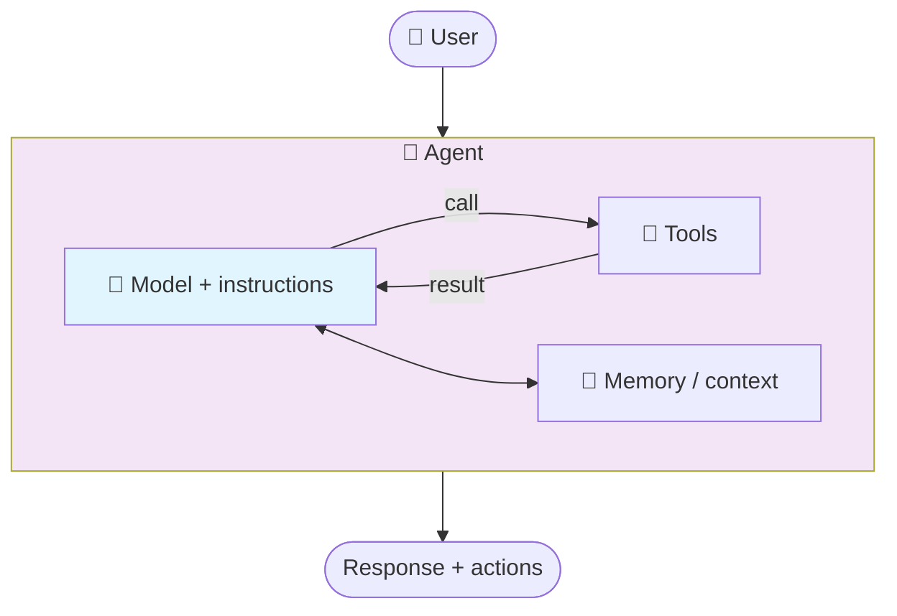
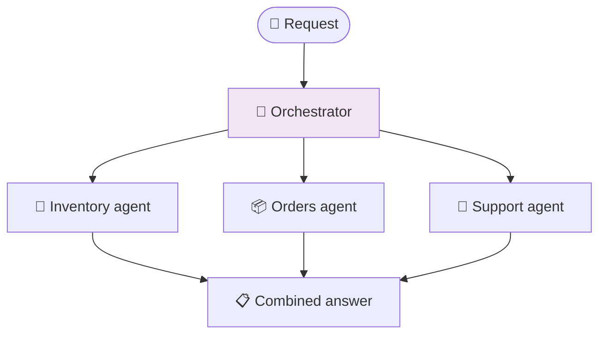

# Part 10: Agent Framework Essentials

> **⏱️ Estimated Time:** 30-45 minutes
>
> **Prerequisites**: Complete [Part 2: Build Chat App](../Part%202%20-%20Build%20Chat%20App/README.md) and [Part 3: Add RAG](../Part%203%20-%20Add%20RAG/README.md). [Part 7: MCP Server Basics](../Part%207%20-%20MCP%20Server%20Basics/README.md) is recommended (the MCP section references it) but not required.

## Overview

So far the workshop has covered *pieces*: a chat loop built on `IChatClient`, retrieval that augments a prompt, and MCP servers that expose callable tools. This part connects those pieces into the abstraction that applications actually use: an **agent**.

This is a short bridge module focused on the mental model. You should leave with a clear answer to three questions:

- What is an agent, in app code?
- Where do my MCP tools fit?
- What does it mean for several agents to work together?

That mental model is what Part 11 needs, where the job is adding AI to an *existing* application rather than building a new one.

## Learning Objectives

By the end of this part, you will:

- ✅ Explain the difference between a chatbot and an agent
- ✅ Describe the core agent building blocks: model, instructions, tools, memory/context, orchestration
- ✅ Map your existing `IChatClient` mental model onto Microsoft Agent Framework's `AIAgent`
- ✅ Explain how MCP servers supply tools that agents consume
- ✅ Describe multi-agent concepts (specialist agents, handoffs, orchestration) at a high level

## Chatbot vs. agent

In Part 2 you wrote a chat loop. You owned the message history, you decided what to send, and you decided what to do with the answer. That is a **chatbot**: it responds.

An **agent** is given an objective and some capabilities, and it decides the intermediate steps itself: which tool to call, what to do with the result, and whether another step is needed before answering.

| Chatbot | Agent |
| --- | --- |
| Responds to a message | Works toward an objective |
| You manage message history | The agent manages a conversation thread |
| You wire up and invoke tools | The agent decides when to call tools |
| You write the orchestration loop | The agent reasons about the next step |

**A chatbot answers. An agent acts.**

This does not make agents strictly better. A single question with a single answer is still a chat completion, and it should stay one. Reach for an agent when the task needs multiple steps, tool use, or context that survives across turns.

## The agent building blocks

Every agent, in every framework, is the same five things:

| Building block | What it is | Where you have already seen it |
| --- | --- | --- |
| **Model** | The reasoning engine | The `IChatClient` from Parts 2-5 |
| **Instructions** | The system prompt that defines role and boundaries | The system message in your chat loop |
| **Tools** | Functions the model may call to act or fetch data | Function calling; the MCP tools in Parts 7-8 |
| **Memory / context** | What the agent knows across turns, plus retrieved knowledge | Chat history; the RAG results from Part 3 |
| **Orchestration** | How steps, and other agents, are sequenced | The loop you wrote by hand in Part 2 |



The framework's job is to own the loop between the model and the tools so you do not hand-write it.

## From `IChatClient` to `AIAgent`

[Microsoft Agent Framework (MAF)](https://learn.microsoft.com/agent-framework/overview/agent-framework-overview) adds one primary abstraction on top of what you already have: `AIAgent`. For example, your provider setup from Part 5 works exactly as it is; you just add one package:

```bash
dotnet add package Microsoft.Agents.AI
```

The following snippets show the shape of the API. You will write a complete working app in the hands-on section below.

Your Part 2 chat call looked like this:

```csharp
var response = await chatClient.GetResponseAsync("Summarize this week's orders.");
Console.WriteLine(response.Text);
```

The agent version wraps the same client:

```csharp
using Microsoft.Agents.AI;
using Microsoft.Extensions.AI;

AIAgent agent = chatClient.AsAIAgent(
    name: "OrdersAssistant",
    instructions: "You help support staff answer questions about customer orders.");

var response = await agent.RunAsync("Summarize this week's orders.");
Console.WriteLine(response.Text);
```

Two lines, and the shape is nearly identical. The difference shows up once you add sessions and tools.

**Memory across turns** becomes a session instead of a `List<ChatMessage>` you maintain yourself:

```csharp
AgentSession session = await agent.CreateSessionAsync();

await agent.RunAsync("My name is Bruno.", session);
var reply = await agent.RunAsync("What's my name?", session);   // remembers "Bruno"
```

**Tools** are ordinary .NET methods, described so the model knows when to use them. This is the same `AIFunctionFactory` pattern as function calling, now owned by the agent:

```csharp
using System.ComponentModel;
using Microsoft.Extensions.AI;

[Description("Get the current status of a customer order by ID")]
static string GetOrderStatus(
    [Description("The order ID, for example ORD-1001")] string orderId)
    => $"Order {orderId} shipped on {DateTime.UtcNow.AddDays(-2):yyyy-MM-dd}.";

AIAgent agent = chatClient.AsAIAgent(
    name: "OrdersAssistant",
    instructions: "You help support staff answer questions about customer orders. Use tools for anything order-specific.",
    tools: [AIFunctionFactory.Create(GetOrderStatus)]);

var response = await agent.RunAsync("What happened to order ORD-1001?");
```

You never call `GetOrderStatus` yourself. The agent decides it is needed, calls it, reads the result, and continues. That call-and-continue loop is what MAF is really giving you.

> [!TIP]
> To try this, start from your Part 2 console app, add the `Microsoft.Agents.AI` package, and replace the body of the chat loop with the agent code above. Your existing Microsoft Foundry configuration works unchanged.

## Where MCP fits

Parts 7 and 8 built MCP servers. Their relationship to agents is simple:

- **MCP is a way to *expose* tools**, over a standard protocol, independently of any one application.
- **An agent is a *consumer* of tools.** It does not care whether a tool is a local C# method or a remote MCP tool.

In Parts 7-8 the consumer happened to be GitHub Copilot. Here the consumer is your own agent. The server does not change.

```csharp
using ModelContextProtocol.Client;
using Microsoft.Extensions.AI;

await using var mcpClient = await McpClient.CreateAsync(clientTransport);
var mcpTools = await mcpClient.ListToolsAsync();

AIAgent agent = chatClient.AsAIAgent(
    name: "OrdersAssistant",
    instructions: "You help support staff answer questions about customer orders.",
    tools: [.. mcpTools]);
```

This is why MCP matters: **the agent uses the app, not the database.** Tools are the safe, reviewed surface your application chooses to expose, so business rules, validation, and authorization stay in your application instead of being re-implemented in a prompt.

## Hands-on: build an agent console app

Time to write code. You will create a standalone console app that uses `AIAgent` with a tool, so you can see the agent decide to call the tool on its own.

### Step 1: Create the project

```bash
mkdir AgentApp && cd AgentApp
dotnet new console
dotnet add package Microsoft.Extensions.AI
dotnet add package Microsoft.Extensions.AI.OpenAI
dotnet add package Azure.AI.OpenAI
dotnet add package Microsoft.Agents.AI
dotnet add package Microsoft.Extensions.Configuration.UserSecrets
dotnet user-secrets init
```

### Step 2: Configure your credentials

Use the same Azure OpenAI credentials from Part 2:

```bash
dotnet user-secrets set "AzureOpenAI:Endpoint" "https://YOUR-RESOURCE.openai.azure.com/"
dotnet user-secrets set "AzureOpenAI:Key" "YOUR-KEY"
```

### Step 3: Write the agent

Replace the contents of `Program.cs` with:

```csharp
using System.ComponentModel;
using Azure;
using Azure.AI.OpenAI;
using Microsoft.Agents.AI;
using Microsoft.Extensions.AI;
using Microsoft.Extensions.Configuration;

// --- Configuration (same pattern as Part 2) ---
var config = new ConfigurationBuilder()
    .AddUserSecrets<Program>()
    .Build();

string endpoint = config["AzureOpenAI:Endpoint"]
    ?? throw new InvalidOperationException(
        "Missing 'AzureOpenAI:Endpoint'. Run: dotnet user-secrets set \"AzureOpenAI:Endpoint\" \"https://YOUR-RESOURCE.openai.azure.com/\"");
string key = config["AzureOpenAI:Key"]
    ?? throw new InvalidOperationException(
        "Missing 'AzureOpenAI:Key'. Run: dotnet user-secrets set \"AzureOpenAI:Key\" \"YOUR-KEY\"");

// --- Create the chat client ---
IChatClient chatClient = new AzureOpenAIClient(
        new Uri(endpoint), new AzureKeyCredential(key))
    .GetChatClient("gpt-4o-mini")
    .AsIChatClient();

// --- Define a tool ---
[Description("Get the current status of a customer order")]
static string GetOrderStatus(
    [Description("The order ID, e.g. ORD-1001")] string orderId)
{
    // In a real app this would call your order service or database
    return orderId switch
    {
        "ORD-1001" => $"Shipped on {DateTime.UtcNow.AddDays(-3):yyyy-MM-dd}, arriving {DateTime.UtcNow.AddDays(3):MMMM d}",
        "ORD-1002" => "Processing, expected to ship tomorrow",
        _ => $"No order found with ID {orderId}"
    };
}

// --- Create the agent with the tool ---
AIAgent agent = chatClient.AsAIAgent(
    name: "OrdersAssistant",
    instructions: """
        You help support staff answer questions about customer orders.
        Use the GetOrderStatus tool when someone asks about a specific order.
        """,
    tools: [AIFunctionFactory.Create(GetOrderStatus)]);

// --- Run a multi-turn conversation ---
AgentSession session = await agent.CreateSessionAsync();

Console.WriteLine("Order Assistant ready. Type 'exit' to quit.\n");

while (true)
{
    Console.Write("You: ");
    string? input = Console.ReadLine();
    if (string.IsNullOrWhiteSpace(input) || input.Equals("exit", StringComparison.OrdinalIgnoreCase))
        break;

    var response = await agent.RunAsync(input, session);
    Console.WriteLine($"Agent: {response.Text}\n");
}
```

### Step 4: Run it

```bash
dotnet run
```

Try these prompts to see the agent use the tool:

```text
You: What's the status of order ORD-1001?
You: How about ORD-1002?
You: When will ORD-1001 arrive?
```

Notice you never call `GetOrderStatus` yourself. The agent sees the question, decides the tool is relevant, calls it, reads the result, and formulates an answer. The thread keeps context across turns, so follow-up questions work without repeating the order ID.

### What you just built

This is the same five building blocks from the earlier section, now running:

| Building block | Where it is in your code |
| --- | --- |
| Model | The `IChatClient` pointing at Azure OpenAI |
| Instructions | The system prompt in `AsAIAgent(...)` |
| Tools | `GetOrderStatus`, wrapped by `AIFunctionFactory` |
| Memory / context | The `AgentSession` that carries conversation history |
| Orchestration | Handled by MAF internally (you wrote no loop) |

## Multiple agents, briefly

One agent with fifty tools becomes unreliable. The model has too many similar-sounding options and too much instruction text to honor at once.

The usual answer is **specialist agents**: several narrowly scoped agents, each with its own instructions and a small tool set, plus some form of coordination between them.



The coordination patterns you will hear about:

| Pattern | What happens | Typical use |
| --- | --- | --- |
| **Sequential** | Each agent's output feeds the next | Draft → review → publish pipelines |
| **Concurrent** | Several agents analyze the same input and results are combined | Independent checks on one request |
| **Handoff** | An agent transfers the conversation to a better-suited agent | Escalation and routing |
| **Group chat** | Agents collaborate in a shared conversation | Iterative refinement |

MAF expresses these as workflows. The API is still evolving, but the shape looks like this (conceptual):

```csharp
// Conceptual — API subject to change
using Microsoft.Agents.AI.Workflows;
using Microsoft.Extensions.AI;

Workflow workflow = AgentWorkflowBuilder.BuildSequential(researcher, writer, editor);
var response = await workflow.AsAIAgent().RunAsync("Draft the release notes.");
```

You do not need to memorize the patterns now. What matters for the next module is the shape: **an orchestrator coordinates specialist agents and combines their findings**, and each specialist is just the single agent you already understand.

## A note on hosted agents

Everything above runs inside your application process, which is the right place to start and the easiest thing to debug. Agents can also run as **hosted agents** in a managed service, which adds autonomous execution, scaling, and persistent state. Treat that as a deployment decision to evaluate later rather than a prerequisite here. See [hosted agents](https://learn.microsoft.com/azure/foundry/agents/concepts/hosted-agents) if you are curious.

## Summary

In this part you learned the agent abstraction that sits on top of everything you have already built:

- ✅ A chatbot responds; an agent pursues an objective and acts
- ✅ An agent is model + instructions + tools + memory/context + orchestration
- ✅ `AIAgent` wraps the same `IChatClient` you configured in Parts 2-5 and owns the tool-calling loop
- ✅ MCP servers expose tools and agents consume them, so the agent uses your app rather than your data store
- ✅ Specialist agents plus an orchestrator are how larger scenarios stay reliable

## What's next

Up to this point the workshop built new applications. The next step is the more common real-world situation: an **existing** application that needs AI added to it, with targeted agents and tools placed where the app already has signals and actions, instead of one large chatbot bolted onto the side. That is [Part 11: Adding AI to an Existing App with eShopLite](../Part%2011%20-%20Adding%20AI%20to%20an%20Existing%20App/README.md).

## Additional resources

- 📖 [Agent Framework overview](https://learn.microsoft.com/agent-framework/overview/agent-framework-overview)
- 🚀 [Agent Framework quick start](https://learn.microsoft.com/agent-framework/tutorials/quick-start)
- 🧠 [What are agents? (.NET)](https://learn.microsoft.com/dotnet/ai/conceptual/agents)
- 🔧 [Agent tools](https://learn.microsoft.com/agent-framework/user-guide/agents/agent-tools)
- 🧭 [Multi-agent orchestrations](https://learn.microsoft.com/agent-framework/user-guide/workflows/orchestrations/overview)
- 🎓 [Generative AI for Beginners .NET - Lesson 4: Agents with MAF](https://github.com/microsoft/Generative-AI-for-beginners-dotnet/tree/main/04-AgentsWithMAF) (more samples and deeper walkthroughs)
- 💻 [Microsoft Agent Framework repo](https://github.com/microsoft/agents) (source, issues, and additional samples)
- 🛒 [eShopLite concurrent agents scenario](https://github.com/Azure-Samples/eShopLite/tree/main/scenarios/07-AgentsConcurrent) (multi-agent example in a real app)

---

📖 **Return to**: [Workshop Overview](../README.md) | 🔄 **Previous**: [Part 9: MCP Publishing](../Part%209%20-%20MCP%20Publishing/README.md) | ➡️ **Next**: [Part 11: Adding AI to an Existing App](../Part%2011%20-%20Adding%20AI%20to%20an%20Existing%20App/README.md)
