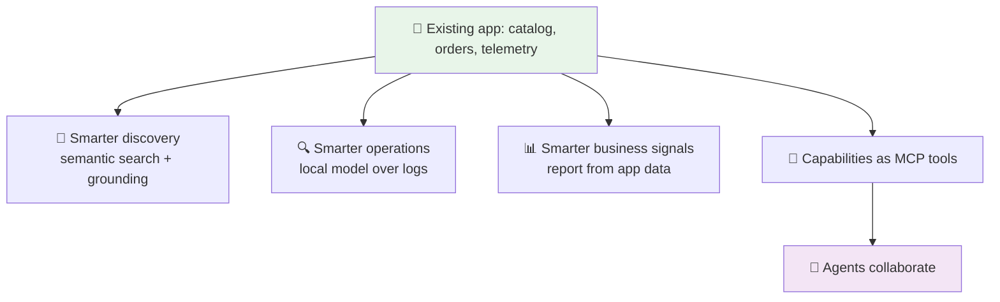
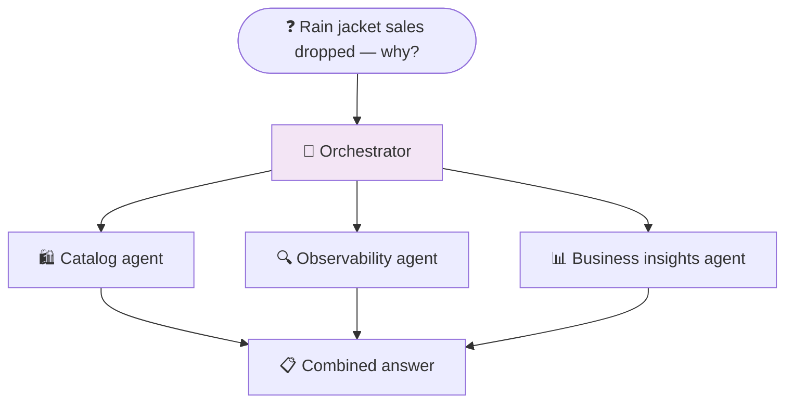

# Part 11: Adding AI to an Existing App with eShopLite

> **⏱️ Estimated Time:** 45-60 minutes
>
> **Prerequisites**: Complete [Part 10: Agent Framework Essentials](../Part%2010%20-%20Agent%20Framework%20Basics/README.md). [Part 3: Add RAG](../Part%203%20-%20Add%20RAG/README.md) and [Part 7: MCP Server Basics](../Part%207%20-%20MCP%20Server%20Basics/README.md) are assumed background.

## Overview

Every earlier part of this workshop built something new: a console chat app, a RAG loop, a template-generated web app, MCP servers, an agent. Real work rarely looks like that. Most teams already have an application in production, and the question is not "how do I build an AI app?" but **"where does AI actually belong in the app I already have?"**

This is the capstone, and it comes in two halves:

- **`StoreApp/` in this folder** is a completed, runnable project you work through hands-on. It is a small existing store application — catalog, search log, operational telemetry — with five targeted AI capabilities added on top of it.
- **[eShopLite](https://github.com/Azure-Samples/eShopLite)** is the maintained, full-size version of the same story: a real e-commerce app with Aspire orchestration and a scenario per capability. Each section below links to the scenario that implements it at production scale.

The point of the unit is the *placement decision*, not one more sample. You already know how to call a model. Here you decide **which places in an existing app are worth making smarter**, and why each one uses a different technique.

> **On terminology:** you may see this material presented elsewhere under an "agentic modernization" banner. This unit is not about .NET upgrades or platform modernization. The prerequisite work — moving to a supported .NET version, adding Aspire, wiring up telemetry, drawing clean service boundaries — is assumed to be done. What follows is what you build *on top of* that foundation.

## Learning Objectives

By the end of this part, you will:

- ✅ Add five targeted AI capabilities to a working store application and run them
- ✅ Explain why targeted AI beats "one big chatbot" bolted onto an existing app
- ✅ Identify the surfaces in a typical enterprise app where AI earns its place
- ✅ Describe the retrieval + score-gate ("honesty gate") pattern for grounded product answers
- ✅ Explain when to use a local model instead of a cloud model, using operations as the example
- ✅ Describe how MCP exposes app capabilities so an agent uses the app, not the database
- ✅ Describe how specialist agents collaborate on a request that spans several domains
- ✅ Position hosted agents as an evaluation and deployment path rather than a starting point

## Why this comes after Part 10

Every technique in this part is something you have already seen in isolation:

| Capability area | Builds on |
| --- | --- |
| Product discovery | Embeddings and semantic search ([Part 3](../Part%203%20-%20Add%20RAG/README.md)) |
| Operations assistant | Provider choice and local models ([Part 5](../Part%205%20-%20Providers%20and%20Fallbacks/README.md)) |
| Business reporting | Grounded prompting over your own data ([Part 2](../Part%202%20-%20Build%20Chat%20App/README.md)) |
| App capabilities as tools | MCP servers ([Part 7](../Part%207%20-%20MCP%20Server%20Basics/README.md)) |
| Agents collaborating | `AIAgent`, specialist agents, orchestration ([Part 10](../Part%2010%20-%20Agent%20Framework%20Basics/README.md)) |

Nothing new is introduced. What is new is the **judgment**: choosing the smallest technique that solves each problem, in an app that already has users, data, and an operations story.

## The capstone story: targeted AI, not one big chatbot

The tempting move is a single assistant on every page that can answer anything. It demos well and ages badly: it has no grounding, no clear owner, no way to evaluate, and no obvious failure mode other than "it made something up."

The alternative is to **add intelligence where the app already has signals or actions**:

- a **signal** is data the app already produces — a catalog, a search log, traces, orders
- an **action** is something the app already knows how to do safely — look up an order, check inventory

Where AI fits in an enterprise app:

| Surface | Question it answers | Technique |
| --- | --- | --- |
| **User experience** | "Do you sell something that solves my problem?" | Semantic search + grounded answers |
| **Observability** | "Why did that request fail?" | Local model over logs and traces |
| **Business operations** | "What should we do about it?" | Reporting over app signals |
| **Integrations** | "How does an assistant use my app safely?" | MCP tools |
| **Workflows** | "Who answers a question that spans domains?" | Collaborating agents |
| **Deployment** | "Where does this run in production?" | Hosted agents (next step) |



Each section below is one beat of that story, paired with the eShopLite scenario that implements it.

---

## 1. Smarter product discovery

**Problem:** keyword search fails the moment a customer describes a need instead of a product. "Something warm for a rainy hike" matches nothing in a catalog full of nouns.

**Technique:** the same retrieval pattern from Part 3, applied to the catalog the app already owns.

1. **Embed the catalog once**, and re-embed only when products change.
2. **Embed the user's intent** per query.
3. **Select the top matches** by vector similarity.
4. **Apply a score threshold.** If nothing clears the bar, return nothing.
5. **Send only the matched products** to the chat model, and instruct it to answer from those products alone.

Step 4 is the one people skip, and it is the one that matters. Call it the **honesty gate**: without it, a model handed a weak match will happily describe a jacket you do not sell. With it, "we do not carry anything like that" is a valid, correct answer.

Step 5 is the other half of the same idea. The model never sees the whole catalog, so it cannot invent from it; it composes an answer from retrieved facts. That combination — retrieve, gate, ground — is what makes discovery safe enough to put in front of customers.

**In this project:** `StoreApp/Ai/ProductDiscovery.cs` (the gate is the `Where(x => x.Score >= relevanceThreshold)` line).

**Try it in eShopLite:**

- [01-SemanticSearch](https://github.com/Azure-Samples/eShopLite/tree/main/scenarios/01-SemanticSearch) — the baseline: semantic search over the existing catalog
- [14-ProductDiscoveryCopilot](https://github.com/Azure-Samples/eShopLite/tree/main/scenarios/14-ProductDiscoveryCopilot) — the capstone expression, with grounded conversational discovery

## 2. Smarter operations

**Problem:** the app already emits structured logs and traces. Finding the one failing dependency in them is still a human skill that takes minutes at the worst possible time.

**Technique:** an observability assistant that reads the telemetry the app already produces and answers questions like "what changed in the last hour?" in plain language.

The interesting decision here is not the prompt, it is **which model runs it**. Operational data is verbose, high-volume, and often sensitive, and the answers need to be reproducible.

| | Customer-facing discovery | Operations assistant |
| --- | --- | --- |
| Model | Cloud (Microsoft Foundry) | Local (Foundry Local / Ollama) |
| Why | Best quality for open-ended language | Data stays local, no per-token cost, deterministic and offline-friendly |
| Input | A handful of retrieved products | Large volumes of logs and traces |

This is the **cloud-for-users, local-for-operations** split, and it is a concrete payoff from Part 5: because provider selection was configuration, running one feature locally and another in the cloud is a wiring change, not a rewrite.

**In this project:** `StoreApp/Ai/OperationsAssistant.cs`, with the provider choice made in `Program.cs`.

**Try it in eShopLite:**

- [13-ObservabilityAssistantFoundryLocal](https://github.com/Azure-Samples/eShopLite/tree/main/scenarios/13-ObservabilityAssistantFoundryLocal)

## 3. Smarter business signals

**Problem:** the app knows things nobody reads. Searches that returned nothing are unmet demand. Repeated searches are trending interest. Operational events are customer impact. All of it sits in a database that a store manager will never query.

**Technique:** turn those existing signals into a periodic report written for a non-operator — what happened, what it probably means, what to consider doing.

Two things keep this honest:

- **The inputs are facts the app already recorded.** The model summarizes and prioritizes; it does not supply the numbers.
- **The output is a recommendation, not an action.** A human decides whether to stock the thing nobody could find.

This is the shortest distance between "we added AI" and "someone outside engineering noticed."

**In this project:** `StoreApp/Ai/StoreIntelligenceReport.cs` — `BuildFacts()` computes, the model only writes.

**Try it in eShopLite:**

- [15-StoreIntelligenceReport](https://github.com/Azure-Samples/eShopLite/tree/main/scenarios/15-StoreIntelligenceReport)

## 4. App capabilities as tools

**Problem:** once an assistant needs live data, the fastest path is to hand it database access. That path gives away every business rule the application enforces.

**Technique:** expose a small set of reviewed capabilities as MCP tools — the servers you built in Parts 7 and 8, now pointed at a real app.

**The agent uses the app, not the database.** A `GetOrderStatus` tool runs your service code, so validation, authorization, pricing rules, and auditing all still apply. A SQL connection bypasses all of it and re-implements your domain inside a prompt.

Practical guidance for a first tool surface:

- **Start read-only.** Lookups and searches before anything that writes.
- **Keep tools narrow and well described.** The description is the model's only documentation.
- **Return grounded data, not prose.** Let the calling model do the wording.
- **Treat the tool list as an API surface.** It gets reviewed, versioned, and tested like one.

**In this project:** `StoreApp/Ai/StoreTools.cs`. Every tool calls a service in `StoreApp/Store/`; nothing touches a data store directly. These are in-process `AIFunction` tools, which is the same shape you would publish over MCP.

**Try it in eShopLite:**

- [16-MCPStoreOperationsTools](https://github.com/Azure-Samples/eShopLite/tree/main/scenarios/16-MCPStoreOperationsTools)

## 5. Agents collaborate

**Problem:** "sales of rain jackets dropped this week — is that demand or a bug?" spans the catalog, the telemetry, and the business data. One agent holding every tool for all three becomes unreliable, exactly as described in Part 10.

**Technique:** specialist agents plus coordination. eShopLite uses three roles that map directly onto the sections above:

| Agent | Owns | Backed by |
| --- | --- | --- |
| **Catalog Agent** | Products and search relevance | Section 1 |
| **Observability Agent** | Health, errors, traces | Section 2 |
| **Business Insights Agent** | Trends, unmet demand, reporting | Section 3 |



The orchestrator routes the parts of the question, each specialist answers only from its own tools, and the findings are combined. Because each agent stays small, each one stays debuggable — and each one is just the single agent you already built in Part 10.

**In this project:** `StoreApp/Ai/StoreAgentNetwork.cs` — the fan-out and synthesis are written out explicitly so you can see there is no magic in them.

**Try it in eShopLite:**

- [17-A2AStoreOperationsNetwork](https://github.com/Azure-Samples/eShopLite/tree/main/scenarios/17-A2AStoreOperationsNetwork)

## 6. Hosted agents: the next step, not the lab

Everything above runs inside the application, which is where it should start: easy to debug, easy to test, no new infrastructure.

**Hosted agents** move an agent into a managed service, which buys you autonomous execution, scaling, and persistent state, and costs you local debuggability and some deployment complexity. That is a real trade to evaluate once a scenario has proven itself locally — not a prerequisite for anything in this unit.

There is no hands-on hosted-agent lab here by design. See [hosted agents](https://learn.microsoft.com/azure/foundry/agents/concepts/hosted-agents) when you are ready to evaluate it.

---

## Hands-on: run the completed project

`StoreApp/` in this folder is the finished application. Read it in the order the sections above introduce the ideas — the code is commented to match.

```text
StoreApp/
├── Store/                      THE EXISTING APP - no AI packages referenced
│   ├── Catalog.cs              products + the keyword search the app always had
│   ├── SearchLog.cs            what customers searched for, and what found nothing
│   └── OperationsLog.cs        the structured logs the app already emits
├── Ai/                         THE ADDITIONS - one file per capability
│   ├── ProductDiscovery.cs     1. semantic search + honesty gate + grounding
│   ├── OperationsAssistant.cs  2. plain-language answers over the logs
│   ├── StoreIntelligenceReport.cs  3. a briefing built from existing signals
│   ├── StoreTools.cs           4. app capabilities exposed as read-only tools
│   └── StoreAgentNetwork.cs    5. three specialists + an orchestrator
└── Program.cs                  wiring and a menu for the five capabilities
```

Delete `Ai/` and you still have a working store. That is the shape you want when you add AI to something real.

### Step 1: Configure and run

The same Microsoft Foundry (Azure OpenAI) credentials you used in Part 2. From this folder:

```bash
cd StoreApp
dotnet user-secrets set "AzureOpenAI:Endpoint" "https://YOUR-RESOURCE.openai.azure.com/"
dotnet user-secrets set "AzureOpenAI:Key" "YOUR-KEY"
dotnet run
```

The app needs a chat deployment (`gpt-4o-mini`) and an embedding deployment (`text-embedding-3-small`). If your deployment names differ, edit the two constants at the top of `Program.cs`.

### Step 2: See why keyword search is not enough (menu option 4)

Option 4 runs the same three queries through both search paths and prints the scores:

```text
Query: "something warm for a rainy hike"
  Keyword search: 0 result(s)
  Semantic search: 0.48  Cascade Rain Shell
  Semantic search: 0.41  Riverbend Fleece Pullover
```

The customer described a *need*; the catalog contains *nouns*. Then watch the last query:

```text
Query: "scuba tank"
  Keyword search: 0 result(s)
  Semantic search: 0 results above the relevance threshold (honesty gate held)
```

Vector search always returns *something* — the nearest neighbours exist no matter how bad they are. The threshold is what turns "here is the closest thing I have" into "we do not carry that." Try lowering `relevanceThreshold` in `Program.cs` to `0.0f` and running option 1 with "scuba tank" to see what the gate was protecting you from.

### Step 3: Discovery, grounded (menu option 1)

Ask for what you need rather than what you want:

```text
Customer: something warm for a rainy hike
Customer: how do I carry water on a long walk
Customer: scuba tank
```

The third one never reaches the model. When retrieval returns nothing, there is nothing to ground an answer in, so the app answers itself. That is a deliberate design choice, not a limitation.

### Step 4: Operations, locally (menu option 2)

```text
Operator: what is failing right now and who is affected?
```

The seeded log contains a payment gateway degrading into timeouts, failing three orders, and finally opening a circuit breaker. The assistant should name the dependency, cite trace IDs, and describe the customer impact.

To run this feature against a local model while discovery stays on the cloud — the **cloud-for-users, local-for-operations** split — add either of these and restart:

```bash
# Ollama
dotnet user-secrets set "LocalModel:Endpoint" "http://localhost:11434/v1"
dotnet user-secrets set "LocalModel:Model" "llama3.2"

# Foundry Local
dotnet user-secrets set "LocalModel:Endpoint" "http://localhost:5273/v1"
dotnet user-secrets set "LocalModel:Model" "phi-4-mini"
```

Nothing in `OperationsAssistant.cs` changes. That is the Part 5 provider abstraction paying off in a scenario that actually motivates it: log data never leaves the machine, and there is no per-token cost for reading telemetry.

### Step 5: Business signals (menu option 3)

Option 3 prints the facts the app computed *first*, then the briefing the model wrote from them. Compare the two. Every number in the briefing should appear in the facts above it; if one does not, the prompt is not constraining the model tightly enough.

Notice that the searches you typed in step 3 are already in the report. The AI-powered search kept writing to the same `SearchLog` the app always had, so a query that found nothing became a demand signal without any new instrumentation.

### Step 6: Agents collaborating (menu option 5)

```text
Ops lead: Rain shells are selling badly this week. Is that demand or a bug?
```

Each specialist prints as it reports, then the orchestrator synthesizes. Watch what each one *refuses* to answer: the catalog agent has no access to logs, and the observability agent has no access to demand data. That narrowness is what keeps each agent reliable, and it is why the orchestrator exists.

> [!TIP]
> Try asking something only one specialist can answer, such as "what is running low?". The other two should say it is outside their area, and the orchestrator should not invent agreement between them.

### Optional: check your understanding

- Move the honesty gate *after* the model call instead of before it. What breaks, and why is "no model call at all" the better design?
- Add a `GetOrderStatus` tool to `StoreTools.cs` backed by a new service in `Store/`. Notice that you never had to give the agent a connection string.
- Point the orchestrator at only two of the three specialists. Does the synthesis still admit what it does not know?

`StoreApp/` is deliberately small: one console app, no containers, everything visible in a single read. eShopLite is the same ideas at production scale — real services, Aspire orchestration, and a UI. It is actively maintained and each scenario has its own README with current prerequisites and run steps, so rather than duplicating those here — where they would go stale — use them directly:

1. Clone [Azure-Samples/eShopLite](https://github.com/Azure-Samples/eShopLite).
2. Pick the scenario for the capability area you want, from the table below.
3. Follow that scenario's README for setup and run instructions.

| Capability area | Scenario |
| --- | --- |
| Search foundation | [01-SemanticSearch](https://github.com/Azure-Samples/eShopLite/tree/main/scenarios/01-SemanticSearch) |
| Product discovery | [14-ProductDiscoveryCopilot](https://github.com/Azure-Samples/eShopLite/tree/main/scenarios/14-ProductDiscoveryCopilot) |
| Observability assistant | [13-ObservabilityAssistantFoundryLocal](https://github.com/Azure-Samples/eShopLite/tree/main/scenarios/13-ObservabilityAssistantFoundryLocal) |
| Store intelligence report | [15-StoreIntelligenceReport](https://github.com/Azure-Samples/eShopLite/tree/main/scenarios/15-StoreIntelligenceReport) |
| MCP store tools | [16-MCPStoreOperationsTools](https://github.com/Azure-Samples/eShopLite/tree/main/scenarios/16-MCPStoreOperationsTools) |
| Agent collaboration | [17-A2AStoreOperationsNetwork](https://github.com/Azure-Samples/eShopLite/tree/main/scenarios/17-A2AStoreOperationsNetwork) |

> [!TIP]
> If you are running this unit as a timed instructor-led session, demo scenarios 14 and 13 and discuss the rest. The contrast between a cloud-backed customer experience and a local-model operations assistant is the moment that lands.

**Taught here:** which surfaces are worth making smarter, why each one uses a different technique, how the earlier parts of the workshop combine into an existing-app story, and a small end-to-end implementation you can read in one sitting.

**Explore in eShopLite:** the working code, the Aspire wiring, the deployment details, and the scenario-specific architecture docs. A [supporting session package](https://github.com/Azure-Samples/eShopLite/tree/main/docs/26%2006%2016%20NET%20Agentic%20Modernization) with slides and demo notes is also maintained there.

## Summary

- ✅ The foundation — supported .NET, Aspire, telemetry, clean service boundaries — is the prerequisite, not the AI work
- ✅ Targeted AI beats one big chatbot: add intelligence where the app already has signals or actions
- ✅ Grounded discovery is retrieve → **gate on score** → answer only from matches
- ✅ Cloud models for customer language, local models for operational data
- ✅ Existing app signals become business insight with no new data collection
- ✅ MCP keeps the agent on your app's rules instead of your database
- ✅ Specialist agents plus an orchestrator handle questions that cross domains
- ✅ Hosted agents are a deployment path to evaluate after a scenario proves itself locally
- ✅ The additions stay additive: delete `Ai/` from the sample and the store still works

## What's next

You now have the full arc: build a chat app, ground it, choose a provider, expose tools, compose agents, and place all of it into an application that already exists. Next, run one of the eShopLite scenarios end to end to see these patterns at production scale — then pick the single highest-value surface in **your** application and add exactly one of these capabilities to it.

## Additional resources

- 🛒 [eShopLite repository](https://github.com/Azure-Samples/eShopLite)
- 📚 [eShopLite scenarios](https://github.com/Azure-Samples/eShopLite/tree/main/scenarios)
- 🧠 [What are agents? (.NET)](https://learn.microsoft.com/dotnet/ai/conceptual/agents)
- 🔧 [Model Context Protocol](https://modelcontextprotocol.io/)
- 🖥️ [Foundry Local](https://learn.microsoft.com/azure/ai-foundry/foundry-local/what-is-foundry-local)
- ☁️ [Hosted agents](https://learn.microsoft.com/azure/foundry/agents/concepts/hosted-agents)
- 📈 [Aspire dashboard and telemetry](https://learn.microsoft.com/dotnet/aspire/fundamentals/dashboard/overview)

---

📖 **Return to**: [Workshop Overview](../README.md) | 🔄 **Previous**: [Part 10: Agent Framework Essentials](../Part%2010%20-%20Agent%20Framework%20Basics/README.md)
