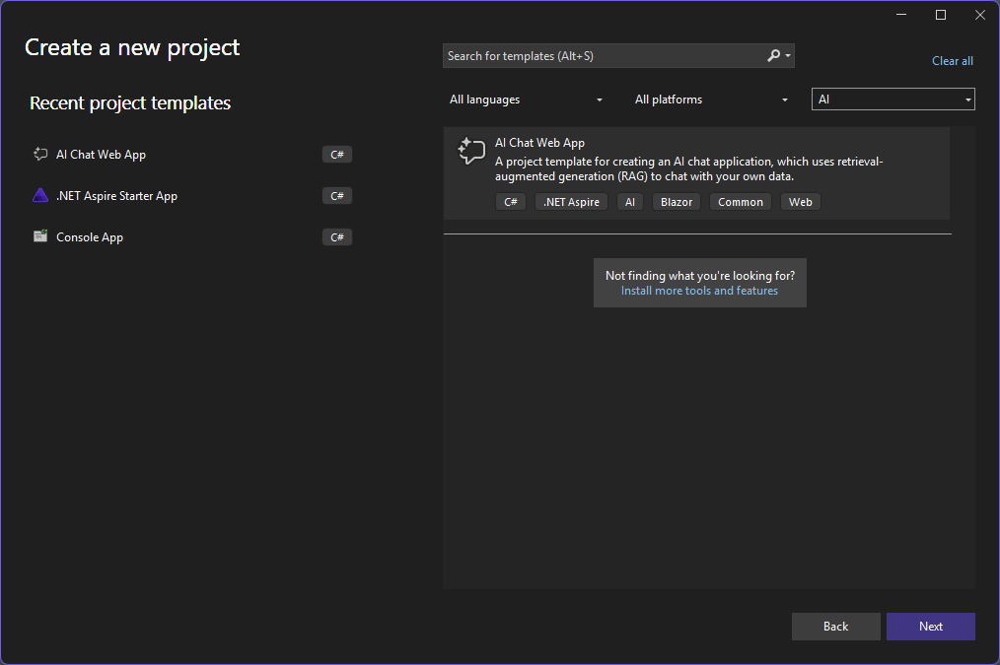
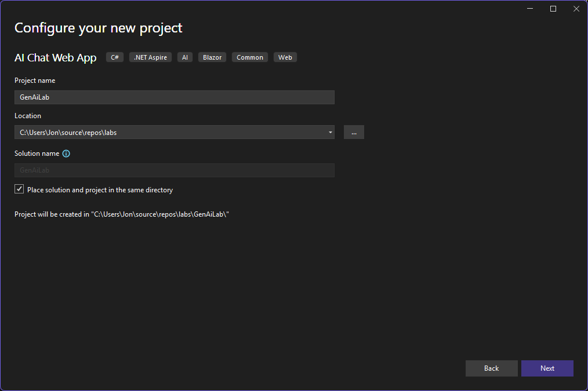
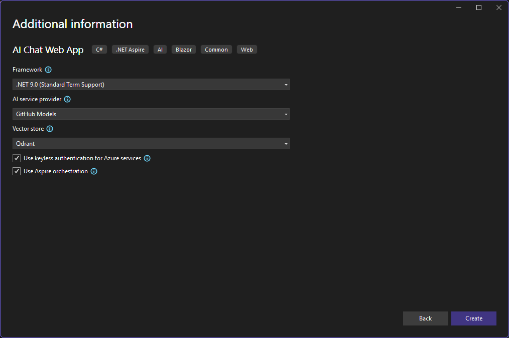

# Create a new project using the AI Web Chat template

> **⏱️ Estimated Time:** 30-45 minutes

## In this workshop

In this workshop, you'll create a new project using the AI Web Chat template in Visual Studio. You'll configure GitHub Models as the AI service provider, set up the connection string, and run and explore the application.

## Create the project using Visual Studio

Create a new project using the AI Web Chat template as follows:

1. Open Visual Studio 2022
1. Click "Create a new project"
1. Search for and select "AI Chat Web App" template

   

1. Click "Next"
1. Configure your project:
   - Enter "GenAiLab" as the project name
   - Choose a location for your project
   - Make sure "Place solution and project in same directory" is checked
   - Click "Next"

   

1. Configure AI options:
   - Select "GitHub Models" for AI service provider
   - Select "Qdrant" for Vector store
   - Check the box for "Use keyless authentication for Azure services"
   - Check the box for "Use Aspire orchestration"
   - Click "Create"

   > **Alternative: Ollama Option**: If you're using the Ollama development container (see [Development Container Options](../.github/.devcontainer/README.md)), you can select "Ollama" as the AI service provider instead of "GitHub Models". This allows you to work with local AI models without requiring a GitHub account or internet connection.

   

1. Wait for Visual Studio to create the project and restore packages. When you see the Sign in popup, just close it.

## Alternative: Create the project using the .NET CLI

If you prefer to use the command line, you can create the same project using the .NET CLI:

1. First, ensure you have the AI Chat Web App template installed:

   ```powershell
   dotnet new install Microsoft.Extensions.AI.Templates
   ```

2. Navigate to the directory where you want to create your project:

   ```powershell
   cd "C:\your\desired\path"
   ```

3. Create the project using the `dotnet new` command with the appropriate parameters:

   ```powershell
   dotnet new aichatweb --name GenAiLab --Framework net9.0 --provider githubmodels --vector-store qdrant --aspire true
   ```

   This command creates a new AI Chat Web App with:
   - Project name: `GenAiLab`
   - Framework: `.NET 9.0`
   - AI service provider: `GitHub Models`
   - Vector store: `Qdrant`
   - .NET Aspire orchestration: `enabled`

   > **Alternative: Ollama Option**: If you're using the Ollama development container, you can replace `--provider githubmodels` with `--provider ollama` to use local AI models instead.

4. Navigate into the project directory:

   ```powershell
   cd GenAiLab
   ```

   > **Note for automation**: The `dotnet new aichatweb` command creates a solution structure with multiple projects. If you need to move the generated files to a specific directory structure (like `/src/start`), you may need to reorganize the files after creation.

5. Open the project in your preferred editor:

   ```powershell
   code .  # For Visual Studio Code
   # or
   start GenAiLab.sln  # For Visual Studio
   ```

## Set the GitHub Models connection string

For GitHub Models to work, you need to set up a connection string with a GitHub token:

> **Note:** This step requires a GitHub account. If you don't have one yet, please follow the instructions in [Part 1: Setup](../Part%201%20-%20Setup/README.md#step-2-create-a-github-account-if-needed) to create a GitHub account.

1. Create a GitHub token for accessing GitHub Models:
   - Go to [https://github.com/settings/tokens](https://github.com/settings/tokens)
   - Click "Generate new token (classic)"
   - Give the token a description like "AI Models Access"
   - Click "Generate token"
   - Copy the generated token (you won't be able to see it again)

   > **Note**: We're using classic tokens for simplicity. If you prefer fine-grained tokens, you'll need to specify the `models:read` scope. See the [GitHub Models announcement](https://github.blog/changelog/2025-05-15-modelsread-now-required-for-github-models-access/) for more details.

1. In the Solution Explorer, right-click on the `GenAiLab.AppHost` project and select "Manage User Secrets"

1. In the `secrets.json` file that opens, add the following connection string:

   ```json
   {
     "ConnectionStrings:openai": "Endpoint=https://models.github.ai;Key=YOUR-API-KEY"
   }
   ```

   Replace `YOUR-GITHUB-TOKEN` with the GitHub token you created in step 1.

1. Save the `secrets.json` file.

   > **Note:** GitHub Models now use the endpoint `models.github.ai`. While the previous endpoint `models.inference.ai.azure.com` is [still supported until October 2025](https://github.blog/changelog/2025-07-17-deprecation-of-azure-endpoint-for-github-models/), it's best to use the new endpoint now.

## Run the application

Now let's run the application and explore its features:

1. Make sure that Docker Desktop is running. This is required to run containerized resources like Qdrant.

1. Make sure the `GenAiLab.AppHost` project is set as the startup project.

1. Press F5 or click the "Start Debugging" button in Visual Studio.

   > **Note:** When running the application for the first time, Visual Studio may display a prompt asking you to trust the IIS Developer certificate. This prompt sometimes appears beneath the browser window. If the `aichatweb-app` resource doesn't start, check for this certificate prompt and click "Yes" to accept it. The application won't run until you've accepted this certificate.

1. The .NET Aspire dashboard will open in your browser first, displaying all the services in your application.

1. Shortly after, the web application will launch in another browser tab.

## Review the services in the .NET Aspire dashboard

Explore the .NET Aspire dashboard to understand the architecture of your application:

1. You'll see several services running:
   - `aichatweb-app`: The main web application
   - `vectordb`: The Qdrant vector database service
   - `ingestionCache`: SQLite database for caching ingestion state

1. Click on each service to see more details:
   - Explore the endpoints tab to see service URLs
   - Check the logs tab to monitor service activity
   - View the environment variables to understand service configuration

1. Notice how .NET Aspire orchestrates all these services together, making it easy to develop distributed applications.

## Test the application

Let's test the AI functionality of the application:

1. Launch the *aiwebchat-app* by clicking on the hyperlinked URL listed in the Endpoints column in the .NET Aspire dashboard. You should see the web app launch in a seprate tab with a chat interface.

1. Type a message like "What PDF documents do you have information about?" and press Enter.

1. The AI will respond with information about the PDF documents that have been ingested.

1. Ask another question like "Tell me about survival kits" and observe how the AI uses information from the ingested documents to provide a response.

1. Notice how the chat history is maintained and displayed on the left sidebar.

## What You've Learned

- How to create a new project using the AI Web Chat template in Visual Studio
- How to configure GitHub Models as the AI service provider
- How to set up the connection string for AI services
- How to use .NET Aspire to orchestrate multiple services
- How to interact with an AI-powered chat application

## Troubleshooting

### Common Issues and Solutions

#### Issue: Certificate Trust Prompt

**Problem**: Application doesn't start, appears to hang during launch.

**Solution**: Look for the IIS Developer certificate trust prompt (may be hidden behind the browser). Click "Yes" to accept the certificate.

#### Issue: Build Errors After Template Creation

**Problem**: Build fails with static asset conflicts or package restore issues.

**Solution**:

```powershell
dotnet clean
dotnet restore
dotnet build
```

#### Issue: GitHub Models Connection Fails

**Problem**: Authentication errors or "unauthorized" messages when testing chat.

**Solution**:

1. Verify your GitHub token has the correct permissions
2. Check that the token is correctly placed in `secrets.json`
3. Ensure the connection string format is correct: `"Endpoint=https://models.github.ai;Key=YOUR_TOKEN"`

#### Issue: Template Not Found

**Problem**: Can't find the AI Web Chat template in Visual Studio.

**Solution**:

1. Verify the template is installed: `dotnet new list | Select-String aichatweb`
2. If not found, install it: `dotnet new install Microsoft.Extensions.AI.Templates`
3. Restart Visual Studio after template installation

## Next Steps

Now that you've created and run your AI Web Chat application, proceed to [Explore the Template Code](../Part%203%20-%20Template%20Exploration/README.md) to understand the underlying architecture and code structure of the application.
