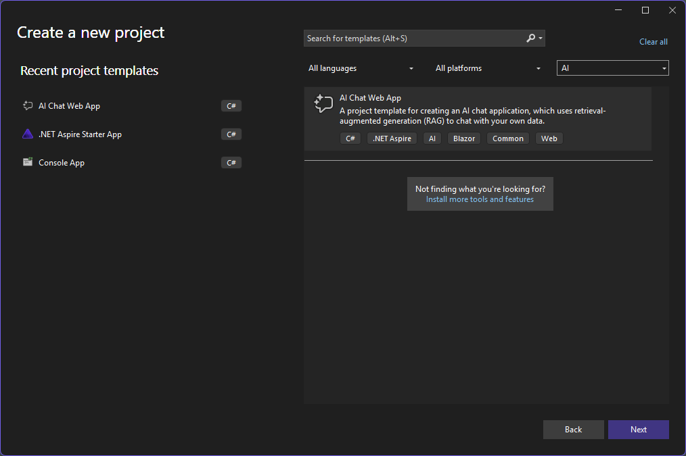
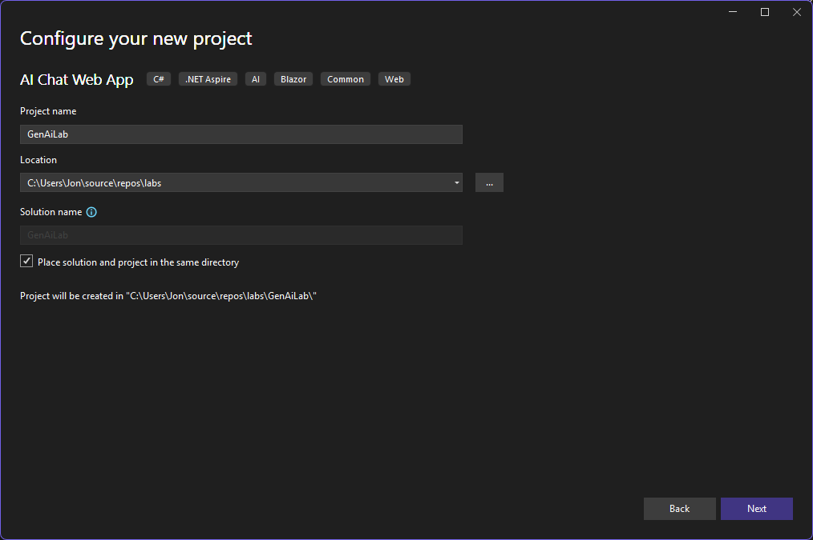
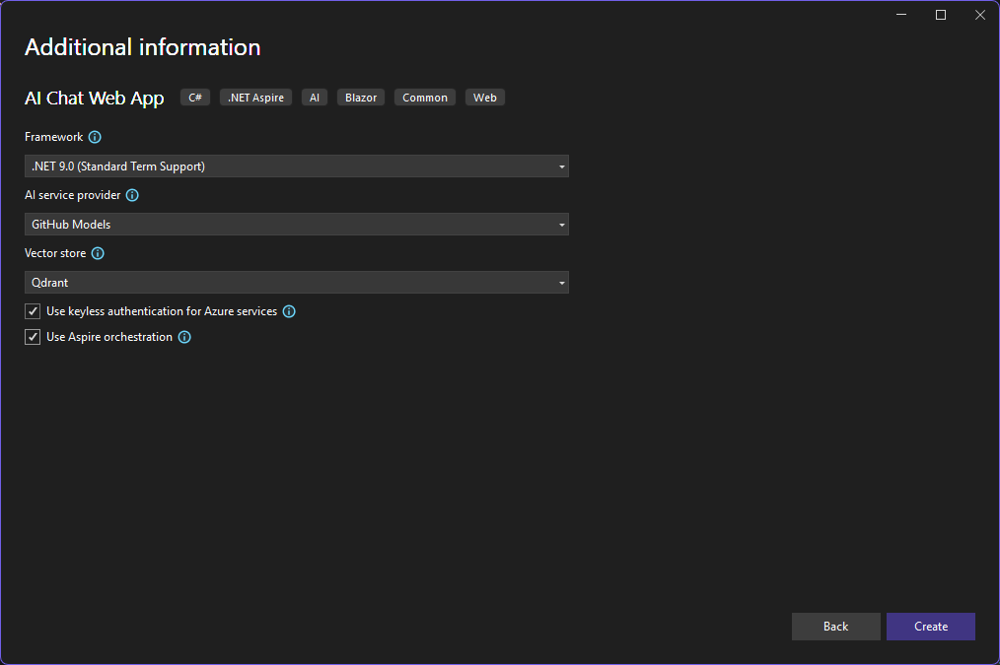
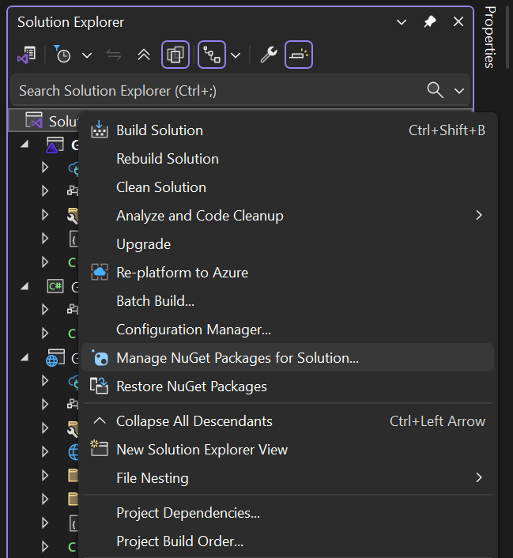
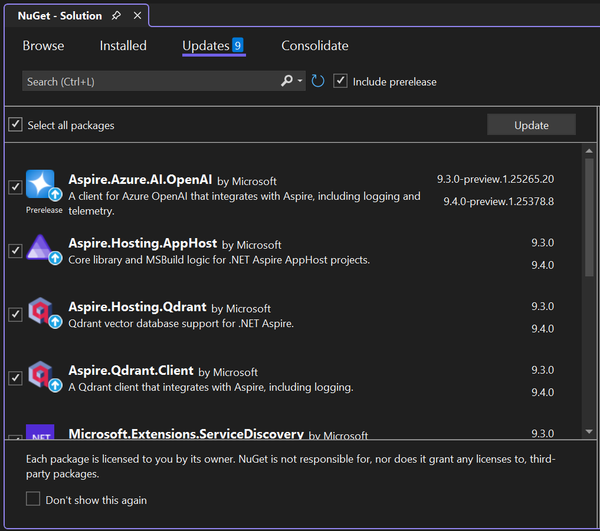
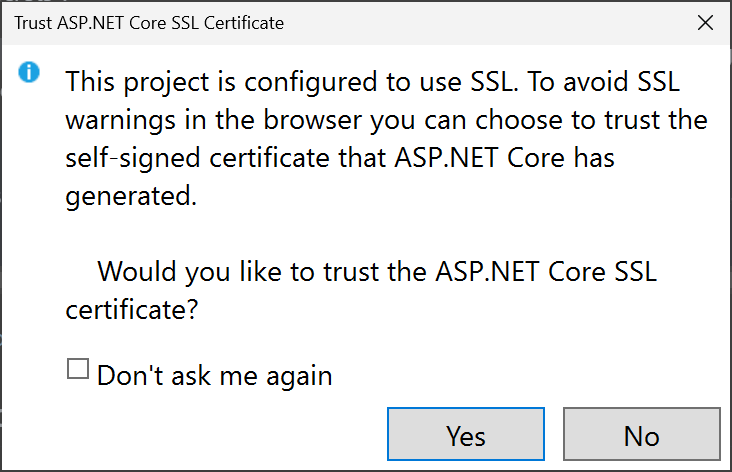
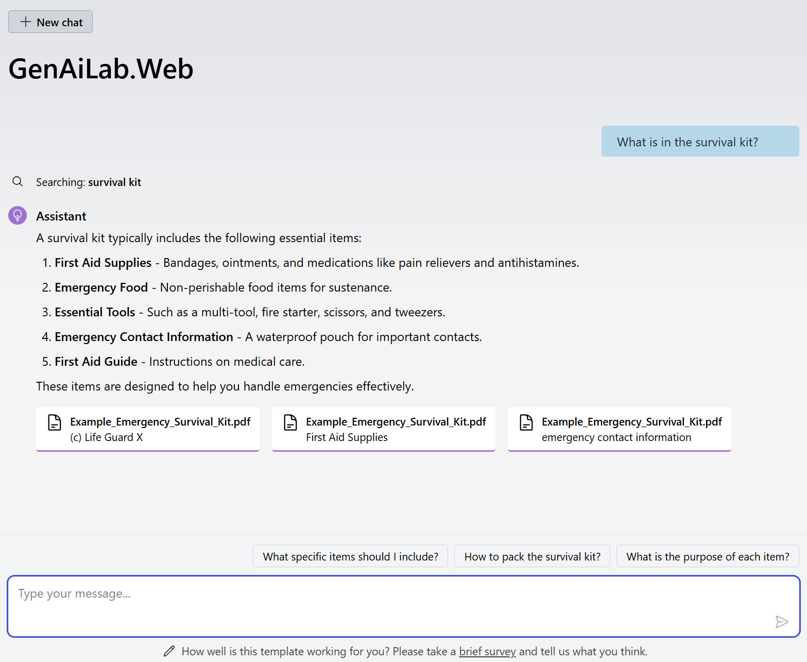

# Create a new project using the AI Web Chat template

> **⏱️ Estimated Time:** 35-50 minutes

## In this workshop

In this workshop, you'll create a new project using the AI Web Chat template in Visual Studio. You'll configure Azure AI Foundry (Azure OpenAI) as the AI service provider, set up the connection string, and run and explore the application.

## Create the project using Visual Studio

Create a new project using the AI Web Chat template as follows:

1. Open Visual Studio 2022
1. Click "Create a new project"
1. Search for and select "AI Chat Web App" template

   

1. Click "Next"
1. Configure your project:
   - Enter "GenAiLab" as the project name
   - Choose a location for your project
   - Make sure "Place solution and project in same directory" is checked
   - Click "Next"

   

1. Configure AI options:
   - Select "Azure OpenAI" for AI service provider
   - Select "Qdrant" for Vector store
   - Check the box for "Use keyless authentication for Azure services"
   - Check the box for "Use Aspire orchestration"
   - Click "Create"

   > **Alternative: Ollama Option**: If you're using the Ollama development container (see [Development Container Options](../.github/.devcontainer/README.md)), you can select "Ollama" as the AI service provider instead of "Azure OpenAI". This allows you to work with local AI models without requiring an Azure or GitHub account or internet connection.
   >
   > **Legacy: GitHub Models**: GitHub Models is being [retired on July 30, 2026](https://github.blog/changelog/2026-07-01-github-models-is-being-fully-retired-on-july-30-2026/). You can still select "GitHub Models" as a temporary fallback, but Azure AI Foundry is the recommended provider.

   

1. Wait for Visual Studio to create the project and restore packages. When you see the Sign in popup, just close it.

## Alternative: Create the project using the .NET CLI

If you prefer to use the command line, you can create the same project using the .NET CLI:

1. First, ensure you have the AI Chat Web App template installed:

   ```powershell
   dotnet new install Microsoft.Extensions.AI.Templates
   ```

2. Navigate to the directory where you want to create your project:

   ```powershell
   cd "C:\your\desired\path"
   ```

3. Create the project using the `dotnet new` command with the appropriate parameters:

   ```powershell
   dotnet new aichatweb --name GenAiLab --Framework net9.0 --provider azureopenai --vector-store qdrant --aspire true
   ```

   This command creates a new AI Chat Web App with:
   - Project name: `GenAiLab`
   - Framework: `.NET 9.0`
   - AI service provider: `Azure OpenAI (Azure AI Foundry)`
   - Vector store: `Qdrant`
   - .NET Aspire orchestration: `enabled`

   > **Alternative: Ollama Option**: If you're using the Ollama development container, you can replace `--provider azureopenai` with `--provider ollama` to use local AI models instead. GitHub Models (`--provider githubmodels`) remains available as a legacy fallback until its [retirement on July 30, 2026](https://github.blog/changelog/2026-07-01-github-models-is-being-fully-retired-on-july-30-2026/).

4. Navigate into the project directory:

   ```powershell
   cd GenAiLab
   ```

   > **Note for automation**: The `dotnet new aichatweb` command creates a solution structure with multiple projects. If you need to move the generated files to a specific directory structure (like `/src/start`), you may need to reorganize the files after creation.

5. Open the project in your preferred editor:

   ```powershell
   code .  # For Visual Studio Code
   # or
   start GenAiLab.sln  # For Visual Studio
   ```

## Update NuGet packages

Due to recent updates in .NET Aspire 9.4 and dependency changes in AI packages, you need to update all NuGet packages in the solution to their latest versions (including prerelease packages) before running the application:

### Using Visual Studio

1. In the Solution Explorer, right-click on the solution file (`GenAiLab.sln`) and select "Manage NuGet Packages for Solution..."

   

1. In the NuGet Package Manager, click on the "Updates" tab

1. Check the "Include prerelease" checkbox to include preview versions of AI packages

1. Click "Update All" to update all packages to their latest versions

   

1. Review and accept any license agreements that appear

1. Wait for all packages to be updated and restored

### Using the .NET CLI

If you prefer to use the command line, you can update all packages using the `dotnet outdated` tool:

1. First, install the `dotnet outdated` global tool if you haven't already:

   ```powershell
   dotnet tool install --global dotnet-outdated-tool
   ```

2. Navigate to the solution directory (if not already there):

   ```powershell
   cd GenAiLab
   ```

3. Update all packages in the solution, including prerelease versions:

   ```powershell
   dotnet outdated GenAiLab.sln --upgrade --pre-release Always
   ```

4. After the update completes, restore and build the solution to ensure everything is working:

   ```powershell
   dotnet restore
   dotnet build
   ```

## Set the Azure AI Foundry connection string

Your application uses **Azure AI Foundry** (Azure OpenAI models) as its AI provider. You'll need an Azure OpenAI resource with the `gpt-4o-mini` (chat) and `text-embedding-3-small` (embeddings) models deployed.

> **Note:** The detailed steps to create an Azure OpenAI resource and deploy these two models are covered in [Part 4: Azure AI Foundry](../Part%204%20-%20Azure%20OpenAI/README.md#create-the-azure-openai-resource). If your instructor provided a pre-provisioned resource, use the endpoint and key they gave you.

1. Deploy (or obtain access to) an Azure OpenAI resource with:
   - `gpt-4o-mini` deployed for chat completions
   - `text-embedding-3-small` deployed for embeddings

1. Copy your resource **endpoint** (it looks like `https://YOUR_RESOURCE_NAME.openai.azure.com/`) and an **API key**.

1. In the Solution Explorer, right-click on the `GenAiLab.AppHost` project and select "Manage User Secrets".

1. In the `secrets.json` file that opens, add the following connection string:

   ```json
   {
      "ConnectionStrings:openai": "Endpoint=https://YOUR_RESOURCE_NAME.openai.azure.com/;Key=YOUR_API_KEY"
   }
   ```

   Replace `YOUR_RESOURCE_NAME` and `YOUR_API_KEY` with your Azure OpenAI resource values.

1. Save the `secrets.json` file.

<details>
<summary><strong>Legacy fallback: GitHub Models</strong> (retiring July 30, 2026)</summary>

> [!WARNING]
> GitHub Models is being [fully retired on July 30, 2026](https://github.blog/changelog/2026-07-01-github-models-is-being-fully-retired-on-july-30-2026/), with scheduled brownouts on July 16 and July 23. Use it only if you don't yet have Azure access, and expect it to stop working after retirement.

If you need to use GitHub Models as a temporary fallback (and created the project with `--provider githubmodels`):

1. Create a GitHub token for accessing GitHub Models:
   - Go to [https://github.com/settings/personal-access-tokens/new](https://github.com/settings/personal-access-tokens/new)
   - Click "Generate new token" (fine-grained token)
   - Enter a name for the token, such as "AI Models Access"
   - Under **Permissions**, set **Models** to **Access: Read-only**
   - Click "Generate token" at the bottom of the page
   - Copy the generated token (you won't be able to see it again)

1. In the `GenAiLab.AppHost` user secrets, add this connection string instead:

   ```json
   {
      "ConnectionStrings:openai": "Endpoint=https://models.inference.ai.azure.com;Key=YOUR-GITHUB-TOKEN"
   }
   ```

   Replace `YOUR-GITHUB-TOKEN` with the token you created.

</details>

## Run the application

Now let's run the application and explore its features:

1. Make sure that Docker Desktop is running. This is required to run containerized resources like Qdrant.

1. Make sure the `GenAiLab.AppHost` project is set as the startup project.

1. Press F5 or click the "Start Debugging" button in Visual Studio.

   > **Note:** When running the application for the first time, Visual Studio may display a prompt asking you to trust the IIS Developer certificate. This prompt sometimes appears beneath the browser window. If the `aichatweb-app` resource doesn't start, check for this certificate prompt and click "Yes" to accept it. The application won't run until you've accepted this certificate.

   

1. The .NET Aspire dashboard will open in your browser first, displaying all the services in your application.

1. Shortly after, the web application will launch in another browser tab.

> If you run into issues running the Qdrant container, stop debugging and start it again.

## Review the services in the .NET Aspire dashboard

Explore the .NET Aspire dashboard to understand the architecture of your application:

1. You'll see several services running:
   - `aichatweb-app`: The main web application
   - `vectordb`: The Qdrant vector database service

1. Click on each service to see more details:
   - Explore the endpoints tab to see service URLs
   - Check the logs tab to monitor service activity
   - View the environment variables to understand service configuration

1. Notice how .NET Aspire orchestrates all these services together, making it easy to develop distributed applications.

## Test the application

Let's test the AI functionality of the application:

1. Launch the *aiwebchat-app* by clicking on the hyperlinked URL listed in the Endpoints column in the .NET Aspire dashboard. You should see the web app launch in a seprate tab with a chat interface.

   

1. Type a message like "What PDF documents do you have information about?" and press Enter.

1. The AI will respond with information about the PDF documents that have been ingested.

1. Ask another question like "Tell me about survival kits" and observe how the AI uses information from the ingested documents to provide a response.

1. Notice how the chat history is maintained and displayed on the left sidebar.

## What You've Learned

- How to create a new project using the AI Web Chat template in Visual Studio
- How to update NuGet packages in a solution to get the latest AI and Aspire components
- How to configure Azure AI Foundry (Azure OpenAI) as the AI service provider
- How to set up the connection string for AI services
- How to use .NET Aspire to orchestrate multiple services
- How to interact with an AI-powered chat application

## Troubleshooting

### Common Issues and Solutions

#### Issue: Certificate Trust Prompt

**Problem**: Application doesn't start, appears to hang during launch.

**Solution**: Look for the IIS Developer certificate trust prompt (may be hidden behind the browser). Click "Yes" to accept the certificate.

**Alternative Solution**: If the certificate dialog has been dismissed or doesn't show, you can manually trust the development certificate using the .NET CLI:

```powershell
dotnet dev-certs https --trust
```

This command will regenerate and trust the ASP.NET Core HTTPS development certificate. For more information, see [Trust the ASP.NET Core HTTPS development certificate](https://learn.microsoft.com/aspnet/core/security/enforcing-ssl#trust-the-aspnet-core-https-development-certificate).

#### Issue: Build Errors After Template Creation

**Problem**: Build fails with static asset conflicts or package restore issues.

**Solution**:

```powershell
dotnet clean
dotnet restore
dotnet build
```

#### Issue: Azure OpenAI Connection Fails

**Problem**: Authentication errors or "unauthorized" messages when testing chat.

**Solution**:

1. Verify your Azure OpenAI (Azure AI Foundry) resource has `gpt-4o-mini` and `text-embedding-3-small` deployed
2. Check that the endpoint and key are correctly placed in `secrets.json`
3. Ensure the connection string format is correct: `"Endpoint=https://YOUR_RESOURCE_NAME.openai.azure.com/;Key=YOUR_API_KEY"`

#### Issue: Template Not Found

**Problem**: Can't find the AI Web Chat template in Visual Studio.

**Solution**:

1. Verify the template is installed: `dotnet new list | Select-String aichatweb`
2. If not found, install it: `dotnet new install Microsoft.Extensions.AI.Templates`
3. Restart Visual Studio after template installation

## 🎯 Next Steps

Excellent work! Your AI application is running successfully. Time to dive deeper into the code!

**Continue to** → [Part 3: Explore the Template Code](../Part%203%20-%20Template%20Exploration/README.md)

In Part 3, you'll learn how to:

- 🏗️ Understand the application architecture and structure
- 🔍 Explore the AI integration patterns
- 📊 Learn about vector database usage
- 🧩 Discover how components work together
