# Explore the Template Code

> **⏱️ Estimated Time:** 30-40 minutes

## In this workshop

In this workshop, you'll explore the code structure of the AI Web Chat template. You'll learn about the different services configured in the .NET Aspire AppHost, understand the application configuration in the Web project, explore how `IChatClient` is configured and used, and dive into Microsoft Extensions for Vector Data.

## Architecture Overview

Before diving into the code, let's visualize how the different components work together:


This diagram shows how .NET Aspire orchestrates the web application and its dependencies, with the web app coordinating data ingestion and semantic search using Azure OpenAI and Qdrant.

## Services in .NET Aspire AppHost Program.cs

Let's start by examining the [`AppHost.cs`](../Part%202%20-%20Project%20Creation/GenAiLab/GenAiLab.AppHost/AppHost.cs) file in the `GenAiLab.AppHost` project:

```csharp
var builder = DistributedApplication.CreateBuilder(args);

// You will need to set the connection string to your own value
// You can do this using Visual Studio's "Manage User Secrets" UI, or on the command line:
//   cd this-project-directory
//   dotnet user-secrets set ConnectionStrings:openai "Endpoint=https://models.inference.ai.azure.com;Key=YOUR-API-KEY"
var openai = builder.AddConnectionString("openai");

var vectorDB = builder.AddQdrant("vectordb")
    .WithDataVolume()
    .WithLifetime(ContainerLifetime.Persistent);

var webApp = builder.AddProject<Projects.GenAiLab_Web>("aichatweb-app");
webApp.WithReference(openai);
webApp
    .WithReference(vectorDB)
    .WaitFor(vectorDB);

builder.Build().Run();
```

Key components in the AppHost:

1. **OpenAI Connection**: Added as a connection string reference that will be passed to the web app
1. **Qdrant Vector Database**: Added as a containerized service with persistent storage
1. **Web Application**: The main app that references the OpenAI connection and vector database

## Application configuration in Web Program.cs

Now let's look at the [`Program.cs`](../Part%202%20-%20Project%20Creation/GenAiLab/GenAiLab.Web/Program.cs) file in the `GenAiLab.Web` project:

```csharp
using Microsoft.Extensions.AI;
using GenAiLab.Web.Components;
using GenAiLab.Web.Services;
using GenAiLab.Web.Services.Ingestion;
using OpenAI;

var builder = WebApplication.CreateBuilder(args);
builder.AddServiceDefaults();
builder.Services.AddRazorComponents().AddInteractiveServerComponents();

var openai = builder.AddAzureOpenAIClient("openai");
openai.AddChatClient("gpt-4o-mini")
    .UseFunctionInvocation()
    .UseOpenTelemetry(configure: c =>
        c.EnableSensitiveData = builder.Environment.IsDevelopment());
openai.AddEmbeddingGenerator("text-embedding-3-small");

builder.AddQdrantClient("vectordb");
builder.Services.AddQdrantCollection<Guid, IngestedChunk>("data-genailab-chunks");
builder.Services.AddQdrantCollection<Guid, IngestedDocument>("data-genailab-documents");
builder.Services.AddScoped<DataIngestor>();
builder.Services.AddSingleton<SemanticSearch>();

var app = builder.Build();

app.MapDefaultEndpoints();

// Configure the HTTP request pipeline.
if (!app.Environment.IsDevelopment())
{
    app.UseExceptionHandler("/Error", createScopeForErrors: true);
    // The default HSTS value is 30 days. You may want to change this for production scenarios, see https://aka.ms/aspnetcore-hsts.
    app.UseHsts();
}

app.UseHttpsRedirection();
app.UseAntiforgery();

app.UseStaticFiles();
app.MapRazorComponents<App>()
    .AddInteractiveServerRenderMode();

// By default, we ingest PDF files from the /wwwroot/Data directory. You can ingest from
// other sources by implementing IIngestionSource.
// Important: ensure that any content you ingest is trusted, as it may be reflected back
// to users or could be a source of prompt injection risk.
await DataIngestor.IngestDataAsync(
    app.Services,
    new PDFDirectorySource(Path.Combine(builder.Environment.WebRootPath, "Data")));

app.Run();
```

Key components in the Web Program.cs:

1. **Service Registration**: Setting up Razor components, service defaults, etc.
1. **Azure OpenAI Setup**:
   - Adding Azure OpenAI client with connection string reference
   - Configuring a chat client with the "gpt-4o-mini" model
   - Setting up an embedding generator with "text-embedding-3-small" model
1. **Qdrant Client**: Connecting to the Qdrant vector database
1. **Vector Collection Services**: Registering collections for ingested chunks and documents directly in the vector database
1. **Service Implementations**:
   - Data ingestor for processing documents
   - Semantic search for finding relevant content
1. **Data Ingestion**: Processing PDF files from the wwwroot/Data directory

## IChatClient configuration and use

The `IChatClient` interface is a key part of Microsoft Extensions for AI. Let's look at how it's configured and used:

```csharp
// Configuration in Program.cs
var openai = builder.AddAzureOpenAIClient("openai");
openai.AddChatClient("gpt-4o-mini")
    .UseFunctionInvocation()
    .UseOpenTelemetry(configure: c =>
        c.EnableSensitiveData = builder.Environment.IsDevelopment());
```

The `IChatClient` is used in the [`Chat.razor`](../Part%202%20-%20Project%20Creation/GenAiLab/GenAiLab.Web/Components/Pages/Chat/Chat.razor#L58-L84) component to handle user messages and generate AI responses:

```csharp
@code {
    @inject IChatClient ChatClient
    
    private async Task AddUserMessageAsync(ChatMessage userMessage)
    {
        // Add the user message to the conversation
        messages.Add(userMessage);
        
        // Stream and display a new response from the IChatClient
        var responseText = new TextContent("");
        currentResponseMessage = new ChatMessage(ChatRole.Assistant, [responseText]);
        currentResponseCancellation = new();
        await foreach (var update in ChatClient.GetStreamingResponseAsync(
            messages.Skip(statefulMessageCount), chatOptions, currentResponseCancellation.Token))
        {
            messages.AddMessages(update, filter: c => c is not TextContent);
            responseText.Text += update.Text;
            chatOptions.ConversationId = update.ConversationId;
            ChatMessageItem.NotifyChanged(currentResponseMessage);
        }
        
        // Store the final response in the conversation
        messages.Add(currentResponseMessage!);
        statefulMessageCount = chatOptions.ConversationId is not null ? messages.Count : 0;
        currentResponseMessage = null;
    }
}
```

Key points about `IChatClient`:

1. It provides a consistent interface for interacting with any AI service
1. It abstracts away the specifics of different AI providers
1. It supports both one-off responses and conversation history
1. It enables function calling and other advanced features

## Microsoft Extensions for Vector Data with Vector Collections

The template uses Microsoft Extensions for Vector Data to implement document ingestion and semantic search. Instead of using a separate database for tracking ingested documents, everything is stored directly in vector collections.

### Vector Collection Registration

The template registers two vector collections for managing document ingestion:

```csharp
builder.Services.AddQdrantCollection<Guid, IngestedChunk>("data-genailab-chunks");
builder.Services.AddQdrantCollection<Guid, IngestedDocument>("data-genailab-documents");
```

These collections store:

- **IngestedChunk**: Individual text chunks from documents with their embeddings
- **IngestedDocument**: Document metadata for tracking what has been processed

### DataIngestor Service with Vector Collections

Let's examine how the [`DataIngestor.cs`](../Part%202%20-%20Project%20Creation/GenAiLab/GenAiLab.Web/Services/Ingestion/DataIngestor.cs#L18-L57) uses vector collections directly:

```csharp
public class DataIngestor(
    ILogger<DataIngestor> logger,
    VectorStoreCollection<Guid, IngestedChunk> chunksCollection,
    VectorStoreCollection<Guid, IngestedDocument> documentsCollection)
{
    public async Task IngestDataAsync(IIngestionSource source)
    {
        await chunksCollection.EnsureCollectionExistsAsync();
        await documentsCollection.EnsureCollectionExistsAsync();

        var sourceId = source.SourceId;
        var documentsForSource = await documentsCollection.GetAsync(doc => doc.SourceId == sourceId, top: int.MaxValue).ToListAsync();

        var deletedDocuments = await source.GetDeletedDocumentsAsync(documentsForSource);
        foreach (var deletedDocument in deletedDocuments)
        {
            logger.LogInformation("Removing ingested data for {documentId}", deletedDocument.DocumentId);
            await DeleteChunksForDocumentAsync(deletedDocument);
            await documentsCollection.DeleteAsync(deletedDocument.Key);
        }

        var modifiedDocuments = await source.GetNewOrModifiedDocumentsAsync(documentsForSource);
        foreach (var modifiedDocument in modifiedDocuments)
        {
            logger.LogInformation("Processing {documentId}", modifiedDocument.DocumentId);
            await DeleteChunksForDocumentAsync(modifiedDocument);

            await documentsCollection.UpsertAsync(modifiedDocument);

            var newRecords = await source.CreateChunksForDocumentAsync(modifiedDocument);
            await chunksCollection.UpsertAsync(newRecords);
        }
    }

    private async Task DeleteChunksForDocumentAsync(IngestedDocument document)
    {
        var documentId = document.DocumentId;
        var chunksToDelete = await chunksCollection.GetAsync(record => record.DocumentId == documentId, int.MaxValue).ToListAsync();
        if (chunksToDelete.Count != 0)
        {
            await chunksCollection.DeleteAsync(chunksToDelete.Select(r => r.Key));
        }
    }
}
```

Key benefits of this vector-native approach:

1. **Simplified Architecture**: No separate database for ingestion cache - everything is in the vector store
2. **Better Performance**: Direct vector operations without database joins
3. **Unified Storage**: Document chunks and metadata stored together
4. **Easier Deployment**: One less database to manage and configure

### Vector Collection Operations

The template uses several vector collection methods:

- `GetAsync()`: Query documents and chunks with filtering
- `UpsertAsync()`: Insert or update documents and chunks
- `DeleteAsync()`: Remove documents and their associated chunks
- `EnsureCollectionExistsAsync()`: Create collections if they don't exist

### IngestedChunk for Vector Storage

The [`IngestedChunk.cs`](../Part%202%20-%20Project%20Creation/GenAiLab/GenAiLab.Web/Services/IngestedChunk.cs) file shows how data is structured for vector storage:

```csharp
namespace GenAiLab.Web.Services;

public class IngestedChunk
{
    private const int VectorDimensions = 1536; // 1536 is the default vector size for the OpenAI text-embedding-3-small model
    private const string VectorDistanceFunction = DistanceFunction.CosineSimilarity;

    [VectorStoreKey]
    public required Guid Key { get; set; }

    [VectorStoreData(IsIndexed = true)]
    public required string DocumentId { get; set; }

    [VectorStoreData]
    public int PageNumber { get; set; }

    [VectorStoreData]
    public required string Text { get; set; }

    [VectorStoreVector(VectorDimensions, DistanceFunction = VectorDistanceFunction)]
    public string? Vector => Text;
}
```

This class represents the data stored in the vector database with specific attributes for vector storage:

- `Key`: The unique identifier for the record, marked with `[VectorStoreKey]`
- `DocumentId`: The source document's identifier, marked as indexed with `[VectorStoreData(IsIndexed = true)]`
- `PageNumber`: The page number in the source document
- `Text`: A chunk of text from the document
- `Vector`: The embedding vector configured for the OpenAI text-embedding-3-small model's 1536 dimensions using cosine similarity. The property returns the Text, which will be automatically embedded when stored.

The [`SemanticSearch.cs`](../Part%202%20-%20Project%20Creation/GenAiLab/GenAiLab.Web/Services/SemanticSearch.cs) file shows how these records are queried:

```csharp
public class SemanticSearch(
    VectorStoreCollection<Guid, IngestedChunk> vectorCollection)
{
    public async Task<IReadOnlyList<IngestedChunk>> SearchAsync(string text, string? documentIdFilter, int maxResults)
    {
        var nearest = vectorCollection.SearchAsync(text, maxResults, new VectorSearchOptions<IngestedChunk>
        {
            Filter = documentIdFilter is { Length: > 0 } ? record => record.DocumentId == documentIdFilter : null,
        });

        return await nearest.Select(result => result.Record).ToListAsync();
    }
}
```

Key features of semantic search:

1. **Automatic Embedding**: The text parameter is automatically converted to an embedding vector
2. **Vector Similarity**: Finds the most similar chunks using the embedding vector
3. **Optional Filtering**: Can filter results by document ID if specified
4. **Direct Results**: Returns the actual `IngestedChunk` records with their text content

## Document Ingestion and Embeddings with Vector Collections

Document ingestion is handled by the `DataIngestor` service working with `IIngestionSource` implementations. The `PDFDirectorySource` processes PDF files and creates chunks that are stored directly in vector collections.

### Data Ingestion Flow Diagram

Here's a simplified view of how PDF documents are processed and stored:


This flowchart shows the main ingestion process: checking for document changes, processing new/modified PDFs by extracting and chunking text, storing in Qdrant, and automatically generating embeddings via Azure OpenAI.

**Key steps:**

1. **Check for Changes**: Compare current PDFs with previously ingested documents
2. **Process PDF**: For new/modified files, extract text and split into 200-character chunks
3. **Store in Qdrant**: Save chunks in the vector database
4. **Auto-generate Embeddings**: Azure OpenAI converts text to 1536-dimensional vectors
5. **Loop**: Process continues until all changes are handled

### How Ingestion Works

When the application starts, it processes documents from the specified source:

```csharp
await DataIngestor.IngestDataAsync(
    app.Services,
    new PDFDirectorySource(Path.Combine(builder.Environment.WebRootPath, "Data")));
```

The ingestion process:

1. **Checks for Changes**: Compares current documents with previously ingested documents
2. **Removes Deleted Documents**: If a document was removed, deletes its chunks and metadata
3. **Processes New/Modified Documents**: For each changed document:
   - Removes old chunks if the document was previously ingested
   - Creates new `IngestedDocument` metadata record
   - Splits the document into chunks
   - Creates `IngestedChunk` records with text content
   - Stores chunks in the vector collection (embeddings are generated automatically)

### Automatic Vector Generation

A key feature is that embeddings are generated automatically:

```csharp
public class IngestedChunk
{
    // ... other properties ...
    
    [VectorStoreVector(VectorDimensions, DistanceFunction = VectorDistanceFunction)]
    public string? Vector => Text;
}
```

When an `IngestedChunk` is stored via `chunksCollection.UpsertAsync()`, the vector collection automatically:

1. Takes the `Text` property value (returned by the `Vector` property)
2. Generates an embedding using the configured embedding generator
3. Stores both the text and its embedding vector

This approach eliminates the need for manual embedding generation and ensures consistency across all document chunks.

#### Vector Storage Architecture

Here's how the automatic vector generation works when storing chunks:

```mermaid
%%{init: {'theme': 'base', 'themeVariables': { 'primaryColor': '#f4f4f4', 'primaryTextColor': '#000', 'primaryBorderColor': '#333', 'lineColor': '#333', 'secondaryColor': '#e1f5fe', 'tertiaryColor': '#f3e5f5' }}}%%
flowchart TB
    Chunk["IngestedChunk Object<br/>---<br/>Key: Guid<br/>DocumentId: string<br/>PageNumber: int<br/>Text: 'Product features...'<br/><br/>VectorStoreVector attribute<br/>Vector property → returns Text"]
    
    Chunk -->|Call UpsertAsync| VectorCollection[Vector Collection Framework]
    
    VectorCollection -->|1. Detect VectorStoreVector attribute| Detect{Attribute<br/>Found?}
    
    Detect -->|Yes| Extract[2. Get value from Vector property<br/>Result: 'Product features...']
    
    Extract --> Generate[3. Call Azure OpenAI<br/>Embedding Generator<br/>text-embedding-3-small model]
    
    Generate --> Embed[4. Generate 1536-dimensional<br/>vector embedding]
    
    Embed --> Store[5. Store in Qdrant]
    
    Store --> Result["Stored Record<br/>---<br/>Metadata: Key, DocumentId, Text<br/>Vector: float array 1536 dims<br/>Distance: Cosine Similarity"]
    
    style Chunk fill:#e1f5fe
    style VectorCollection fill:#fff4e6
    style Detect fill:#fff4e6
    style Extract fill:#f9d5e5
    style Generate fill:#d5e8d4
    style Embed fill:#d5e8d4
    style Store fill:#e1f5fe
    style Result fill:#e8f5e8
```



**Key Concept**: The `[VectorStoreVector]` attribute on the `Vector` property enables automatic embedding generation:

1. **Attribute Detection**: Framework detects properties marked with `[VectorStoreVector]`
2. **Text Extraction**: Gets the text value from the Vector property
3. **Embedding Generation**: Sends text to Azure OpenAI's text-embedding-3-small model
4. **Vector Creation**: Converts text into a 1536-dimensional vector
5. **Storage**: Stores both the original text metadata and the generated vector using cosine similarity for distance calculations

This automatic process eliminates manual embedding generation and ensures consistency.

### Semantic Search Flow

Once documents are ingested, the `SemanticSearch` service enables finding relevant content:


The semantic search process:

1. **Query Embedding**: User's search text is automatically converted to a vector
2. **Vector Similarity Search**: Qdrant compares the query vector with all stored chunk vectors using cosine similarity
3. **Ranking**: Results are ranked by similarity score (closest matches first)
4. **Filtering**: Optional DocumentId filter can restrict results to specific documents
5. **Results**: Returns the most relevant text chunks that can be used for RAG in the chat interface

## What You've Learned

- How services are configured and orchestrated in .NET Aspire
- How the main application is structured and configured
- How `IChatClient` is set up and used for interacting with AI models
- How vector collections are used to store both document chunks and metadata
- How Microsoft Extensions for Vector Data simplifies document ingestion with vector-native storage
- How the simplified architecture eliminates the need for separate ingestion cache databases

## 🎯 Next Steps

Great job exploring the template architecture! Now let's scale up to production-ready AI services.

**Continue to** → [Part 4: Convert from GitHub Models to Azure OpenAI](../Part%204%20-%20Azure%20OpenAI/README.md)

In Part 4, you'll learn how to:

- ☁️ Migrate from GitHub Models to Azure OpenAI for production
- 🔑 Set up Azure OpenAI resources and API keys
- 🚀 Deploy AI models for chat and embeddings
- 📊 Handle higher token limits and better scaling
