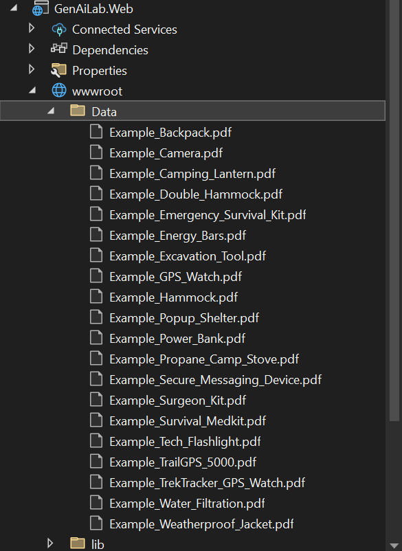
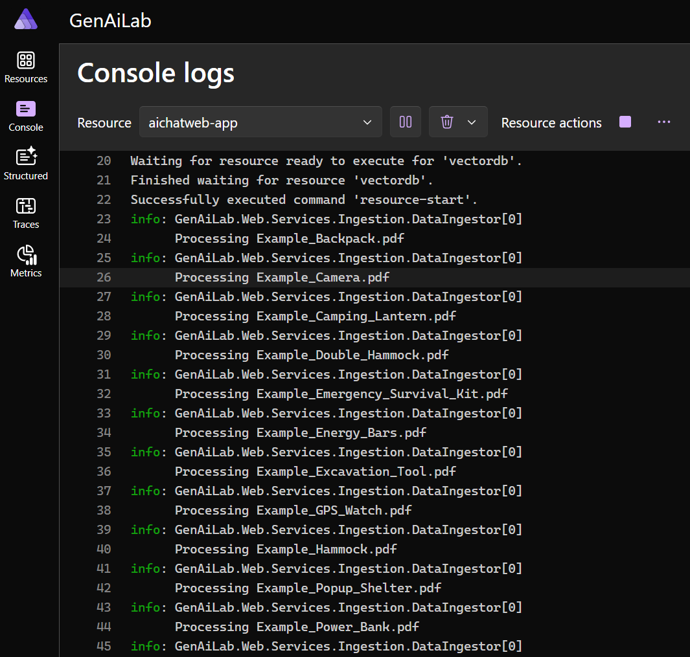

# Convert from GitHub Models to Azure OpenAI

> **⏱️ Estimated Time:** 45-60 minutes

## In this workshop

In this workshop, you will learn how to migrate your application from using GitHub Models during development to Azure OpenAI for production. You'll understand how the common interfaces in Microsoft Extensions for AI make this migration seamless, create an Azure OpenAI resource, deploy models, and update your application's configuration.

> [!TIP]
> **Alternative AI Providers**: While this workshop focuses on migrating from GitHub Models to Azure OpenAI, the same principles apply to other providers:
>
> - **Azure OpenAI** (covered here): Simpler setup, better error handling, higher token limits - recommended if you have Azure access
> - **OpenAI** (direct): Similar to Azure OpenAI but with different pricing and terms - see [OpenAI documentation](https://platform.openai.com/docs/quickstart) for setup
> - **GitHub Models**: Great for getting started and learning, with free tier access for all GitHub users
>
> Choose the provider that best fits your access and requirements. The beauty of Microsoft Extensions for AI is that switching between providers requires minimal code changes.

## Understand the IChatClient as a common interface across services

Microsoft Extensions for AI provides common interfaces that work across different AI providers:

- `IChatClient` for text generation
- `IEmbeddingGenerator` for creating vector embeddings
- `ITextCompletion` for text completions

These interfaces allow you to switch between AI providers without changing your application code. For example, when using `IChatClient`:

```csharp
public class MyService
{
    private readonly IChatClient _chatClient;

    public MyService(IChatClient chatClient)
    {
        _chatClient = chatClient;
    }

    public async Task<string> GetResponseAsync(string userMessage)
    {
        var response = await _chatClient.GetResponseAsync(
            new[] {
                new ChatMessage(ChatRole.System, "You are a helpful assistant."),
                new ChatMessage(ChatRole.User, userMessage)
            });
        
        return response.Text;
    }
}
```

The same code works whether the `IChatClient` is implemented by GitHub Models, Azure OpenAI, or another provider.

## Create the Azure OpenAI resource

To use Azure OpenAI, you need to set up resources in Azure:

1. **Create an Azure OpenAI resource**:   - Navigate to the Azure portal (<https://portal.azure.com>)
   - Click "Create a resource" and search for "Azure OpenAI"
   - Fill in the required details:
     - **Subscription**: Will be pre-selected based on your Azure account
     - **Resource group**: Select an existing resource group if you are doing this in a managed environment or create a new one (e.g., "rg-mygenaiapp")
     - **Region**: Select a region close to you (e.g., "East US" or "West Europe")
     - **Pricing tier**: Select "Standard" (this is the only option available for Azure OpenAI)
   - Click "Next" on the following screens (leaving the default settings) and then "Create"

> [!NOTE]
> If you are using a managed environment, use the resource group provided by your instructor or organization. Otherwise, you can create your own resource group as needed.

## Deploy the `gpt-4o-mini` model for chat completions

After creating your Azure OpenAI resource, you need to deploy the models:

1. Navigate to your Azure OpenAI resource by clicking the "Explore Azure AI Foundry portal" button or browsing to <https://ai.azure.com>
1. Select "Deployments" from the left menu
1. Click "+ Deploy model" button
1. Select the "Deploy base model" option
1. Select the model "gpt-4o-mini" for chat completions (you can use the search filter to narrow the list down)
1. Leave the default deployment name and type values ("gpt-4o-mini" and Global Standard)
1. Click "Deploy"

## Deploy the `text-embedding-3-small` model for embeddings

Follow the same process to deploy the embedding model:

1. Select "Deployments" from the left menu
1. Click "+ Deploy model" button
1. Select the "Deploy base model" option
1. Select the model "text-embedding-3-small" for embeddings (again using search to filter if desired)
1. Leave the default deployment name and type values ("text-embedding-3-small" and Global Standard)
1. Click "Deploy"

## Obtain the Endpoint and API Keys

To connect your application to Azure OpenAI, you need the endpoint and API key:

1. Open one of your deployments from the above steps if you have closed it
1. Locate the Endpoint box in the upper left
1. Copy just the first part of the Endpoint Target URI (it will look like `https://YOUR_RESOURCE_NAME.openai.azure.com/`)
1. Copy the key (you can use the copy button for this)

## Update the connection strings

Now you'll update your application's connection string to use Azure OpenAI instead of GitHub Models:

1. In the Solution Explorer, right-click on the `GenAiLab.AppHost` project and select "Manage User Secrets"

1. In the `secrets.json` file, update the connection string:

   ```json
   {
     "ConnectionStrings:openai": "Endpoint=https://YOUR_RESOURCE_NAME.openai.azure.com/;Key=YOUR_API_KEY"
   }
   ```

   Replace `YOUR_RESOURCE_NAME` with your Azure OpenAI resource name and `YOUR_API_KEY` with the API key you copied.

## Add new Product PDFs for ingestion

To test the new Azure OpenAI integration, let's add the sample product PDF manuals that are included with the lab:

1. In the Solution Explorer, navigate to the `GenAiLab.Web/wwwroot/Data` folder

1. Right-click on the `Data` folder and select "Add" > "Existing Item..."

1. Browse to the `/manuals` directory in your project folder

1. Select all PDF files (Ctrl+A)

1. Click "Add" to copy these files into your project

   

These sample manual PDFs include a variety of products such as:

- Example_Backpack.pdf
- Example_Camera.pdf
- Example_Camping_Lantern.pdf
- Example_Double_Hammock.pdf
- Example_Energy_Bars.pdf
- Example_Survival_Medkit.pdf
- Example_Water_Filtration.pdf

And many other product manuals that will provide rich content for testing the AI capabilities.

> **Note**: Ingesting all of these PDFs requires processing a large number of tokens, which would likely exceed the free token limits when using GitHub Models. This is why we're adding these resources after switching to Azure OpenAI, which provides higher token limits and better scaling options. This demonstrates an important consideration when choosing between different AI providers - understanding their resource constraints and cost models is crucial for production applications.

## Run the application

Now let's run the application with Azure OpenAI integration:

1. Make sure the `GenAiLab.AppHost` project is set as the startup project

1. Press F5 or click the "Start Debugging" button in Visual Studio

1. The .NET Aspire dashboard will open in your browser

1. You can observe the PDF ingestion process by checking the logs for the `aichatweb-app` service, which will show the DataIngestor processing the newly added PDF documents:

   

1. Shortly after, the web application will launch in another browser tab

1. Test the chat functionality with Azure OpenAI by asking questions like:
   - "What products do you have information about?"
   - "Tell me about the emergency survival kit"
   - "What's the most useful feature of the solar power bank?"

1. Notice how the responses now come from Azure OpenAI rather than GitHub Models

## What You've Learned

- How Microsoft Extensions for AI provides common interfaces across AI providers
- How to create an Azure OpenAI resource in the Azure portal
- How to deploy models for chat completions and embeddings
- How to obtain the endpoint and API keys for Azure OpenAI
- How to update your application to use Azure OpenAI instead of GitHub Models
- How to test the application with Azure OpenAI integration

## Troubleshooting

### Common Issues and Solutions

#### Issue: Build Errors After Configuration Changes

**Problem**: Build fails with static asset conflicts after updating connection strings.

**Solution**:

```powershell
dotnet clean
dotnet build
```

#### Issue: Package Restore Problems

**Problem**: Missing dependencies or package restore failures.

**Solution**:

```powershell
dotnet restore
dotnet build
```

#### Issue: Azure OpenAI Deployment Not Found

**Problem**: Application can't connect to Azure OpenAI, getting "deployment not found" errors.

**Solution**:

1. Verify both models are deployed: `gpt-4o-mini` and `text-embedding-3-small`
2. Check deployment names match exactly (case-sensitive)
3. Ensure the Azure OpenAI resource is in the correct region
4. Verify the endpoint URL format: `https://YOUR_RESOURCE_NAME.openai.azure.com/`

#### Issue: Invalid API Key

**Problem**: Authentication errors when connecting to Azure OpenAI.

**Solution**:

1. Regenerate the API key in the Azure portal
2. Update the `secrets.json` file with the new key
3. Ensure no extra spaces or characters in the connection string
4. Restart the application after updating secrets

#### Issue: PDF Ingestion Fails

**Problem**: Application crashes or fails when processing the new PDF files.

**Solution**:

1. Ensure all PDF files are properly copied to `wwwroot/Data`
2. Check that the Azure OpenAI deployment has sufficient quota
3. Monitor token usage in the Azure portal
4. Consider processing PDFs in smaller batches if hitting rate limits

## 🎯 Next Steps

Fantastic! Your application is now powered by Azure OpenAI. Let's add some exciting new features!

**Continue to** → [Part 5: Write a New Products Page](../Part%205%20-%20Products%20Page/README.md)

In Part 5, you'll learn how to:

- 🛍️ Build an AI-powered product catalog
- 🤖 Use AI to generate product descriptions automatically
- 🔍 Implement smart categorization and filtering
- 📊 Work with vector databases as primary storage
