# Part 7: MCP Server Basics

> **⏱️ Estimated Time:** 45-60 minutes

## Overview

In this part of the workshop, you'll learn how to create a **Model Context Protocol (MCP) server** that extends AI agents like GitHub Copilot with custom tools and capabilities. MCP servers allow you to provide AI agents with access to real-time data, business systems, and specialized functionality that goes beyond their built-in knowledge.

## Learning Objectives

By the end of this part, you will:

- ✅ Understand what MCP is and why it's valuable for AI applications
- ✅ Create your first MCP server using the .NET template
- ✅ Implement custom weather tools that provide real-time data
- ✅ Configure VS Code to use your custom MCP server
- ✅ Test MCP functionality with GitHub Copilot

## What is Model Context Protocol (MCP)?

**Model Context Protocol (MCP)** is an open standard that enables AI agents to securely access external data sources and tools. Think of it as a way to give AI assistants like GitHub Copilot "superpowers" by connecting them to:

- 🌐 **Real-time data** (weather, stock prices, news)
- 🏢 **Business systems** (CRM, inventory, orders)
- 🔧 **Custom tools** (calculators, validators, converters)
- 📊 **Live databases** (customer data, analytics)

### MCP Architecture

```mermaid
flowchart TD
    User([👤 You]) <--> Agent[🤖 GitHub Copilot]
    Agent <--> MCP[📡 MCP Server]
    MCP <--> Weather[🌤️ Weather API]
    MCP <--> Business[🏢 Business Data]
    MCP <--> Tools[🔧 Custom Tools]
    
    style MCP fill:#e1f5fe
    style Agent fill:#f3e5f5
```



**Why MCP matters:**

- **Real-time Information**: AI gets access to current data, not just training data
- **Business Integration**: Connect AI to your company's systems and data
- **Custom Capabilities**: Extend AI with domain-specific tools and knowledge
- **Security**: Controlled access to sensitive systems through defined protocols

## Prerequisites

Before starting this part, ensure you have:

- ✅ **Completed Parts 1-6** of this workshop series:
  - [Part 1: Setup](../Part%201%20-%20Setup/README.md) - Set up your development environment
  - [Part 2: Create Project](../Part%202%20-%20Project%20Creation/README.md) - Understanding the AI web chat template
  - [Part 3: Template Exploration](../Part%203%20-%20Template%20Exploration/README.md) - Integrate with Azure OpenAI services
  - [Part 4: Azure OpenAI](../Part%204%20-%20Azure%20OpenAI/README.md) - Build dynamic product pages
  - [Part 5: Products Page](../Part%205%20-%20Products%20Page/README.md) - Deploy your application to Azure
  - [Part 6: Deployment](../Part%206%20-%20Deployment/README.md) - Deploy your application to Azure
- ✅ **.NET 10.0 SDK** (preview 6 or higher) - `dotnet --version`
- ✅ **Visual Studio Code** with GitHub Copilot extension
- ✅ **MCP template installed** - verify with `dotnet new list | Select-String mcp`

## Step 1: Understanding the Project Structure

Navigate to the `Part 7 - MCP Server Basics` directory and explore the `WeatherMcpServer` project:

```text
WeatherMcpServer/
├── Program.cs                    # MCP server startup and configuration
├── Tools/
│   └── WeatherTools.cs          # Custom weather tools implementation
├── .mcp/
│   └── server.json              # MCP server metadata and configuration
└── WeatherMcpServer.csproj      # Project file with MCP dependencies
```

### Key Files Explained

**`Program.cs`** - The entry point that sets up the MCP server:

```csharp
// Configure all logs to go to stderr (stdout is used for the MCP protocol messages)
builder.Logging.AddConsole(o => o.LogToStandardErrorThreshold = LogLevel.Trace);

// Add the MCP services: the transport to use (stdio) and the tools to register
builder.Services
    .AddMcpServer()
    .WithStdioServerTransport()
    .WithTools<WeatherTools>();
```

**`Tools/WeatherTools.cs`** - Contains the custom tools that AI agents can use:

- `GetCurrentWeather(string city)` - Get current weather for a city
- `GetWeatherForecast(string city)` - Get 5-day forecast for a city

**`.mcp/server.json`** - Metadata that describes your MCP server to package managers.

## Step 2: Examine the Weather Tools

Open `WeatherMcpServer/Tools/WeatherTools.cs` and examine the implementation:

```csharp
[McpServerTool]
[Description("Gets current weather for a specified city.")]
public async Task<string> GetCurrentWeather(
    [Description("Name of the city to get weather for")] string city)
{
    // Simulate weather API call with realistic data
    var weatherData = new
    {
        City = city,
        Temperature = Random.Shared.Next(-10, 35) + "°C",
        Condition = GetRandomWeatherCondition(),
        Humidity = Random.Shared.Next(30, 90) + "%",
        WindSpeed = Random.Shared.Next(5, 25) + " km/h",
        LastUpdated = DateTime.Now.ToString("yyyy-MM-dd HH:mm:ss")
    };

    return JsonSerializer.Serialize(weatherData, new JsonSerializerOptions { WriteIndented = true });
}
```

### Key MCP Concepts

1. **`[McpServerTool]` Attribute**: Marks a method as an MCP tool that AI agents can discover and use
2. **`[Description]` Attributes**: Provide context to AI agents about what the tool does and what parameters mean
3. **JSON Serialization**: MCP tools return structured data as JSON strings
4. **Async Methods**: Tools can perform async operations (database calls, API requests, etc.)

## Step 3: Build and Test the MCP Server

1. **Build the project** to ensure everything compiles:

   ```powershell
   cd "Part 7 - MCP Server Basics\WeatherMcpServer"
   dotnet build
   ```

   You should see a successful build with warnings about async methods (this is expected for this demo).

2. **Test the server locally** by running it:

   ```powershell
   dotnet run
   ```

   The server will start and wait for MCP protocol messages. You can press `Ctrl+C` to stop it.

## Step 4: Configure VS Code to Use Your MCP Server

Now you'll configure VS Code to use your custom MCP server alongside GitHub Copilot.

1. **Create the MCP configuration directory** in your workspace:

   ```powershell
   cd ..\..\  # Navigate back to repository root
   mkdir .vscode -Force
   ```

2. **Create the MCP configuration file** `.vscode/mcp.json`:

   ```json
   {
     "servers": {
       "WeatherMcpServer": {
         "type": "stdio",
         "command": "dotnet",
         "args": [
           "run",
           "--project",
           "Part 7 - MCP Server Basics/WeatherMcpServer"
         ]
       }
     }
   }
   ```

3. **Restart VS Code** to pick up the new MCP configuration:
   - Close VS Code completely
   - Reopen VS Code in your workshop directory
   - VS Code will automatically detect and load your MCP server

## Step 5: Test MCP Integration with GitHub Copilot

Now for the exciting part - testing your custom MCP server with GitHub Copilot!

### Test 1: Current Weather

1. **Open GitHub Copilot Chat** in VS Code
2. **Ask for weather information**:

   ```text
   What's the current weather in Seattle?
   ```

3. **Expected behavior**:
   - Copilot should detect your WeatherMcpServer
   - It will use the `GetCurrentWeather` tool
   - You'll see realistic weather data returned

### Test 2: Weather Forecast

1. **Ask for a forecast**:

   ```text
   Can you give me a 5-day weather forecast for Tokyo?
   ```

2. **Expected behavior**:
   - Copilot should use the `GetWeatherForecast` tool
   - You'll see a 5-day forecast with temperatures and conditions

### Test 3: Multiple Cities

1. **Ask for comparative weather**:

   ```text
   Compare the current weather in London and Paris
   ```

2. **Expected behavior**:
   - Copilot should call `GetCurrentWeather` twice
   - You'll get weather data for both cities

## Step 6: Understanding MCP Tool Discovery

### How AI Agents Discover Your Tools

When VS Code starts, it:

1. **Reads** your `.vscode/mcp.json` configuration
2. **Starts** your MCP server as a background process
3. **Queries** the server for available tools using MCP protocol
4. **Registers** tools with GitHub Copilot for use in conversations

### Tool Descriptions Matter

The `[Description]` attributes are crucial:

```csharp
[Description("Gets current weather for a specified city.")]
//            ^ This helps AI understand when to use this tool

[Description("Name of the city to get weather for")] string city
//            ^ This helps AI understand what to pass as parameters
```

**Best Practices for Tool Descriptions:**

- ✅ Be specific about what the tool does
- ✅ Explain parameter requirements clearly
- ✅ Use natural language that AI can understand
- ✅ Include examples when helpful

## Step 7: Explore Advanced Scenarios

### Scenario 1: Weather for Travel Planning

Try asking Copilot to help with travel planning:

```text
I'm planning a trip to Rome next week. What should I pack based on the weather?
```

### Scenario 2: Weather-Based Recommendations

Ask for contextual recommendations:

```text
What outdoor activities would be good in Vancouver based on the current weather?
```

### Scenario 3: Weather Comparison

Compare weather across regions:

```text
Which city has better weather right now: Miami, Denver, or Portland?
```

## Understanding the MCP Server Output

When your MCP server runs, you might see log output in VS Code's Output panel:

1. **Open Output panel**: `View > Output`
2. **Select "MCP Servers"** from the dropdown
3. **Watch for**:
   - Server startup messages
   - Tool invocation logs
   - Error messages (if any)

## Troubleshooting Common Issues

### Issue 1: "MCP server not found"

**Solution**:

- Verify `.vscode/mcp.json` exists and has correct paths
- Restart VS Code completely
- Check Output panel for error messages

### Issue 2: "Tool not available"

**Solution**:

- Ensure project builds successfully (`dotnet build`)
- Verify `[McpServerTool]` attributes are present
- Check that tools are registered in `Program.cs`

### Issue 3: "Server fails to start"

**Solution**:

- Run `dotnet run` manually to see error messages
- Check .NET 10 SDK is installed (`dotnet --version`)
- Verify project dependencies are restored

## Key Concepts Learned

### MCP Fundamentals

- **MCP servers** extend AI agents with custom capabilities
- **Tools** are methods marked with `[McpServerTool]` attribute
- **Descriptions** help AI understand when and how to use tools
- **JSON serialization** provides structured data to AI agents

### Integration Points

- **VS Code configuration** in `.vscode/mcp.json`
- **GitHub Copilot** automatically discovers and uses MCP tools
- **Real-time execution** - tools run when AI needs them
- **Logging and debugging** through VS Code Output panel

### Development Workflow

1. **Create** MCP server project with `dotnet new mcpserver`
2. **Implement** custom tools with proper attributes
3. **Configure** VS Code to use your server
4. **Test** with GitHub Copilot conversations
5. **Iterate** and improve based on AI usage patterns

## Next Steps

Now that you understand MCP basics, you're ready for more advanced scenarios!

**Continue to** → [Part 8: Enhanced MCP Server](../Part%208%20-%20Enhanced%20MCP%20Server/README.md)

In Part 8, you'll learn how to:

- 🏢 Build business-focused MCP tools
- 📊 Access real business data and systems  
- 🔧 Implement more sophisticated tool interactions
- 🛡️ Handle security and validation in MCP tools

## Additional Resources

- 📖 [Official MCP Documentation](https://modelcontextprotocol.io/)
- 🔧 [MCP Protocol Specification](https://spec.modelcontextprotocol.io/)
- 📦 [ModelContextProtocol NuGet Package](https://www.nuget.org/packages/ModelContextProtocol)
- 💻 [MCP in VS Code Documentation](https://code.visualstudio.com/docs/copilot/chat/mcp-servers)
- 🎯 [MCP .NET Guide](https://aka.ms/nuget/mcp/guide)

## Troubleshooting

### Common Issues and Solutions

#### Issue: MCP Server Not Found

**Problem**: VS Code can't discover the MCP server, tools not available in Copilot.

**Solution**:

1. Verify `.vscode/mcp.json` path is correct
2. Check that the project builds successfully: `dotnet build`
3. Restart VS Code after configuration changes
4. Verify .NET 10 SDK is in PATH: `dotnet --version`

#### Issue: Tool Execution Failed

**Problem**: MCP server starts but tools fail to execute.

**Solution**:

1. Check VS Code Output panel → "MCP" channel for errors
2. Verify tool methods have proper `[McpTool]` attributes
3. Check for runtime exceptions in tool code
4. Validate tool parameter types and descriptions

#### Issue: .NET 10 SDK Not Found

**Problem**: Template creation or build fails with SDK version errors.

**Solution**:

1. Install .NET 10 SDK preview: Download from [.NET Downloads](https://dotnet.microsoft.com/download/dotnet/10.0)
2. Verify installation: `dotnet --version` should show 10.0.x
3. Set .NET 10 as default if multiple versions installed

#### Issue: GitHub Copilot Not Using Tools

**Problem**: Copilot responds but doesn't use MCP tools.

**Solution**:

1. Verify GitHub Copilot subscription is active
2. Check that both `github.copilot` and `github.copilot-chat` extensions are installed
3. Try explicit tool requests: "Use the weather tool to get current conditions for Seattle"
4. Check MCP server is running in VS Code Output panel

---

## Summary

In this part, you've learned the fundamentals of Model Context Protocol and built your first MCP server. You now understand how to:

- ✅ Create MCP servers that extend AI agents
- ✅ Implement custom tools with proper descriptions
- ✅ Configure VS Code to use your MCP servers
- ✅ Test MCP functionality with GitHub Copilot
- ✅ Debug and troubleshoot MCP integrations

**Weather tools are just the beginning!** MCP can connect AI to any system, API, or data source you can imagine. In the next part, you'll see how to apply these concepts to real business scenarios.

## Continue Your Journey

🎯 **Continue your MCP journey:**

- **[Part 8: Enhanced MCP Server](../Part%208%20-%20Enhanced%20MCP%20Server/README.md)** - Build sophisticated business tools for order management, inventory, and customer service scenarios
- **[Part 9: MCP Publishing](../Part%209%20-%20MCP%20Publishing/README.md)** - Learn how to package, publish, and distribute your MCP servers professionally

---

📖 **Return to**: [Workshop Overview](../README.md) | 🔄 **Previous**: [Part 6: Deployment](../Part%206%20-%20Deployment/README.md)
