# Part 7: MCP Server Basics

> **⏱️ Estimated Time:** 45-60 minutes

## Overview

In this part of the workshop, you'll learn how to create a **Model Context Protocol (MCP) server** that extends AI agents like GitHub Copilot with custom tools and capabilities. MCP servers allow you to provide AI agents with access to real-time data, business systems, and specialized functionality that goes beyond their built-in knowledge.

## Learning Objectives

By the end of this part, you will:

- ✅ Understand what MCP is and why it's valuable for AI applications
- ✅ Create your first MCP server using the .NET template
- ✅ Implement custom weather tools that provide real-time data
- ✅ Configure VS Code to use your custom MCP server
- ✅ Test MCP functionality with GitHub Copilot

## What is Model Context Protocol (MCP)?

**Model Context Protocol (MCP)** is an open standard that enables AI agents to securely access external data sources and tools. Think of it as a way to give AI assistants like GitHub Copilot "superpowers" by connecting them to:

- 🌐 **Real-time data** (weather, stock prices, news)
- 🏢 **Business systems** (CRM, inventory, orders)
- 🔧 **Custom tools** (calculators, validators, converters)
- 📊 **Live databases** (customer data, analytics)

### MCP Architecture

```mermaid
flowchart TD
    User([👤 You]) <--> Agent[🤖 GitHub Copilot]
    Agent <--> MCP[📡 MCP Server]
    MCP <--> Weather[🌤️ Weather API]
    MCP <--> Business[🏢 Business Data]
    MCP <--> Tools[🔧 Custom Tools]
    
    style MCP fill:#e1f5fe
    style Agent fill:#f3e5f5
```



**Why MCP matters:**

- **Real-time Information**: AI gets access to current data, not just training data
- **Business Integration**: Connect AI to your company's systems and data
- **Custom Capabilities**: Extend AI with domain-specific tools and knowledge
- **Security**: Controlled access to sensitive systems through defined protocols

## Prerequisites

Before starting this part, ensure you have:

- ✅ **Completed Parts 1-6** of this workshop series:
  - [Part 1: Setup](../Part%201%20-%20Setup/README.md) - Set up your development environment
  - [Part 2: Create Project](../Part%202%20-%20Project%20Creation/README.md) - Understanding the AI web chat template
  - [Part 3: Template Exploration](../Part%203%20-%20Template%20Exploration/README.md) - Integrate with Azure OpenAI services
  - [Part 4: Azure OpenAI](../Part%204%20-%20Azure%20OpenAI/README.md) - Build dynamic product pages
  - [Part 5: Products Page](../Part%205%20-%20Products%20Page/README.md) - Deploy your application to Azure
  - [Part 6: Deployment](../Part%206%20-%20Deployment/README.md) - Deploy your application to Azure
- ✅ **.NET 10.0 SDK** (preview 6 or higher) - `dotnet --version`
- ✅ **Visual Studio Code** with GitHub Copilot extension
- ✅ **Active GitHub Copilot subscription**

## Step 1: Verify the MCP Server Template

The MCP server template is included in the `Microsoft.Extensions.AI.Templates` package that you installed in Part 2. Let's verify it's available:

1. **Verify the template is available and see its options**:

   ```powershell
   dotnet new mcpserver -h
   ```

   You should see help output showing the MCP Server template options, including:

   ```text
   MCP Server (C#)
   Author: Microsoft
   Description: A template for creating a Model Context Protocol server...
   
   Options:
     -n, --name <name>           The name for the output being created...
     -o, --output <output>       Location to place the generated output...
   ```

   > **Note**: If you get an error that the template is not found, make sure you have .NET 10.0 SDK (preview 6 or higher) installed and the templates were installed correctly in Part 2. You can reinstall with: `dotnet new install Microsoft.Extensions.AI.Templates`

## Step 2: Create Your First MCP Server

Now let's create a new MCP server project using the template:

1. **Navigate to the Part 7 directory**:

   ```powershell
   cd "Part 7 - MCP Server Basics"
   ```

2. **Create a new MCP server project**:

   ```powershell
   dotnet new mcpserver -n MyMcpServer
   ```

   This command creates a new MCP server project with:
   - Basic MCP server infrastructure  
   - Example `RandomNumberTools` implementation
   - Configuration files for VS Code integration

3. **Navigate to the new project**:

   ```powershell
   cd MyMcpServer
   ```

## Step 3: Understanding the Generated Project Structure

The MCP template has created a complete MCP server project for you. Let's explore what was generated:

```text
MyMcpServer/
├── Program.cs                    # MCP server startup and configuration
├── Tools/
│   └── RandomNumberTools.cs     # Example tools implementation
├── .mcp/
│   └── server.json              # MCP server metadata and configuration
└── MyMcpServer.csproj           # Project file with MCP dependencies
```

### Key Files Explained

**`Program.cs`** - The entry point that sets up the MCP server:

```csharp
// Configure all logs to go to stderr (stdout is used for the MCP protocol messages)
builder.Logging.AddConsole(o => o.LogToStandardErrorThreshold = LogLevel.Trace);

// Add the MCP services: the transport to use (stdio) and the tools to register
builder.Services
    .AddMcpServer()
    .WithStdioServerTransport()
    .WithTools<RandomNumberTools>();
```

**`Tools/RandomNumberTools.cs`** - Contains example tools that AI agents can use. We'll customize this for weather functionality.

The template generates a simple `RandomNumberTools` class with a `GetRandomNumber` method:

```csharp
using System.ComponentModel;
using ModelContextProtocol.Server;

/// <summary>
/// Sample MCP tools for demonstration purposes.
/// These tools can be invoked by MCP clients to perform various operations.
/// </summary>
internal class RandomNumberTools
{
    [McpServerTool]
    [Description("Generates a random number between the specified minimum and maximum values.")]
    public int GetRandomNumber(
        [Description("Minimum value (inclusive)")] int min = 0,
        [Description("Maximum value (exclusive)")] int max = 100)
    {
        return Random.Shared.Next(min, max);
    }
}
```

We'll replace this with weather functionality while keeping the same class name for simplicity.

**`.mcp/server.json`** - Metadata that describes your MCP server to package managers.

## Step 4: Add Weather Tools Alongside Random Number Tools

Instead of replacing the existing tools, let's add new weather tools alongside the template-generated random number tools. This way you can see both examples working together.

1. **Create a new weather tools file** `Tools/WeatherTools.cs`:

```csharp
using System.ComponentModel;
using System.Text.Json;
using ModelContextProtocol.Server;

namespace MyMcpServer.Tools;

/// <summary>
/// Weather tools that provide current weather and forecast information.
/// </summary>
internal class WeatherTools
{
    private static readonly string[] WeatherConditions = [
        "Sunny", "Partly Cloudy", "Cloudy", "Overcast", "Light Rain", 
        "Heavy Rain", "Snow", "Fog", "Windy", "Stormy"
    ];

    [McpServerTool]
    [Description("Gets current weather for a specified city.")]
    public async Task<string> GetCurrentWeather(
        [Description("Name of the city to get weather for")] string city)
    {
        // Simulate API call delay
        await Task.Delay(500);
        
        // Simulate weather API call with realistic data
        var weatherData = new
        {
            City = city,
            Temperature = Random.Shared.Next(-10, 35) + "°C",
            Condition = GetRandomWeatherCondition(),
            Humidity = Random.Shared.Next(30, 90) + "%",
            WindSpeed = Random.Shared.Next(5, 25) + " km/h",
            Pressure = Random.Shared.Next(980, 1040) + " hPa",
            LastUpdated = DateTime.Now.ToString("yyyy-MM-dd HH:mm:ss")
        };

        return JsonSerializer.Serialize(weatherData, new JsonSerializerOptions { WriteIndented = true });
    }

    [McpServerTool]
    [Description("Gets a 5-day weather forecast for a specified city.")]
    public async Task<string> GetWeatherForecast(
        [Description("Name of the city to get forecast for")] string city)
    {
        // Simulate API call delay
        await Task.Delay(800);
        
        var forecast = new
        {
            City = city,
            Forecast = Enumerable.Range(0, 5).Select(day => new
            {
                Date = DateTime.Now.AddDays(day).ToString("yyyy-MM-dd"),
                DayName = DateTime.Now.AddDays(day).ToString("dddd"),
                HighTemp = Random.Shared.Next(15, 35) + "°C",
                LowTemp = Random.Shared.Next(-5, 20) + "°C",
                Condition = GetRandomWeatherCondition(),
                ChanceOfRain = Random.Shared.Next(0, 100) + "%"
            }).ToArray()
        };

        return JsonSerializer.Serialize(forecast, new JsonSerializerOptions { WriteIndented = true });
    }

    private static string GetRandomWeatherCondition()
    {
        return WeatherConditions[Random.Shared.Next(WeatherConditions.Length)];
    }
}
```

1. **Register the new weather tools** in `Program.cs`. Update the file to register both tool classes:

```csharp
using Microsoft.Extensions.DependencyInjection;
using Microsoft.Extensions.Hosting;
using Microsoft.Extensions.Logging;

var builder = Host.CreateApplicationBuilder(args);

// Configure all logs to go to stderr (stdout is used for the MCP protocol messages).
builder.Logging.AddConsole(o => o.LogToStandardErrorThreshold = LogLevel.Trace);

// Add the MCP services: the transport to use (stdio) and the tools to register.
builder.Services
    .AddMcpServer()
    .WithStdioServerTransport()
    .WithTools<RandomNumberTools>()     // Original template tools
    .WithTools<WeatherTools>();         // Our new weather tools

await builder.Build().RunAsync();
```

## Step 5: Build and Test the MCP Server

Now that we've added our weather tools alongside the original random number tools, let's build and test the MCP server:

1. **Build the project** to ensure everything compiles correctly:

   ```powershell
   dotnet build
   ```

   You should see a successful build output. If there are any errors, review the code in `Tools/ExampleTools.cs`.

2. **Test the server locally** by running it:

   ```powershell
   dotnet run
   ```

   The server will start and wait for MCP protocol messages. You should see output similar to:

   ```text
   info: Microsoft.Hosting.Lifetime[14]
         Now listening on: stdio
   info: Microsoft.Hosting.Lifetime[0]
         Application started. Press Ctrl+C to shut down.
   ```

   Press `Ctrl+C` to stop the server after verifying it starts successfully.

### Key MCP Concepts You've Implemented

Now that you've built your own MCP server, let's review the key concepts:

1. **`[McpServerTool]` Attributes**: Mark methods as tools available to AI agents
2. **`[Description]` Attributes**: Provide context to AI agents about what tools do and what parameters mean
3. **Async Methods**: Tools can perform async operations (database calls, API requests, etc.)
4. **JSON Serialization**: MCP tools return structured data as JSON strings
5. **Realistic Data Simulation**: The tools simulate real API calls with delays and varied data

## Step 6: Configure VS Code to Use Your MCP Server

Now you'll configure VS Code to use your custom MCP server alongside GitHub Copilot.

1. **Navigate back to the workshop root directory**:

   ```powershell
   cd ..\..  # Navigate back to repository root
   ```

2. **Create the MCP configuration directory** in your workspace:

   ```powershell
   mkdir .vscode -Force
   ```

3. **Create the MCP configuration file** `.vscode/mcp.json`:

   ```json
   {
     "servers": {
       "MyMcpServer": {
         "type": "stdio",
         "command": "dotnet",
         "args": [
           "run",
           "--project",
           "Part 7 - MCP Server Basics/MyMcpServer"
         ]
       }
     }
   }
   ```

4. **Restart VS Code** to pick up the new MCP configuration:
   - Close VS Code completely
   - Reopen VS Code in your workshop directory
   - VS Code will automatically detect and load your MCP server

## Step 7: Alternative - Configure Visual Studio 2022 to Use Your MCP Server

If you prefer to use **Visual Studio 2022** instead of VS Code, you can configure it to use your MCP server as well.

### Prerequisites for Visual Studio 2022

- **Visual Studio 2022 version 17.14** or later
- **GitHub Copilot** extension installed and active subscription
- **Agent mode** enabled (preview feature)

### Configuration Steps

1. **Navigate to your solution directory** (where the `.sln` file is located):

   ```powershell
   cd "Part 2 - Project Creation\GenAiLab"  # or your main solution directory
   ```

2. **Create the MCP configuration file** `.mcp.json` in your solution directory:

   ```json
   {
     "servers": {
       "MyMcpServer": {
         "type": "stdio",
         "command": "dotnet",
         "args": [
           "run",
           "--project",
           "../../Part 7 - MCP Server Basics/MyMcpServer"
         ]
       }
     }
   }
   ```

3. **Add the configuration file to your solution** (optional but recommended):
   - Right-click on the solution in **Solution Explorer**
   - Select **Add > Existing Item**
   - Navigate to and select the `.mcp.json` file
   - Choose **Add as Link** to include it in your solution

4. **Enable Agent Mode in GitHub Copilot**:
   - Open the **GitHub Copilot Chat** window
   - Click the **Ask** dropdown
   - Select **Agent** mode

5. **Restart Visual Studio** to pick up the new MCP configuration

### Configuration File Locations

Visual Studio checks for MCP configurations in several locations, in this order:

1. `%USERPROFILE%\.mcp.json` - Global configuration for all solutions
2. `<SOLUTIONDIR>\.vs\mcp.json` - VS-specific, user-specific configuration
3. `<SOLUTIONDIR>\.mcp.json` - Solution-wide configuration (recommended for source control)
4. `<SOLUTIONDIR>\.vscode\mcp.json` - Shared with VS Code
5. `<SOLUTIONDIR>\.cursor\mcp.json` - Shared with Cursor

### Testing in Visual Studio 2022

1. **Open GitHub Copilot Chat**
2. **Ensure Agent mode is selected** (from the Ask dropdown)
3. **Test weather functionality**:

   ```text
   What's the current weather in New York?
   ```

4. **Grant tool permissions** when prompted:
   - Visual Studio will ask for permission to use MCP tools
   - Select **Allow** with your preferred scope (session, solution, or always)

### Managing Tool Approvals

- **Tool confirmations**: When tools are invoked, Copilot requests confirmation
- **Permission levels**: You can allow tools for the current session, solution, or all future invocations
- **Reset permissions**: Go to **Tools > Options > GitHub > Copilot > Tools** to reset tool approval settings

## Step 8: Test MCP Integration with GitHub Copilot

Now for the exciting part - testing your custom MCP server with GitHub Copilot!

### Test 1: Random Number Tool (From Template)

1. **Open GitHub Copilot Chat** in VS Code
2. **Test the original template tool**:

   ```text
   Give me a random number between 1 and 100
   ```

3. **Expected behavior**:
   - Copilot should detect your MyMcpServer
   - It will use the `GetRandomNumber` tool
   - You'll see a random number returned

### Test 2: Current Weather

1. **Ask for weather information**:

   ```text
   What's the current weather in Seattle?
   ```

2. **Expected behavior**:
   - Copilot should use the `GetCurrentWeather` tool
   - You'll see realistic weather data returned

### Test 3: Weather Forecast

1. **Ask for a forecast**:

   ```text
   Can you give me a 5-day weather forecast for Tokyo?
   ```

2. **Expected behavior**:
   - Copilot should use the `GetWeatherForecast` tool
   - You'll see a 5-day forecast with temperatures and conditions

### Test 4: Multiple Cities

1. **Ask for comparative weather**:

   ```text
   Compare the current weather in London and Paris
   ```

2. **Expected behavior**:
   - Copilot should call `GetCurrentWeather` twice
   - You'll get weather data for both cities

## Step 9: Understanding MCP Tool Discovery

### How AI Agents Discover Your Tools

When VS Code starts, it:

1. **Reads** your `.vscode/mcp.json` configuration
2. **Starts** your MCP server as a background process
3. **Queries** the server for available tools using MCP protocol
4. **Registers** tools with GitHub Copilot for use in conversations

### Tool Descriptions Matter

The `[Description]` attributes are crucial for AI understanding:

```csharp
[McpServerTool]
[Description("Gets current weather for a specified city.")]
//            ^ This helps AI understand when to use this tool

[Description("Name of the city to get weather for")] string city
//            ^ This helps AI understand what to pass as parameters
```

**Best Practices for Tool Descriptions:**

- ✅ Be specific about what the tool does
- ✅ Explain parameter requirements clearly
- ✅ Use natural language that AI can understand
- ✅ Include examples when helpful

## Step 10: Explore Advanced Scenarios

### Scenario 1: Weather for Travel Planning

Try asking Copilot to help with travel planning:

```text
I'm planning a trip to Rome next week. What should I pack based on the weather?
```

### Scenario 2: Weather-Based Recommendations

Ask for contextual recommendations:

```text
What outdoor activities would be good in Vancouver based on the current weather?
```

### Scenario 3: Weather Comparison

Compare weather across regions:

```text
Which city has better weather right now: Miami, Denver, or Portland?
```

## Understanding the MCP Server Output

When your MCP server runs, you might see log output in VS Code's Output panel:

1. **Open Output panel**: `View > Output`
2. **Select "MCP Servers"** from the dropdown
3. **Watch for**:
   - Server startup messages
   - Tool invocation logs
   - Error messages (if any)

## Troubleshooting Common Issues

### Issue 1: "MCP server not found"

**Solution**:

- Verify `.vscode/mcp.json` exists and has correct paths
- Restart VS Code completely
- Check Output panel for error messages

### Issue 2: "Tool not available"

**Solution**:

- Ensure project builds successfully (`dotnet build`)
- Verify `[McpServerTool]` attributes are present
- Check that tools are registered in `Program.cs`

### Issue 3: "Server fails to start"

**Solution**:

- Run `dotnet run` manually to see error messages
- Check .NET 10 SDK is installed (`dotnet --version`)
- Verify project dependencies are restored

## Key Concepts Learned

### MCP Fundamentals

- **MCP servers** extend AI agents with custom capabilities
- **Tools** are methods marked with `[McpServerTool]` attribute
- **Descriptions** help AI understand when and how to use tools
- **JSON serialization** provides structured data to AI agents

### Integration Points

- **VS Code configuration** in `.vscode/mcp.json`
- **Visual Studio 2022 configuration** in `.mcp.json` (solution directory)
- **GitHub Copilot** automatically discovers and uses MCP tools
- **Real-time execution** - tools run when AI needs them
- **Logging and debugging** through VS Code Output panel

### Development Workflow

1. **Create** MCP server project with `dotnet new mcpserver`
2. **Implement** custom tools with proper attributes
3. **Configure** VS Code or Visual Studio 2022 to use your server
4. **Test** with GitHub Copilot conversations
5. **Iterate** and improve based on AI usage patterns

> **🚀 Advanced Challenge**: If you're moving quickly and want an extra challenge, check out the [official Microsoft quickstart guide](https://learn.microsoft.com/en-us/dotnet/ai/quickstarts/build-mcp-server) which shows how to publish your MCP server to NuGet for others to use. This is covered in more detail in Part 9, but the quickstart provides a streamlined approach if you want to try it now!

## Next Steps

Now that you understand MCP basics, you're ready for more advanced scenarios!

**Continue to** → [Part 8: Enhanced MCP Server](../Part%208%20-%20Enhanced%20MCP%20Server/README.md)

In Part 8, you'll learn how to:

- 🏢 Build business-focused MCP tools
- 📊 Access real business data and systems  
- 🔧 Implement more sophisticated tool interactions
- 🛡️ Handle security and validation in MCP tools

## Additional Resources

- 📖 [Official MCP Documentation](https://modelcontextprotocol.io/)
- 🔧 [MCP Protocol Specification](https://spec.modelcontextprotocol.io/)
- 📦 [ModelContextProtocol NuGet Package](https://www.nuget.org/packages/ModelContextProtocol)
- 💻 [MCP in VS Code Documentation](https://code.visualstudio.com/docs/copilot/chat/mcp-servers)
- 🎯 [MCP .NET Guide](https://aka.ms/nuget/mcp/guide)

## Troubleshooting

### Common Issues and Solutions

#### Issue: MCP Server Not Found

**Problem**: VS Code can't discover the MCP server, tools not available in Copilot.

**Solution**:

1. Verify `.vscode/mcp.json` path is correct
2. Check that the project builds successfully: `dotnet build`
3. Restart VS Code after configuration changes
4. Verify .NET 10 SDK is in PATH: `dotnet --version`

#### Issue: Tool Execution Failed

**Problem**: MCP server starts but tools fail to execute.

**Solution**:

1. Check VS Code Output panel → "MCP" channel for errors
2. Verify tool methods have proper `[McpTool]` attributes
3. Check for runtime exceptions in tool code
4. Validate tool parameter types and descriptions

#### Issue: .NET 10 SDK Not Found

**Problem**: Template creation or build fails with SDK version errors.

**Solution**:

1. Install .NET 10 SDK preview: Download from [.NET Downloads](https://dotnet.microsoft.com/download/dotnet/10.0)
2. Verify installation: `dotnet --version` should show 10.0.x
3. Set .NET 10 as default if multiple versions installed

#### Issue: GitHub Copilot Not Using Tools

**Problem**: Copilot responds but doesn't use MCP tools.

**Solution**:

1. Verify GitHub Copilot subscription is active
2. Check that both `github.copilot` and `github.copilot-chat` extensions are installed
3. Try explicit tool requests: "Use the weather tool to get current conditions for Seattle"
4. Check MCP server is running in VS Code Output panel

---

## Summary

In this part, you've learned the fundamentals of Model Context Protocol and built your first MCP server. You now understand how to:

- ✅ Create MCP servers that extend AI agents
- ✅ Implement custom tools with proper descriptions
- ✅ Configure VS Code to use your MCP servers
- ✅ Test MCP functionality with GitHub Copilot
- ✅ Debug and troubleshoot MCP integrations

**Weather tools are just the beginning!** MCP can connect AI to any system, API, or data source you can imagine. In the next part, you'll see how to apply these concepts to real business scenarios.

## Continue Your Journey

🎯 **Continue your MCP journey:**

- **[Part 8: Enhanced MCP Server](../Part%208%20-%20Enhanced%20MCP%20Server/README.md)** - Build sophisticated business tools for order management, inventory, and customer service scenarios
- **[Part 9: MCP Publishing](../Part%209%20-%20MCP%20Publishing/README.md)** - Learn how to package, publish, and distribute your MCP servers professionally

---

📖 **Return to**: [Workshop Overview](../README.md) | 🔄 **Previous**: [Part 6: Deployment](../Part%206%20-%20Deployment/README.md)
