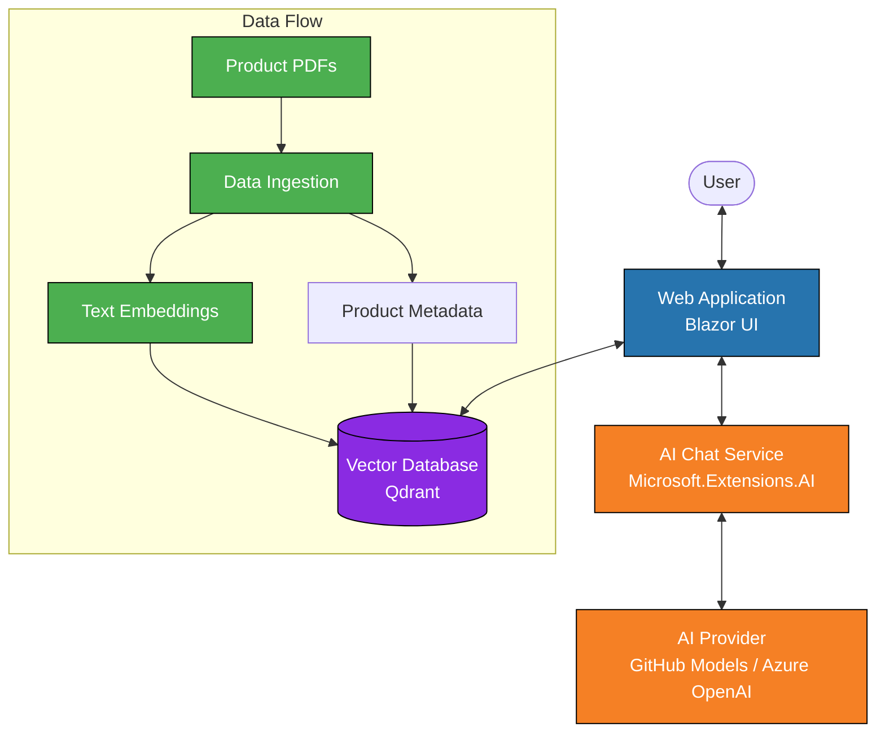
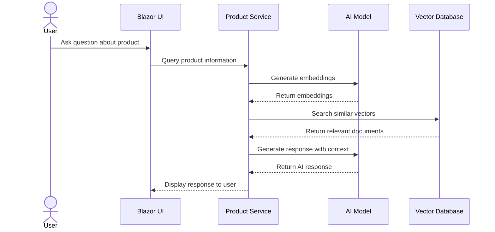
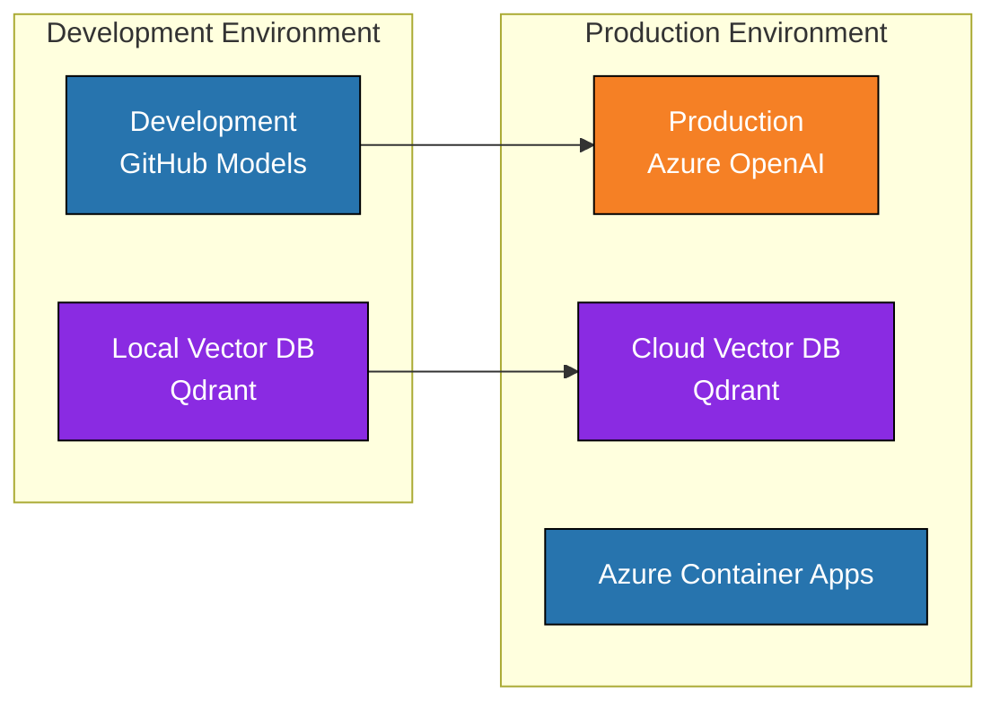

# .NET AI Workshop

Get up to speed quickly with AI app building in .NET! Explore the new .NET AI project templates integrated with Microsoft Extensions for AI (MEAI), GitHub Models, and vector data stores. Learn how to take advantage of free GitHub Models in development, then deploy with global scale and enterprise support using Azure OpenAI. Gain hands-on experience building cutting-edge intelligent solutions with state-of-the-art frameworks and best practices.

## Prerequisites

### AI Web Chat Application Requirements (Parts 1-6)

- Visual Studio 2022 with .NET Aspire workload installed
- .NET AI Web Chatbot template installed  
- .NET 9.0 SDK or later
- Azure OpenAI subscription (optional, but recommended for full experience)

### Model Context Protocol (Parts 7-9)

- .NET 10.0 SDK (preview 6 or higher) - Required for MCP development
- Visual Studio Code with GitHub Copilot extensions
- GitHub Copilot subscription (required for MCP testing)
- Microsoft.Extensions.AI.Templates package

### Optional but Recommended

- Git for version control
- Azure subscription for production deployment

## Lab Overview 🧪

The lab consists of a series of hands-on exercises where you'll build an AI-powered web application using the new .NET AI project templates. The application includes:

- 🤖 **AI Chatbot**: A conversational interface that can answer questions about products
- 📋 **Product Catalog**: AI-generated product descriptions and categories
- 🔍 **Semantic Search**: Vector-based search using document embeddings
- 🔌 **Integration with GitHub Models and Azure OpenAI**: Use free models for development and enterprise-grade models for production

## What We're Building

This lab guides you through building a complete AI-powered web application for an outdoor gear company. The application enables users to chat with an AI assistant that has knowledge of the company's product catalog through document ingestion.

### Application Architecture 🏢

**Architecture Overview** This diagram illustrates the component relationships in our outdoor gear application. The Blazor web application connects with three key components: a vector database for storing embeddings, an AI chat service powered by Microsoft.Extensions.AI, and a product database. The AI functionality is provided by either GitHub Models (for development) or Azure OpenAI (for production). The data flow shows how product PDFs are ingested, transformed into embeddings, and stored in the vector database to enable contextual AI responses.

### Component Interaction 🔄

**Sequence Overview** This diagram demonstrates the interaction flow when a user queries the system. When a customer asks about a product, their question is processed by the UI and passed to the Product Service. The AI model generates text embeddings for the query, which are then used to search the Vector Database for relevant documents. Once matching information is found, both the original question and retrieved context are sent to the AI model to generate a contextually informed response. This response is then returned through the service layer to the UI for display to the user.

### Development to Production Flow 🚀

**Development to Production Pathway** This diagram illustrates the transition path from a local development environment to production deployment. During development, you'll use GitHub Models and a local vector database, which provides a cost-effective environment for experimentation and testing. In production, the application transitions to Azure OpenAI for enterprise-grade AI capabilities, Qdrant for scalable vector storage, and Azure Container Apps for a scalable, managed cloud hosting environment. This migration path enables seamless transition while maintaining architectural consistency.

Throughout this lab, you'll implement each part of this architecture, from setting up the AI chat interface to building the product catalog and finally deploying to Azure.

## Key Technologies 🛠️

- 🔷 **.NET 9**: The latest version of .NET
- 🧠 **Microsoft Extensions for AI (MEAI)**: Libraries for integrating AI capabilities into .NET applications
- 🔥 **Blazor**: For building interactive web UIs
- 🌐 **.NET Aspire**: For orchestrating cloud-native distributed applications
- 🐱 **GitHub Models**: Free AI models for development
- ☁️ **Azure OpenAI**: Enterprise-grade AI models for production
- 🔮 **Qdrant Vector Database**: For storing and searching vector embeddings

## Getting Started

Follow the [setup instructions](Part%201%20-%20Setup/README.md) to get started with the lab.

## Lab Modules 📚

The lab is divided into nine modules:

### AI Web Chat Application (Parts 1-6)

1. 🏗️ [**Create a Project with AI Web Chat Template**](Part%202%20-%20Project%20Creation/README.md): Build a web application using the .NET AI Web Chat template.

2. 🔍 [**Explore the Template Code**](Part%203%20-%20Template%20Exploration/README.md): Understand the implementation of vector embeddings, semantic search, and chat interfaces in AI Web Chat projects.

3. ☁️ [**Convert from GitHub Models to Azure OpenAI**](Part%204%20-%20Azure%20OpenAI/README.md): Transition from GitHub Models to the Azure OpenAI service for production-ready capabilities.

4. 🛍️ [**Write a Products Page**](Part%205%20-%20Products%20Page/README.md): Implement a product catalog that leverages AI for enhanced product information.

5. 🚀 [**Deploy to Azure**](Part%206%20-%20Deployment/README.md): Deploy your application to Azure using the Azure Developer CLI.

### Model Context Protocol (MCP) Servers (Parts 7-9)

1. 🔧 [**MCP Server Basics**](Part%207%20-%20MCP%20Server%20Basics/README.md): Create your first MCP server with weather tools that extend AI agents like GitHub Copilot.

2. 🏢 [**Enhanced MCP Server with Business Tools**](Part%208%20-%20Enhanced%20MCP%20Server/README.md): Build sophisticated business tools for order management, inventory, and customer service scenarios.

3. 📦 [**MCP Publishing and Distribution**](Part%209%20-%20MCP%20Publishing/README.md): Package, publish, and distribute your MCP servers through NuGet for professional deployment.

## Lab Structure 📁

The repository is structured as follows:

- 📖 `/lab`: Contains all the lab instructions and documentation
- 🚀 `/src/start`: Contains the starting code for the lab exercises
- ✅ `/src/complete`: Contains the completed solution after all lab exercises

## Session Resources 📚

| Resources          | Links                             | Description        |
|:-------------------|:----------------------------------|:-------------------|
|Microsoft Learn|<https://aka.ms/build25/plan/ADAI_DevStartPlan>|AI developer resources|
|Microsoft Learn|<https://learn.microsoft.com/en-us/dotnet/machine-learning/ai-overview>|.NET AI Documentation|
|Microsoft Learn|<https://learn.microsoft.com/en-us/dotnet/aspire/get-started/aspire-overview>|.NET Aspire Documentation|
|Microsoft Learn|<https://learn.microsoft.com/en-us/dotnet/machine-learning/extensions-ai/>|Extensions for AI Documentation|
|Microsoft Learn|<https://learn.microsoft.com/en-us/azure/ai-services/openai/>|Azure OpenAI Documentation|

## License

This project is licensed under the MIT License - see the [LICENSE](LICENSE) file for details.
