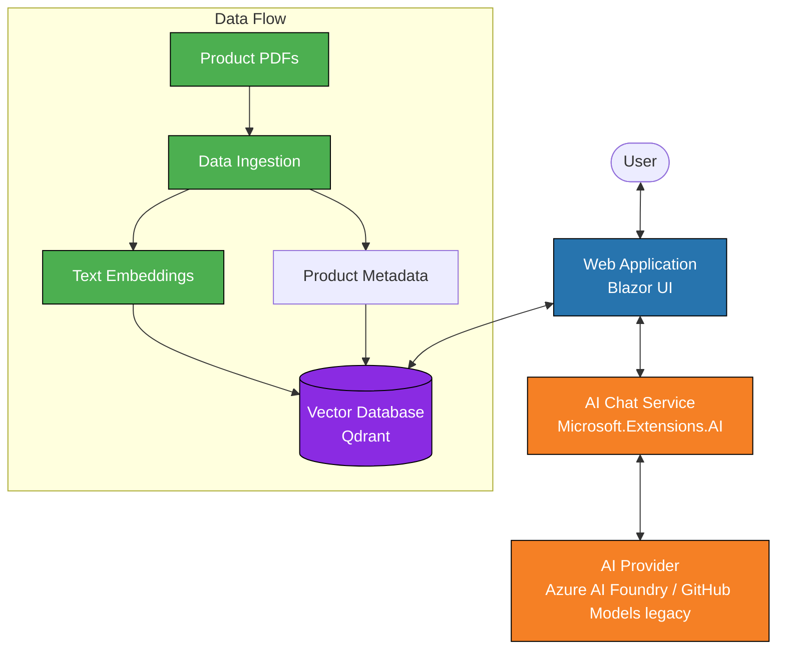
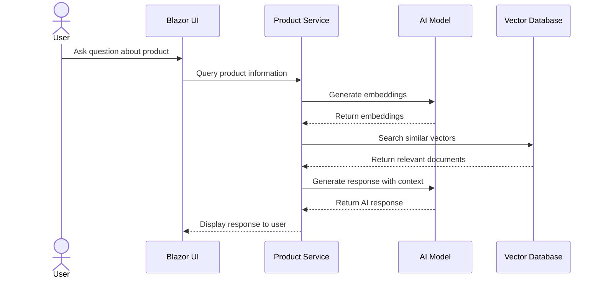
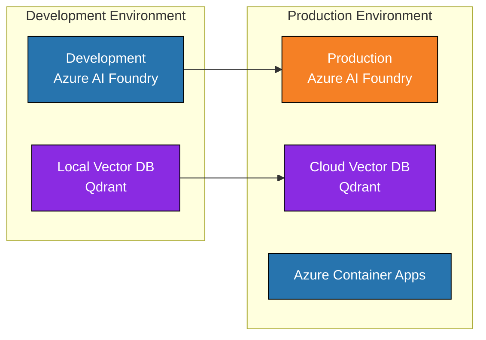

# .NET AI Workshop

Get up to speed quickly with AI app building in .NET! Explore the new .NET AI project templates integrated with Microsoft Extensions for AI (MEAI), Azure AI Foundry, and vector data stores. Learn how to build with Azure AI Foundry (Azure OpenAI) models for both development and production, with GitHub Models and local models (Foundry Local / Ollama) available as fallbacks. Gain hands-on experience building cutting-edge intelligent solutions with state-of-the-art frameworks and best practices.

> [!IMPORTANT]
> **GitHub Models is [retiring on July 30, 2026](https://github.blog/changelog/2026-07-01-github-models-is-being-fully-retired-on-july-30-2026/)** (with brownouts on July 16 and 23). This workshop uses **Azure AI Foundry (Azure OpenAI)** as the primary provider; GitHub Models appears only as a legacy fallback. See [Part 5 - Providers and Fallbacks](Part%205%20-%20Providers%20and%20Fallbacks/README.md).

## Prerequisites

### AI Web Chat Application Requirements (Parts 1-6)

- Visual Studio 2022 or Visual Studio 2026
- .NET AI Web Chatbot template installed (instructions in Part 1 - Setup)
- .NET 9.0 SDK or later
- Docker Desktop or Podman (required for .NET Aspire orchestration)
- Azure subscription with access to Azure AI Foundry (Azure OpenAI) — the primary AI provider
- GitHub account (optional; GitHub Models is a legacy fallback [retiring July 30, 2026](https://github.blog/changelog/2026-07-01-github-models-is-being-fully-retired-on-july-30-2026/))

### Model Context Protocol (Parts 7-9)

- .NET 10.0 SDK (preview 6 or higher) - Required for MCP development
- Visual Studio Code with GitHub Copilot extensions
- GitHub Copilot subscription (required for MCP testing)
- Microsoft.Extensions.AI.Templates package

### Optional but Recommended

- Git for version control
- Azure subscription for production deployment

## Lab Overview 🧪

The lab consists of a series of hands-on exercises where you'll build an AI-powered web application using the new .NET AI project templates. The application includes:

- 🤖 **AI Chatbot**: A conversational interface that can answer questions about products
- 📋 **Product Catalog**: AI-generated product descriptions and categories
- 🔍 **Semantic Search**: Vector-based search using document embeddings
- 🔌 **Integration with Azure AI Foundry**: Use Azure OpenAI models for development and production, with GitHub Models and local models (Foundry Local / Ollama) as fallbacks

## What We're Building

This lab guides you through building a complete AI-powered web application for an outdoor gear company. The application enables users to chat with an AI assistant that has knowledge of the company's product catalog through document ingestion.

### Application Architecture 🏢


```mermaid
flowchart TD
    User([User]) <--> WebApp[Web Application<br>Blazor UI]
    WebApp <--> VectorDB[(Vector Database<br>Qdrant)]
    WebApp <--> AIChatService[AI Chat Service<br>Microsoft.Extensions.AI]
    AIChatService <--> AIProvider[AI Provider<br>Azure AI Foundry / GitHub Models legacy]
    
    subgraph Data Flow
        PDFs[Product PDFs] --> Ingestion[Data Ingestion]
        Ingestion --> Embeddings[Text Embeddings]
        Ingestion --> ProductData[Product Metadata]
        Embeddings --> VectorDB
        ProductData --> VectorDB
    end
    
    classDef webapp fill:#2774AE,stroke:#000,color:#fff
    classDef aiservice fill:#F58025,stroke:#000,color:#fff
    classDef database fill:#8A2BE2,stroke:#000,color:#fff
    classDef dataflow fill:#4CAF50,stroke:#000,color:#fff
    
    class WebApp webapp
    class AIChatService,AIProvider aiservice
    class VectorDB,ProductDB database
    class PDFs,Ingestion,Embeddings dataflow
```

**Architecture Overview** This diagram illustrates the component relationships in our outdoor gear application. The Blazor web application connects with three key components: a vector database for storing embeddings, an AI chat service powered by Microsoft.Extensions.AI, and a product database. The AI functionality is provided by Azure AI Foundry (Azure OpenAI models), with GitHub Models available as a legacy fallback (retiring July 30, 2026). The data flow shows how product PDFs are ingested, transformed into embeddings, and stored in the vector database to enable contextual AI responses.

### Component Interaction 🔄


```mermaid
sequenceDiagram
    actor User
    participant UI as Blazor UI
    participant Service as Product Service
    participant AI as AI Model
    participant DB as Vector Database
    
    User->>UI: Ask question about product
    UI->>Service: Query product information
    Service->>AI: Generate embeddings
    AI-->>Service: Return embeddings
    Service->>DB: Search similar vectors
    DB-->>Service: Return relevant documents
    Service->>AI: Generate response with context
    AI-->>Service: Return AI response
    Service-->>UI: Display response to user
```

**Sequence Overview** This diagram demonstrates the interaction flow when a user queries the system. When a customer asks about a product, their question is processed by the UI and passed to the Product Service. The AI model generates text embeddings for the query, which are then used to search the Vector Database for relevant documents. Once matching information is found, both the original question and retrieved context are sent to the AI model to generate a contextually informed response. This response is then returned through the service layer to the UI for display to the user.

### Development to Production Flow 🚀


```mermaid
flowchart LR
    Dev[Development<br>Azure AI Foundry] --> Prod[Production<br>Azure AI Foundry]
    Local[Local Vector DB<br>Qdrant] --> Cloud[Cloud Vector DB<br>Qdrant]
    
    subgraph Development Environment
        Dev
        Local
    end
    
    subgraph Production Environment
        Prod
        Cloud
        ACA[Azure Container Apps]
    end
    
    classDef devnode fill:#2774AE,stroke:#000,color:#fff
    classDef prodnode fill:#F58025,stroke:#000,color:#fff
    classDef dbnode fill:#8A2BE2,stroke:#000,color:#fff
    
    class Dev,ACA devnode
    class Prod prodnode
    class Local,Cloud dbnode
```

**Development to Production Pathway** This diagram illustrates the transition path from a local development environment to production deployment. During development, you'll use GitHub Models and a local vector database, which provides a cost-effective environment for experimentation and testing. In production, the application transitions to Azure OpenAI for enterprise-grade AI capabilities, Qdrant for scalable vector storage, and Azure Container Apps for a scalable, managed cloud hosting environment. This migration path enables seamless transition while maintaining architectural consistency.

Throughout this lab, you'll implement each part of this architecture, from setting up the AI chat interface to building the product catalog and finally deploying to Azure.

## Key Technologies 🛠️

- 🔷 **.NET 9**: The latest version of .NET
- 🧠 **Microsoft Extensions for AI (MEAI)**: Libraries for integrating AI capabilities into .NET applications
- 🔥 **Blazor**: For building interactive web UIs
- 🌐 **.NET Aspire**: For orchestrating cloud-native distributed applications
- 🐱 **GitHub Models** (legacy — [retiring July 30, 2026](https://github.blog/changelog/2026-07-01-github-models-is-being-fully-retired-on-july-30-2026/)): Free during development; use Azure AI Foundry instead
- ☁️ **Azure OpenAI**: Enterprise-grade AI models for production
- 🔮 **Qdrant Vector Database**: For storing and searching vector embeddings

## Getting Started

Follow the [setup instructions](Part%201%20-%20Setup/README.md) to get started with the lab.

## Lab Modules 📚

The lab is divided into nine modules.

The primary sequence below reflects the current converged workshop flow and keeps advanced modules explicitly optional for pacing.

### AI Web Chat Application (Parts 1-6)

1. 🏗️ [**Setup**](Part%201%20-%20Setup/README.md): Configure prerequisites and development environment for the AI workshop.

2. 💬 [**Build Chat App**](Part%202%20-%20Build%20Chat%20App/README.md): Build and run a minimal console-based AI chat app.

3. 🧩 [**Add RAG**](Part%203%20-%20Add%20RAG/README.md): Add retrieval-augmented generation with embeddings and semantic search.

4. 🔍 [**Template Reveal**](Part%204%20-%20Template%20reveal/README.md): Compare your manual implementation with the generated template architecture.

5. 🔁 [**Providers and Fallbacks**](Part%205%20-%20Providers%20and%20Fallbacks/README.md): Configure provider options and fallback paths (Azure AI Foundry primary).

6. 🚀 [**Deployment**](Part%206%20-%20Deployment/README.md): Deploy your application to Azure using the Azure Developer CLI.

### Model Context Protocol (MCP) Servers (Parts 7-9)

1. 🔧 [**MCP Server Basics**](Part%207%20-%20MCP%20Server%20Basics/README.md): Create your first MCP server with weather tools that extend AI agents like GitHub Copilot.

2. 🏢 [**Enhanced MCP Server**](Part%208%20-%20Enhanced%20MCP%20Server/README.md) *(Optional / bonus)*: Build sophisticated business tools for order management, inventory, and customer service scenarios.

3. 📦 [**MCP Publishing**](Part%209%20-%20MCP%20Publishing/README.md) *(Optional / bonus)*: Package, publish, and distribute your MCP servers through NuGet for professional deployment.

## Lab Structure 📁

The repository is structured as follows:

- 📖 `Part 1 - Setup` through `Part 9 - MCP Publishing`: Contains all the lab instructions, documentation, and working code snapshots
- � `manuals/`: Product documentation PDFs for the AI chatbot to reference
- 🧪 `docs/testing/`: Testing procedures and validation reports

## Session Resources 📚

|Resources|Links|Description|
|:-------------------|:----------------------------------|:-------------------|
|Microsoft Learn|<https://aka.ms/build25/plan/ADAI_DevStartPlan>|AI developer resources|
|Microsoft Learn|<https://learn.microsoft.com/en-us/dotnet/machine-learning/ai-overview>|.NET AI Documentation|
|Microsoft Learn|<https://learn.microsoft.com/en-us/dotnet/aspire/get-started/aspire-overview>|.NET Aspire Documentation|
|Microsoft Learn|<https://learn.microsoft.com/en-us/dotnet/machine-learning/extensions-ai/>|Extensions for AI Documentation|
|Microsoft Learn|<https://learn.microsoft.com/en-us/azure/ai-services/openai/>|Azure OpenAI Documentation|

## Testing the Workshop 🧪

For workshop instructors and contributors who want to validate the workshop content, a comprehensive testing procedure is available:

### Automated Credential Setup

Before testing the workshop, run the credential setup script to configure required API keys and endpoints:

```powershell
# Navigate to the workshop root directory
cd ai-workshop

# Run the credential setup script
.\.github\scripts\setup-workshop-credentials.ps1
```

This script will prompt you for:

- **GitHub Token**: For GitHub Models access (fine-grained token with **Models: Read-only** permission)
- **Azure OpenAI Endpoint**: Your Azure OpenAI service endpoint URL
- **Azure OpenAI Key**: Your Azure OpenAI service API key

The credentials are saved as environment variables (`WORKSHOP_GITHUB_TOKEN`, `WORKSHOP_AZURE_OPENAI_ENDPOINT`, `WORKSHOP_AZURE_OPENAI_KEY`) and will be available for subsequent testing sessions.

### Testing Procedure

The complete testing procedure and validation scripts are available in `.github/prompts/test-workshop.prompt.md`. This includes:

- Step-by-step testing instructions for all 9 workshop parts
- Automated build validation commands
- Common troubleshooting scenarios
- Documentation improvement tracking

## License

This project is licensed under the MIT License - see the [LICENSE](LICENSE) file for details.
