# MCP Workshop Instructor Guide

## Overview

This guide provides instructors with comprehensive information for teaching Parts 7-9 of the AI Workshop, focused on Model Context Protocol (MCP) server development. These parts build upon the AI Web Chat application (Parts 1-6) by introducing custom tools that extend AI agents like GitHub Copilot.

## Workshop Structure and Timing

### Complete 9-Part Workshop Flow

**AI Web Chat Foundation (Parts 1-6)** - *3-4 hours*

- Parts 1-6: Build AI-powered web application with Azure OpenAI integration

**MCP Extension (Parts 7-9)** - *2-3 hours*  

- Part 7: MCP Server Basics (45-60 minutes)
- Part 8: Enhanced MCP Server (45-60 minutes)
- Part 9: MCP Publishing (30-45 minutes)

### Teaching Options

#### **Option 1: Complete Workshop (6-7 hours)**

- Teach all 9 parts in sequence
- Ideal for full-day workshops or multi-session courses
- Provides complete AI development experience

#### **Option 2: MCP-Focused Session (2-3 hours)**

- Start with completed AI Web Chat (use `/src/complete`)
- Focus exclusively on Parts 7-9
- Ideal for workshops focused on AI extensibility

#### **Option 3: Modular Teaching**

- Parts 1-6: AI Web Chat development
- Parts 7-9: AI agent extensibility (separate session)
- Allows flexible scheduling and different skill levels

## Prerequisites for MCP Parts

### Technical Requirements

**Essential Prerequisites:**

- ✅ **.NET 10.0 SDK** (preview 6 or higher) - Required for MCP development
- ✅ **Visual Studio Code** - Required for MCP integration testing
- ✅ **GitHub Copilot** subscription and VS Code extensions
- ✅ **Basic .NET knowledge** - C# syntax, project structure, NuGet packages

**Recommended Prerequisites:**

- ✅ **Completed Parts 1-6** - Understanding of AI chat applications
- ✅ **Git knowledge** - For version control and collaboration
- ✅ **REST API familiarity** - Helps with understanding tool concepts

### Environment Setup (15 minutes)

**Pre-Workshop Setup Checklist:**

1. Verify .NET 10 SDK installation: `dotnet --version`
2. Install MCP templates: `dotnet new install Microsoft.Extensions.AI.Templates`
3. Verify VS Code with GitHub Copilot extensions
4. Test GitHub Copilot functionality
5. Clone workshop repository

**Common Setup Issues:**

- **.NET Version Conflicts**: Ensure .NET 10 preview is primary version
- **GitHub Copilot Access**: Verify subscription is active and extensions installed
- **Template Installation**: May require clearing NuGet cache if templates don't appear

## Part 7: MCP Server Basics

### Learning Objectives (Communicate to Students)

By the end of Part 7, students will:

- ✅ Understand what MCP is and why it extends AI capabilities
- ✅ Create their first MCP server using .NET templates
- ✅ Implement weather tools that provide real-time data simulation
- ✅ Configure VS Code to discover and use custom MCP servers
- ✅ Test MCP functionality with GitHub Copilot

### Key Concepts to Emphasize

#### 1. MCP Value Proposition (5 minutes)

- AI agents limited to training data vs. real-time information
- MCP bridges AI agents with live systems and custom capabilities
- Weather example demonstrates real-world data integration

#### 2. MCP Architecture (10 minutes)

```mermaid
flowchart TD
    User([👤 Student]) <--> Agent[🤖 GitHub Copilot]
    Agent <--> MCP[📡 MCP Server]
    MCP <--> Data[🌤️ Live Data Sources]
```

#### 3. Tool Design Principles (10 minutes)

- Clear, descriptive tool names and descriptions
- Proper parameter documentation with `[Description]` attributes
- Error handling for invalid inputs
- JSON serialization for structured responses

### Teaching Flow - Part 7 (45-60 minutes)

#### **Introduction (10 minutes)**

1. **MCP Overview** - What problems does MCP solve?
2. **Demo Setup** - Show VS Code with GitHub Copilot
3. **Learning Goals** - Set expectations for the session

#### **Hands-On Development (25 minutes)**

1. **Project Creation** (5 minutes)
   - Navigate to Part 7 directory
   - Examine WeatherMcpServer project structure
   - Discuss project template and dependencies

2. **Code Exploration** (15 minutes)
   - Open `Tools/WeatherTools.cs`
   - Explain `[McpServerTool]` and `[Description]` attributes
   - Walk through `GetCurrentWeather` implementation
   - Discuss JSON serialization patterns

3. **Build and Validate** (5 minutes)
   - Run `dotnet build` to verify compilation
   - Address any build issues or questions

#### **VS Code Integration (10 minutes)**

1. **MCP Configuration** - Create `.vscode/mcp.json`
2. **Server Registration** - Add WeatherMcpServer configuration
3. **VS Code Restart** - Refresh MCP server discovery

#### **Testing and Validation (10 minutes)**

1. **GitHub Copilot Testing** - Test weather queries
2. **Error Handling** - Try invalid locations
3. **Tool Discovery** - Verify Copilot can find and use tools

### Common Student Questions

**Q: "Why not just use APIs directly in the AI chat app?"**
A: MCP makes tools reusable across any AI agent (Copilot, Claude, etc.) and provides standard protocols for tool discovery and execution.

**Q: "Do I need real weather APIs?"**
A: No, Part 7 uses simulated data to focus on MCP concepts. Real APIs can be added later.

**Q: "What if my tools don't appear in Copilot?"**
A: Check tool descriptions are clear, VS Code MCP configuration is correct, and GitHub Copilot extensions are active.

### Troubleshooting Guide

**Build Errors:**

- Verify .NET 10 SDK installation
- Check `ModelContextProtocol` package version
- Clear NuGet cache: `dotnet nuget locals all --clear`

**MCP Integration Issues:**

- Restart VS Code after configuration changes
- Verify `.vscode/mcp.json` syntax and paths
- Check VS Code Output panel for MCP-specific errors

## Part 8: Enhanced MCP Server with Business Tools

### Learning Objectives - Part 8

- ✅ Design MCP tools that solve real business problems
- ✅ Implement complex data structures and business logic
- ✅ Handle multiple related tools in a single MCP server
- ✅ Apply data validation and error handling principles
- ✅ Test multi-server MCP configurations

### Key Concepts to Emphasize - Part 8

- ContosoOrders as realistic e-commerce scenario
- Business tools: Orders, Customers, Inventory
- Real-world applicability to any business domain

#### 2. Tool Relationships (10 minutes)

- Multiple tools working together
- Data consistency across tool calls
- Business workflow support through AI

#### 3. Advanced MCP Patterns (10 minutes)

- Complex parameter handling
- Rich data structures in responses
- Error handling for business scenarios

### Teaching Flow - Part 8 (45-60 minutes)

#### **Business Context Introduction (10 minutes)**

1. **ContosoOrders Overview** - E-commerce outdoor gear company
2. **Business Challenges** - Order management, inventory, customer service
3. **MCP Solutions** - How AI tools address these challenges

#### **Code Deep Dive (20 minutes)**

1. **Order Management Tool** (8 minutes)
   - `GetOrderDetails` implementation
   - Complex business data structures
   - Error handling for missing orders

2. **Customer Search Tool** (6 minutes)
   - `SearchOrdersByCustomer` functionality
   - String matching and data filtering
   - Extensibility for partial matching

3. **Inventory Tool** (6 minutes)
   - `GetProductInventory` implementation
   - Product availability and pricing
   - Business logic for stock management

#### **Multi-Server Configuration (10 minutes)**

1. **Update MCP Configuration** - Add ContosoOrders server
2. **Test Both Servers** - Verify weather and business tools coexist
3. **Integration Testing** - Cross-server functionality

#### **Advanced Testing (10 minutes)**

1. **Complex Business Queries** - Multi-tool scenarios
2. **Data Validation** - Error handling and edge cases
3. **Performance Considerations** - Multiple server efficiency

### Advanced Discussion Topics

**Business Integration Patterns:**

- How to connect to real databases and APIs
- Authentication and authorization for business systems
- Data privacy and security considerations

**Scalability Considerations:**

- Multiple MCP servers per organization
- Tool versioning and backwards compatibility
- Enterprise deployment strategies

## Part 9: MCP Publishing and Distribution

### Learning Objectives - Part 9

By the end of Part 9, students will:

- ✅ Understand MCP packaging and distribution strategies
- ✅ Configure professional metadata for MCP servers
- ✅ Learn NuGet publishing workflows
- ✅ Apply versioning and security best practices
- ✅ Plan enterprise distribution scenarios

### Key Concepts to Emphasize - Part 9

- NuGet vs. source code vs. container distribution
- Trade-offs between accessibility and control
- Enterprise vs. public distribution

#### 2. Professional Packaging (15 minutes)

- Package metadata and documentation
- Version management strategies
- Security and authentication considerations

#### 3. Maintenance and Support (10 minutes)

- Tool evolution and backwards compatibility
- User support and documentation
- Community building around MCP tools

### Teaching Flow (30-45 minutes)

#### **Publishing Overview (10 minutes)**

1. **Distribution Options** - NuGet, source, containers, enterprise
2. **Professional Standards** - Metadata, documentation, versioning
3. **Real-World Examples** - Show published MCP packages

#### **Hands-On Publishing Setup (15 minutes)**

1. **Package Configuration** - Update `.csproj` with metadata
2. **Documentation Creation** - README and usage examples
3. **Testing Preparation** - Local package testing

#### **Enterprise Considerations (10 minutes)**

1. **Internal Distribution** - Private NuGet feeds
2. **Security Policies** - Authentication and authorization
3. **Governance** - Tool approval and maintenance

#### **Wrap-Up and Next Steps (5-10 minutes)**

1. **Workshop Summary** - Complete learning journey
2. **Real-World Applications** - Where to apply these skills
3. **Community Resources** - Where to get help and share

## Assessment and Validation

### Knowledge Check Questions

**Part 7 Validation:**

1. What attributes are required for MCP tool methods?
2. How do you handle errors in MCP tools?
3. What is the purpose of the `.vscode/mcp.json` file?

**Part 8 Validation:**

1. How do multiple MCP servers coexist?
2. What makes business tools different from simple tools?
3. How would you secure business data in MCP tools?

**Part 9 Validation:**

1. What are the trade-offs between different distribution methods?
2. How do you version MCP servers for backwards compatibility?
3. What security considerations apply to published MCP tools?

### Practical Validation

**Build Success Criteria:**

- All MCP projects compile without errors
- VS Code can discover both MCP servers
- GitHub Copilot can execute tools successfully

**Functional Testing:**

- Students can query weather information
- Students can lookup business data
- Students understand how to extend tools

**Understanding Validation:**

- Students can explain MCP value proposition
- Students can design new tools for their scenarios
- Students understand professional deployment considerations

## Workshop Resources

### Required Materials

**For Instructors:**

- Workshop slides covering MCP concepts
- Live demo environment with VS Code and GitHub Copilot
- Backup solutions for common technical issues

**For Students:**

- Workshop repository access
- Development environment setup guide
- Reference documentation and cheat sheets

### Timing Guidelines

**Minimum Time Requirements:**

- Part 7: 45 minutes (basic understanding)
- Part 8: 45 minutes (business concepts)
- Part 9: 30 minutes (publishing overview)

**Recommended Time Allocation:**

- Part 7: 60 minutes (thorough understanding)
- Part 8: 60 minutes (hands-on practice)
- Part 9: 45 minutes (real-world planning)

### Extension Activities

**For Fast Learners:**

- Implement additional weather tools (air quality, UV index)
- Add more complex business scenarios (returns, refunds)
- Explore real API integration patterns

**For Advanced Groups:**

- Discuss enterprise security patterns
- Plan organization-specific MCP tool strategies
- Explore advanced MCP protocol features

### Support Resources

**During Workshop:**

- [MCP Testing Guide](MCP_TESTING_GUIDE.md) for troubleshooting
- [Part 7 README](Part%207%20-%20MCP%20Server%20Basics/README.md) for detailed instructions
- [Part 8 README](Part%208%20-%20Enhanced%20MCP%20Server/README.md) for business scenarios

**Post-Workshop:**

- MCP community forums and documentation
- .NET AI development resources
- GitHub Copilot extensibility guides

---

## Instructor Preparation Checklist

### Pre-Workshop (1 week before)

- [ ] Test complete workshop flow on instructor machine
- [ ] Verify GitHub Copilot access and functionality
- [ ] Prepare backup solutions for common issues
- [ ] Review latest MCP documentation for updates

### Day of Workshop (30 minutes before)

- [ ] Verify internet connectivity and GitHub access
- [ ] Test MCP server builds and VS Code integration
- [ ] Prepare workshop materials and reference guides
- [ ] Set up demonstration environment

### During Workshop

- [ ] Monitor student progress and provide individual help
- [ ] Address common issues proactively
- [ ] Encourage experimentation and questions
- [ ] Capture feedback for future improvements

---

*This instructor guide is designed to support successful delivery of the MCP workshop components. For questions or improvements, refer to the [Workshop Planning Document](MCP_WORKSHOP_PLANNING.md).*
